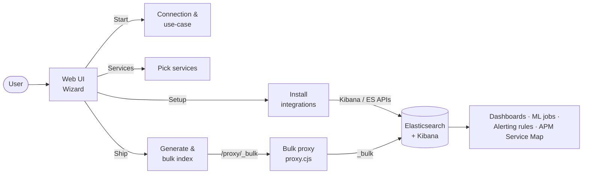

# Cloud Loadgen for Elastic

A web UI that bulk-generates **realistic** AWS, Google Cloud, and Microsoft Azure observability data — logs, metrics, and traces — and ships it straight into Elasticsearch with the `_bulk` API. Documents follow **ECS** naming and use each provider's **native log/metric shapes** (CloudWatch, Cloud Logging, Azure Monitor), so dashboards, ML jobs, and alerting rules behave the way they would with real cloud workloads.

> Use synthetic data for demos, training, and pilot builds. Don't ship to production-shared indices without explicit approval.

## Who is this for?

| Audience                            | Use it to…                                                                                       |
| ----------------------------------- | ------------------------------------------------------------------------------------------------ |
| **Elastic SEs / demo operators**    | Stand up a populated Observability or Security demo in minutes against any deployment type       |
| **Customers / external evaluators** | Try Elastic dashboards, ML, and detection rules with data that looks like your cloud workloads   |
| **Contributors / developers**       | Add new generators, integrations, or chained scenarios — every asset is JSON and CLI-installable |

## How it works



A four-step wizard. **Start** picks the cloud and Elastic deployment, **Setup** installs Cloud Loadgen Integrations, **Services** chooses what to generate, **Ship** runs the bulk index. Credentials live in the browser session; the small Node proxy forwards `_bulk` so the API key never leaves the host.

## Quick start

```bash
# Docker (recommended) — needs a full clone with installer/ present
./docker-up        # or: npm run docker:up
# → http://localhost:8765
```

For a manual `docker build`, local dev with the Vite + proxy combo, env vars, and contributor notes, see **[docs/development.md](docs/development.md)**.

## What it installs

Every Elastic asset is bundled **per service** as a **Cloud Loadgen Integration** and tagged with the `cloudloadgen` saved-object tag so you can filter, bulk-edit, or bulk-delete load-generator assets without touching production objects. Each service integration includes an ingest pipeline (TSDS for metrics), data stream templates, a Kibana ES|QL dashboard, ML anomaly jobs, and `.es-query` alerting rules.

The wizard opens on the **Start** step, where you pick cloud vendor, deployment type, event type, and Elastic connection details. Subsequent steps install integrations (Setup), pick services, configure advanced data types, tune volume, and ship traffic.


Catalog size today:

| Cloud | Services | Pipelines | Dashboards | ML jobs | Traces | Alerting rules |
| ----- | -------- | --------- | ---------- | ------- | ------ | -------------- |
| AWS   | 246      | 188       | 237        | 421     | 56     | 115            |
| GCP   | 139      | 149       | 136        | 182     | 59     | 62             |
| Azure | 143      | 121       | 130        | 186     | 51     | 66             |

Trace generators produce APM transactions and spans for the Elastic **Service Map**; the remaining services emit logs and metrics only — matching real-world instrumentation patterns where not every cloud service is OTel-instrumented.

Behaviour, categories, post-install toggles, Serverless limits, dashboard fallback, and uninstall semantics are all in **[docs/SETUP-WIZARD-AND-UNINSTALL.md](docs/SETUP-WIZARD-AND-UNINSTALL.md)**. CLI equivalents for every Setup action live in **[installer/README.md](installer/README.md)**, and standalone JSON for one-asset-at-a-time deploys is in **[assets/README.md](assets/README.md)**.

## Beyond per-service generators

Cloud Loadgen for Elastic also produces multi-service **chained scenarios** with shared correlation IDs and audit attribution, **CSPM/KSPM findings using 321 real CIS rule UUIDs**, a **ServiceNow CMDB** generator for cross-index enrichment, and **Microsoft 365** metrics (Teams, Outlook, OneDrive). A canonical alert-enrichment **Elastic Workflow** ties them together. Detail in **[docs/advanced-data-types.md](docs/advanced-data-types.md)**.

The Setup wizard also installs **SLO definitions** (availability and data-pipeline SLIs per cloud) via the Kibana Observability SLO API, and optional **Agent Builder** tool definitions for AI-assisted investigation — including a dedicated **SOC Analyst** agent with 8 security-focused tools for investigating attack chains, querying CMDB context, triaging security alerts, and searching a **364-document knowledge base** of runbooks, investigation guides, and detection rule context.

## AI SOC demo

Cloud Loadgen ships a complete AI SOC demo scenario built around **IAM privilege escalation**, with **16 Elastic Security detection rules** (6 IAM, 6 finding, 4 exfiltration) that produce 50+ alerts for **Attack Discovery**, a **security alert enrichment workflow** that adds originating IP and hostname from **ServiceNow CMDB**, an **Agent Builder SOC Analyst** for conversational investigation, and a **364-document knowledge base** (`kb-cloudloadgen-soc`) of investigation runbooks, detection rule guides, and MITRE ATT&CK context that grounds the agent's responses in documented procedures. Full walkthrough in **[docs/SOC-DEMO-SETUP.md](docs/SOC-DEMO-SETUP.md)**.

Alerting rules ship in two tiers. **51 chained-scenario rules** (17 per cloud) cover the four multi-service chains. **192 per-service domain rules** cover compute, database, networking, AI/ML, storage, messaging, DevOps, and security-ops — **243 rules total** across AWS (115), GCP (62), and Azure (66). Each rule's `artifacts.dashboards` field links **the chain overview plus per-service dashboards** that match the rule's primary dataset (Stack 8.19 / 9.1+), and **per-rule investigation guides** in [docs/runbooks/](docs/runbooks/) cover triage, ES|QL queries, containment, and escalation criteria. Both surface from the alert's "Related dashboards" tab and the optional alert-enrichment workflow's email body.

## ML training mode

The **Ship** page includes **ML training mode**, which automates _reset → baseline → wait → inject → freeze_ for clean, repeatable anomaly demos. See **[docs/ml-training-mode.md](docs/ml-training-mode.md)** for the full workflow.

## API key permissions

Two least-privilege key definitions live in `[installer/api-keys/](installer/api-keys/)`: **ship-only** (bulk index only) and **full-access** (ship plus install/uninstall of dashboards, ML jobs, rules, pipelines, and Fleet integrations). Both carry `metadata.tags: ["cloudloadgen"]`. Privilege breakdown and revocation guidance are in **[docs/api-key-permissions.md](docs/api-key-permissions.md)**.

## Sample data

Reference JSON for every registered generator lives under `samples/{aws,gcp,azure}/{logs,metrics,traces}/`. The directory is gitignored — regenerate locally with `npm run samples` and verify with `npm run samples:verify`.

## Testing

| Command                                   | Purpose                                                                         |
| ----------------------------------------- | ------------------------------------------------------------------------------- |
| `npm run test`                            | Vitest, then regenerate **all** sample JSON for every cloud and verify coverage |
| `npm run format` / `npm run format:check` | Prettier                                                                        |
| `npm run lint` / `npm run typecheck`      | ESLint and `tsc --noEmit`                                                       |
| `npm run build`                           | Production build                                                                |

CI runs format, lint, typecheck, test, and build on Node 20.

## Documentation

| Topic                                                                                 | Where                                                                                                                                                                                                                                  |
| ------------------------------------------------------------------------------------- | -------------------------------------------------------------------------------------------------------------------------------------------------------------------------------------------------------------------------------------- |
| Local dev, proxy env vars, icons, contributor notes                                   | [docs/development.md](docs/development.md)                                                                                                                                                                                             |
| Setup wizard, `cloudloadgen` tag, Serverless behaviour, dashboard fallback            | [docs/SETUP-WIZARD-AND-UNINSTALL.md](docs/SETUP-WIZARD-AND-UNINSTALL.md)                                                                                                                                                               |
| Advanced data types: chained events, CSPM/KSPM, ServiceNow, alert-enrichment workflow | [docs/advanced-data-types.md](docs/advanced-data-types.md)                                                                                                                                                                             |
| Install / customise the alert-enrichment workflow (Cloud Hosted, Serverless, on-prem) | [docs/workflow-deployment.md](docs/workflow-deployment.md)                                                                                                                                                                             |
| ML training mode (reset → baseline → inject → freeze)                                 | [docs/ml-training-mode.md](docs/ml-training-mode.md)                                                                                                                                                                                   |
| API key privileges and revocation                                                     | [docs/api-key-permissions.md](docs/api-key-permissions.md)                                                                                                                                                                             |
| Per-scenario timing, correlation, and failure modes                                   | [docs/chained-events/](docs/chained-events/)                                                                                                                                                                                           |
| Investigation guides (per-rule runbooks for the chained-scenario alerts)              | [docs/runbooks/](docs/runbooks/)                                                                                                                                                                                                       |
| AWS CloudWatch routing, Glue/SageMaker walkthrough, OTel traces                       | [docs/CLOUDWATCH-TO-INDEX-ROUTING.md](docs/CLOUDWATCH-TO-INDEX-ROUTING.md), [docs/GUIDE-CLOUDWATCH-GLUE-SAGEMAKER-ELASTIC.md](docs/GUIDE-CLOUDWATCH-GLUE-SAGEMAKER-ELASTIC.md), [docs/otel-traces-setup.md](docs/otel-traces-setup.md) |
| CLI installers (per-service bundles, individual asset installers, alert rules)        | [installer/README.md](installer/README.md)                                                                                                                                                                                             |
| Per-service loadgen integration packs (pipeline + dashboard + ML per service)         | `npm run setup:aws-loadgen-packs` / `setup:gcp-loadgen-packs` / `setup:azure-loadgen-packs`                                                                                                                                            |
| GCP ingest pipeline reference                                                         | [docs/GCP-INGEST-PIPELINE-REFERENCE.md](docs/GCP-INGEST-PIPELINE-REFERENCE.md)                                                                                                                                                         |
| Azure ingest pipeline reference                                                       | [docs/AZURE-INGEST-PIPELINE-REFERENCE.md](docs/AZURE-INGEST-PIPELINE-REFERENCE.md)                                                                                                                                                     |
| Standalone JSON assets with copy-pasteable `curl` commands                            | [assets/README.md](assets/README.md)                                                                                                                                                                                                   |

Full docs index: **[docs/README.md](docs/README.md)**.

## License and contributors

See the repository license file (if present) and [CONTRIBUTORS.md](CONTRIBUTORS.md).
