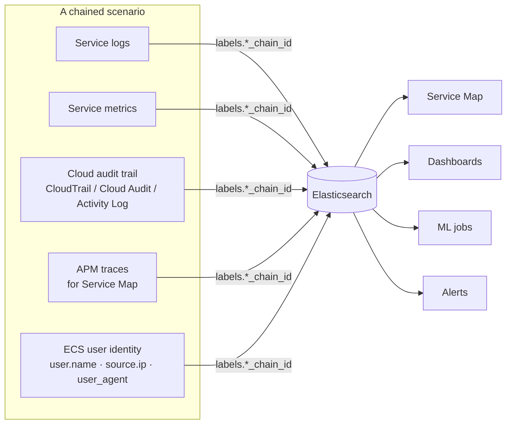

# Advanced data types

Beyond per-service log/metric/trace generators, **Cloud Loadgen for Elastic** ships **multi-service correlated scenarios**, real **CIS-rule CSPM/KSPM findings**, and a **ServiceNow CMDB** generator for cross-index enrichment. Together they let a single ship run populate Service Map, dashboards, ML jobs, alerting rules, and the SOC workflow with believable, attributable data.

## Chained event scenarios

Chained scenarios emit logs, metrics, APM traces (for the Service Map), companion cloud audit events, and ECS user identity fields. They share `labels.*_chain_id` IDs so events can be correlated end-to-end.

| Scenario                      | Per-cloud assets                                                                                                                                                           | Detail doc                                                                                                        |
| ----------------------------- | -------------------------------------------------------------------------------------------------------------------------------------------------------------------------- | ----------------------------------------------------------------------------------------------------------------- |
| **Data & Analytics Pipeline** | `data-pipeline-*` dashboard, ML jobs, **5** rules per cloud. AWS S3→EMR→Glue→Athena→MWAA · GCP GCS→Dataproc→BigQuery→Composer · Azure Blob→Databricks→Synapse→Data Factory | [chained-events/data-analytics-pipeline.md](./chained-events/data-analytics-pipeline.md) (+ GCP / Azure variants) |
| **Security Finding Chain**    | `security-finding-chain` dashboard, **4** rules, ML jobs (native detect → hub/aggregate → lake/triage)                                                                     | [chained-events/security-finding-chain.md](./chained-events/security-finding-chain.md)                            |
| **IAM Privilege Escalation**  | `iam-privesc-chain` dashboard, **4** rules, ML jobs (MITRE-aligned IAM audit progression with stable attacker/target identity)                                             | [chained-events/iam-privilege-escalation-chain.md](./chained-events/iam-privilege-escalation-chain.md)            |
| **Data Exfiltration**         | `data-exfil-chain` dashboard, **4** rules, ML jobs (storage and network evidence with MB-scale volumes)                                                                    | [chained-events/data-exfiltration-chain.md](./chained-events/data-exfiltration-chain.md)                          |

Installing **all** rule files for one cloud gives you 17 rules (5 + 4 + 4 + 4). Use `npm run setup:alert-rules` (cross-cloud) or the web-UI Setup step.

## CSPM / KSPM — real CIS benchmark findings

The CSPM and KSPM generators produce findings identical to what Elastic's [cloudbeat](https://github.com/elastic/cloudbeat) writes to `logs-cloud_security_posture.findings-default`, using **real CIS rule UUIDs, names, sections, and benchmark metadata** sourced from `elastic/cloudbeat`'s security-policies — **321 rules total**.

| Benchmark                    | Rules | Coverage                                                                      |
| ---------------------------- | ----: | ----------------------------------------------------------------------------- |
| CIS AWS Foundations v1.5.0   |    55 | IAM, S3, EC2, RDS, Logging, Monitoring, Networking                            |
| CIS GCP Foundations v2.0.0   |    71 | IAM, Logging, Networking, VMs, Storage, SQL, BigQuery                         |
| CIS Azure Foundations v2.0.0 |    72 | IAM, Defender, Storage, SQL, Logging, Networking, VMs, Key Vault, App Service |
| CIS EKS v1.4.0               |    31 | Logging, Authentication, Networking, Pod Security                             |
| CIS Kubernetes v1.0.1        |    92 | Control Plane, etcd, RBAC, Worker Nodes, Pod Security Standards               |

Failed findings include realistic resource configurations and evidence — S3 buckets without encryption, security groups allowing 0.0.0.0/0 SSH, IAM users without MFA, pods running as privileged, and so on. When the `cloud_security_posture` Fleet integration is installed (automatic when CSPM/KSPM services are selected in the Setup wizard), Elastic's built-in **Posture Dashboard**, **Findings page**, and **Benchmark Rules** display the data exactly as they would for real cloud infrastructure.

CSPM/KSPM is only available on **Security** Serverless projects — see the use-case selector notes in [SETUP-WIZARD-AND-UNINSTALL.md](./SETUP-WIZARD-AND-UNINSTALL.md).

## ServiceNow CMDB

A ServiceNow CMDB log generator produces realistic records across nine CMDB and ITSM tables and ships them to `logs-servicenow.event-*` (using the `servicenow.event` dataset and the integration's `.value` / `.display_value` field convention).

| Table             | Records                                                  |
| ----------------- | -------------------------------------------------------- |
| `cmdb_ci`         | Configuration items (cloud infrastructure mapped to CIs) |
| `cmdb_ci_service` | Business services (e.g. Data Pipeline Service)           |
| `cmdb_rel_ci`     | CI-to-CI relationships (depends-on, runs-on, …)          |
| `incident`        | Incidents with priority, assignment, resolution          |
| `change_request`  | Change requests with risk, approval, test plans          |
| `sys_user`        | User records correlated with pipeline operators          |
| `sys_user_group`  | Support groups (e.g. Data Engineering Team)              |
| `cmn_department`  | Departments and department heads                         |
| `cmn_location`    | Office locations                                         |

CIs are correlated with cloud infrastructure names from the data pipeline chains (`mwaa-globex-prod`, `emr-analytics-cluster`, …) and users align with the same `DATA_ENGINEERING_USERS` pool used by chained event generators. That makes lookups like _"who triggered the pipeline that failed?"_ work out of the box from a CMDB record.

ServiceNow CMDB is treated as **reference data** — capped at 50 documents per ship run. Enable the **ServiceNow** Fleet integration toggle in the Setup wizard to install the `servicenow` integration package alongside the cloud vendor integration.

## Elastic Workflow — alert enrichment

A sample workflow lives in [`workflows/data-pipeline-alert-enrichment.yaml`](../workflows/data-pipeline-alert-enrichment.yaml). It:

1. Triggers on any data pipeline alerting rule.
2. Queries pipeline logs for the triggering user's identity.
3. Looks up the user and affected CI in ServiceNow CMDB.
4. Checks for open incidents and recent change requests.
5. Creates a Kibana case when multiple incidents are found.
6. Sends an enriched Slack notification with contact information.
7. Indexes the enrichment result back to Elasticsearch.

This is the canonical end-to-end demo of pipeline alert → CMDB lookup → SOC case + notification.

## Related

- [chained-events/](./chained-events/) — per-scenario timing, field-level correlation, and failure-mode docs.
- [SETUP-WIZARD-AND-UNINSTALL.md](./SETUP-WIZARD-AND-UNINSTALL.md) — installing the assets and the Serverless use-case selector.
- [ml-training-mode.md](./ml-training-mode.md) — train ML jobs against the chained-event detectors.
