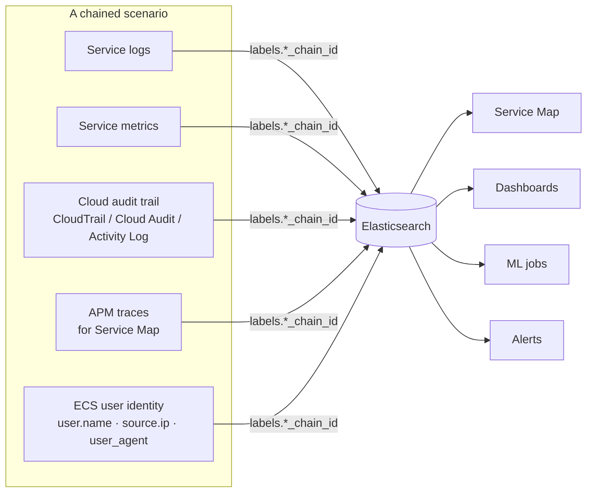

# Advanced data types

Beyond per-service log/metric/trace generators, **Cloud Loadgen for Elastic** ships **multi-service correlated scenarios**, real **CIS-rule CSPM/KSPM findings**, and a **ServiceNow CMDB** generator for cross-index enrichment. Together they let a single ship run populate Service Map, dashboards, ML jobs, alerting rules, and the SOC workflow with believable, attributable data.

## Chained event scenarios

Chained scenarios emit logs, metrics, APM traces (for the Service Map), companion cloud audit events, and ECS user identity fields. They share `labels.*_chain_id` IDs so events can be correlated end-to-end.

| Scenario                      | Per-cloud assets                                                                                                                                                           | Detail doc                                                                                                        |
| ----------------------------- | -------------------------------------------------------------------------------------------------------------------------------------------------------------------------- | ----------------------------------------------------------------------------------------------------------------- |
| **Data & Analytics Pipeline** | `data-pipeline-*` dashboard, ML jobs, **5** rules per cloud. AWS S3→EMR→Glue→Athena→MWAA · GCP GCS→Dataproc→BigQuery→Composer · Azure Blob→Databricks→Synapse→Data Factory | [chained-events/data-analytics-pipeline.md](./chained-events/data-analytics-pipeline.md) (+ GCP / Azure variants) |
| **Security Finding Chain**    | `security-finding-chain` dashboard, **4** rules, ML jobs (native detect → hub/aggregate → lake/triage)                                                                     | [chained-events/security-finding-chain.md](./chained-events/security-finding-chain.md)                            |
| **IAM Privilege Escalation**  | `iam-privesc-chain` dashboard, **4** rules, ML jobs (MITRE-aligned IAM audit progression with stable attacker/target identity)                                             | [chained-events/iam-privilege-escalation-chain.md](./chained-events/iam-privilege-escalation-chain.md)            |
| **Data Exfiltration**         | `data-exfil-chain` dashboard, **4** rules, ML jobs (storage and network evidence with MB-scale volumes)                                                                    | [chained-events/data-exfiltration-chain.md](./chained-events/data-exfiltration-chain.md)                          |

Installing **all** chained-scenario rule files for one cloud gives you 17 rules (5 + 4 + 4 + 4). Beyond these, **per-service domain rules** cover compute, database, networking, AI/ML, storage, messaging, DevOps, and security-ops — **243 rules total** across all clouds (AWS 115, GCP 62, Azure 66). Use `npm run setup:alert-rules` (cross-cloud) or the web-UI Setup step.

Each rule ships with **per-rule context** wired in two ways:

- **Linked dashboards** (Stack 8.19 / 9.1+) — every rule's `artifacts.dashboards` field links the **chain overview** _plus_ one or more **per-service dashboards** that match the rule's primary dataset. So an EMR/Spark error alert opens both the chain overview and the EMR dashboard; an S3 mass-access alert opens the chain overview, CloudTrail, and S3. Multi-source correlation rules (the chain "burst" / "full-chain" rules) deliberately link only the chain overview because that's where the cross-service panels live. Edit `relatedDashboards: ["<title>", …]` per rule in `installer/<cloud>-custom-rules/<file>.json`. Older Kibana versions silently ignore the field. Full mapping in [SETUP-WIZARD-AND-UNINSTALL.md → Linked dashboards on alerts](./SETUP-WIZARD-AND-UNINSTALL.md#linked-dashboards-on-alerts).
- **Investigation guides** (runbooks) — [docs/runbooks/](./runbooks/) ships per-rule "what to do when this alert fires" guides for all 51 rules: five-minute triage, ES|QL queries the on-call can run in Discover, likely true / false positives, containment / remediation, related rules in the chain, and escalation criteria. The wizard, `setup:alert-rules` CLI, and the alert-enrichment workflow's email body all surface the runbook URL after install / on every notification.

## CSPM / KSPM — real CIS benchmark findings

The CSPM and KSPM generators produce findings identical to what Elastic's [cloudbeat](https://github.com/elastic/cloudbeat) writes to `logs-cloud_security_posture.findings-default`, using **real CIS rule UUIDs, names, sections, and benchmark metadata** sourced from `elastic/cloudbeat`'s security-policies — **321 rules total**.

| Benchmark                    | Rules | Coverage                                                                      |
| ---------------------------- | ----: | ----------------------------------------------------------------------------- |
| CIS AWS Foundations v1.5.0   |    55 | IAM, S3, EC2, RDS, Logging, Monitoring, Networking                            |
| CIS GCP Foundations v2.0.0   |    71 | IAM, Logging, Networking, VMs, Storage, SQL, BigQuery                         |
| CIS Azure Foundations v2.0.0 |    72 | IAM, Defender, Storage, SQL, Logging, Networking, VMs, Key Vault, App Service |
| CIS EKS v1.4.0               |    31 | Logging, Authentication, Networking, Pod Security                             |
| CIS Kubernetes v1.0.1        |    92 | Control Plane, etcd, RBAC, Worker Nodes, Pod Security Standards               |

Failed findings include realistic resource configurations and evidence — S3 buckets without encryption, security groups allowing 0.0.0.0/0 SSH, IAM users without MFA, pods running as privileged, and so on. When the `cloud_security_posture` Fleet integration is installed (automatic when CSPM/KSPM services are selected in the Setup wizard), Elastic's built-in **Posture Dashboard**, **Findings page**, and **Benchmark Rules** display the data exactly as they would for real cloud infrastructure.

CSPM/KSPM is only available on **Security** Serverless projects — see the use-case selector notes in [SETUP-WIZARD-AND-UNINSTALL.md](./SETUP-WIZARD-AND-UNINSTALL.md).

## ServiceNow CMDB

A ServiceNow CMDB log generator produces realistic records across nine CMDB and ITSM tables and ships them to `logs-servicenow.event-*` (using the `servicenow.event` dataset and the integration's `.value` / `.display_value` field convention).

| Table             | Records                                                  |
| ----------------- | -------------------------------------------------------- |
| `cmdb_ci`         | Configuration items (cloud infrastructure mapped to CIs) |
| `cmdb_ci_service` | Business services (e.g. Data Pipeline Service)           |
| `cmdb_rel_ci`     | CI-to-CI relationships (depends-on, runs-on, …)          |
| `incident`        | Incidents with priority, assignment, resolution          |
| `change_request`  | Change requests with risk, approval, test plans          |
| `sys_user`        | User records correlated with pipeline operators          |
| `sys_user_group`  | Support groups (e.g. Data Engineering Team)              |
| `cmn_department`  | Departments and department heads                         |
| `cmn_location`    | Office locations                                         |

CIs are correlated with cloud infrastructure names from the data pipeline chains (`mwaa-globex-prod`, `emr-analytics-cluster`, …) and users align with the same `DATA_ENGINEERING_USERS` pool used by chained event generators. That makes lookups like _"who triggered the pipeline that failed?"_ work out of the box from a CMDB record.

ServiceNow CMDB is treated as **reference data** — capped at 50 documents per ship run. Enable the **ServiceNow** Fleet integration toggle in the Setup wizard to install the `servicenow` integration package alongside the cloud vendor integration.

## Cross-cloud generators

`servicenow_cmdb`, `cspm`/`gcp-cspm`/`azure-cspm`, and `kspm`/`gcp-kspm`/`azure-kspm` are **cross-cloud** generators: they target Elastic integration data streams (`logs-servicenow.event-default`, `logs-cloud_security_posture.findings-default`) whose mappings are owned by the relevant Fleet integration package, not by any single cloud. The generators emit byte-for-byte equivalent documents whether you've selected AWS, GCP, or Azure as the active vendor — the only vendor-specific bits are the CIS rule set (`CIS_AWS_RULES` / `CIS_GCP_RULES` / `CIS_AZURE_RULES`) and the resource shape (`s3-bucket` vs `gcs-bucket` vs `azure-storage-account`), which is exactly the model Elastic's [cloudbeat](https://github.com/elastic/cloudbeat) follows when it normalises vendor-specific API responses into the shared findings schema.

Two implementation rules follow from this and matter if you write or modify a generator:

1. **Mark the doc with `__dataset`.** Cross-cloud generators set `__dataset` (e.g. `servicenow.event`, `cloud_security_posture.findings`) so the bulk-loop in `runShipWorkload` routes the doc to the correct data stream regardless of which vendor's `formatBulkIndexName` produced the service-level destination label.
2. **Don't let vendor enrichment touch them.** `enrichDocument` (AWS) and `enrichGcpAzureDocument` (GCP/Azure) detect `__dataset` whose namespace doesn't match the running vendor and short-circuit. This avoids stamping `event.module: "aws"` (or `gcp`/`azure`) on a doc whose target data stream pins `event.module` to `servicenow` via `constant_keyword` — which would otherwise reject every doc into the data stream's failure store.

For CSPM/KSPM, `event.module` is hardcoded to `cloud_security_posture` in the shared finding builder (`src/data/cspFindingsHelpers.ts`) to match what the real CSPM integration emits. The cloud is identified by `cloud.provider` and `rule.benchmark.id` (`cis_aws` / `cis_gcp` / `cis_azure` / `cis_eks` / `cis_k8s`).

## Elastic Workflow — alert enrichment

A sample workflow lives in [`workflows/data-pipeline-alert-enrichment.yaml`](../workflows/data-pipeline-alert-enrichment.yaml). It:

0. **Pre-flight check** — `kibana.request` GETs `/api/actions/connector/{{ inputs.emailConnector }}` and aborts the run with a single clear 404 error if the configured connector ID doesn't exist, instead of burning retries inside the email step.
1. Triggers on any data pipeline alerting rule.
2. Queries pipeline logs for the triggering user's identity.
3. Looks up the user and affected CI in ServiceNow CMDB.
4. Checks for open incidents and recent change requests.
5. Creates a Kibana case when multiple incidents are found.
6. Emails an enriched alert (subject + body include CI owner, support group, contact info, open incidents and recent changes) via the deployment's preconfigured `elastic-cloud-email` SMTP connector. Slack, Teams, PagerDuty, ServiceNow ITSM, Opsgenie and webhook variants are bundled as commented-out alternatives in the workflow YAML.
7. Indexes the enrichment result back to Elasticsearch.

This is the canonical end-to-end demo of pipeline alert → CMDB lookup → SOC case + notification.

### Security alert enrichment workflow

A second workflow at [`workflows/security-alert-enrichment.yaml`](../workflows/security-alert-enrichment.yaml) targets **security alerts** (IAM PrivEsc, data exfiltration, GuardDuty findings). It enriches alerts with the **originating IP address and hostname** from ServiceNow CMDB, the **attacker's source IP, user identity, and user agent**, plus open incident counts and related alert volume. Cases are created under `securitySolution` and the enriched alert is indexed to `logs-security-alert-enriched-default` for Agent Builder queries. See [SOC-DEMO-SETUP.md](./SOC-DEMO-SETUP.md) for the full AI SOC demo walkthrough.

### Elastic Security detection rules

Cloud Loadgen also ships **16 Elastic Security detection rules** (`installer/security-detection-rules/`) installed via the Detection Engine API. These produce alerts in `.alerts-security.alerts-*` — required for **Attack Discovery**. The rules cover IAM privilege escalation (6), security findings (6), and data exfiltration (4), each with MITRE ATT&CK mappings, severity, and risk scores. Install with `npm run setup:security-detection-rules`.

> **The workflow installs disconnected.** None of the Cloud Loadgen
> alerting rules attach the workflow as an action — every rule ships with
> `"actions": []` and the installers (wizard / CLI / paste) never modify
> rules. Two manual steps make it useful:
>
> 1. Review the notification step — switch from email to Slack / Teams /
>    PagerDuty / ServiceNow ITSM / Opsgenie / webhook by uncommenting one
>    of the alternative blocks in the YAML if email isn't right for you.
> 2. Attach the workflow per rule under **Stack Management → Rules →
>    \<rule\> → Actions → Workflow**.
>
> Full step-by-step instructions: [workflow-deployment.md → Attaching the workflow to alerting rules](./workflow-deployment.md#attaching-the-workflow-to-alerting-rules).

| Deployment                         | Out-of-the-box?                | Notes                                                                                                      |
| ---------------------------------- | ------------------------------ | ---------------------------------------------------------------------------------------------------------- |
| Elastic Cloud Hosted (ESS)         | Yes                            | `elastic-cloud-email` is auto-provisioned                                                                  |
| Elastic Cloud Serverless           | Yes (Workflows is preview)     | Same `elastic-cloud-email` ID is preconfigured                                                             |
| Self-hosted (Stack 9.3+, ECE, ECK) | Requires email connector setup | Preconfigure `elastic-cloud-email` in `kibana.yml` or override `emailConnector` input — Enterprise licence |

Full deployment guide, licence requirements, self-hosted `kibana.yml` snippet, and troubleshooting: see [workflow-deployment.md](./workflow-deployment.md).

On Stack 9.4+ the workflow can also use the new first-class `cases.createCase` step (cleaner than `kibana.createCaseDefaultSpace`, with optional `push-case: true`), the `workflows.executionFailed` trigger for fallback workflows, the server-side validation endpoint, and UI-driven workflow import/export. The bundled YAML keeps the 9.3-compatible step active and ships the 9.4+ alternative as a commented block — see [workflow-deployment.md → Stack 9.4+ enhancements](./workflow-deployment.md#stack-94-enhancements).

## Related

- [SOC-DEMO-SETUP.md](./SOC-DEMO-SETUP.md) — full AI SOC demo walkthrough: Attack Discovery, Agent Builder, security workflow, detection rules.
- [workflow-deployment.md](./workflow-deployment.md) — install, configure, and troubleshoot the alert-enrichment workflows per deployment type.
- [chained-events/](./chained-events/) — per-scenario timing, field-level correlation, and failure-mode docs.
- [runbooks/](./runbooks/) — per-rule investigation guides for the 51 chained-scenario alerts.
- [SETUP-WIZARD-AND-UNINSTALL.md](./SETUP-WIZARD-AND-UNINSTALL.md) — installing the assets, the Serverless use-case selector, and the per-rule linked-dashboard mapping.
- [ml-training-mode.md](./ml-training-mode.md) — train ML jobs against the chained-event detectors.
