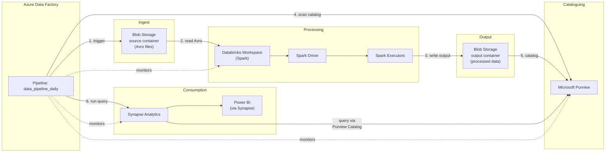

# Azure Data & Analytics Pipeline — Chained Event

## Overview

This chained event models a realistic multi-service data pipeline on Microsoft Azure, mirroring the AWS data pipeline scenario with Azure-native services. It generates correlated log documents and APM traces across five services, enabling end-to-end observability including Elastic Service Map visualization.

## Architecture



## Services Involved

| Service                | Role                                         | Azure Equivalent of AWS |
| ---------------------- | -------------------------------------------- | ----------------------- |
| **Azure Data Factory** | Orchestration (pipeline engine)              | MWAA                    |
| **Blob Storage**       | Raw data storage & output                    | S3                      |
| **Azure Databricks**   | Spark processing (batch ETL)                 | EMR                     |
| **Microsoft Purview**  | Metadata cataloguing & governance            | Glue Data Catalog       |
| **Synapse Analytics**  | Analytics queries (dedicated/serverless SQL) | Athena                  |

## Generated Documents

Each pipeline run produces **6-8 correlated log documents** plus **1 APM trace** (transaction + 5-7 spans):

1. **Data Factory pipeline triggered** — `azure.data_factory` dataset
2. **Blob Storage GetBlob** — `azure.blob_storage` dataset (source Avro file)
3. **Databricks Spark job** — `azure.databricks` dataset (processing)
4. **Blob Storage PutBlob** — `azure.blob_storage` dataset (output Parquet)
5. **Purview scan** — `azure.purview` dataset
6. **Synapse query** — `azure.synapse` dataset
7. **Data Factory pipeline completed** — `azure.data_factory` dataset (with quality check)

All documents share a `labels.pipeline_run_id` for cross-service correlation. Azure diagnostic log fields (`time`, `resourceId`, `operationName`, `category`, `resultType`) are included on all documents. Timing is **orchestrated batch analytics** (stages inside one pipeline run), unlike the **Security Finding**, **IAM Privilege Escalation**, and **Data Exfiltration** chains, which use wider `@timestamp` spacing and `labels.finding_chain_id`, `labels.attack_session_id`, or `labels.exfil_chain_id`.

## Failure Modes

### 1. Null / Empty Source Files (Silent Degradation)

- Blob Storage returns 0 bytes for the source blob
- Databricks Spark processes 0 records, writes 0 output
- Purview discovers 0 assets
- Synapse returns 0 rows
- Data Factory pipeline completes with `quality_check: DEGRADED`
- No hard errors — the issue propagates silently through the chain

### 2. Incorrect File Format (Pipeline Halt)

- Databricks Spark throws `AvroParseException`
- Pipeline halts — no Blob output, no Purview scan, no Synapse query
- Data Factory pipeline fails with `quality_check: FAILED`

### 3. Special Characters in Blob Names (Pipeline Halt)

- Databricks Spark throws `FileNotFoundException` on ABFSS path
- Pipeline halts at the same point as incorrect format
- Data Factory pipeline fails with `quality_check: FAILED`

## APM Traces & Service Map

The generator produces OpenTelemetry-compatible APM traces with Application Insights metadata:

```
adf-data-pipeline (transaction: pipeline_run:data_pipeline_daily)
├── blob.GetBlob (span: storage/blob → blob-st12345678)
├── databricks.SubmitRun (span: compute/databricks → databricks-dbw-12345678)
│   ├── spark.stage.0 (child span)
│   ├── spark.stage.1 (child span)
│   └── spark.stage.N (child span)
├── blob.PutBlob (span: storage/blob → blob-st12345678)
├── purview.Scan (span: catalog/purview → purview-catalog)
└── synapse.SqlQuery (span: query/synapse → synapse-analytics_pool)
```

## Elastic Assets

- **Dashboard**: Azure Data & Analytics Pipeline — overview (12 Lens panels)
- **ML Jobs**: 4 anomaly detection jobs
  - `azure-data-pipeline-duration-anomaly` — slow pipeline detection
  - `azure-data-pipeline-error-spike` — failure rate spike
  - `azure-data-pipeline-null-data` — zero-row Synapse queries
  - `azure-data-pipeline-stage-latency` — Databricks Spark stage anomalies
- **Alerting Rules**: 5 Kibana ES-query rules (installed disabled by default)

| Rule                                                    | Condition                                                   | Index Pattern              |
| ------------------------------------------------------- | ----------------------------------------------------------- | -------------------------- |
| Azure Data Pipeline — High Failure Rate                 | `> 3` Data Factory failures in 15 min                       | `logs-azure.data_factory*` |
| Azure Data Pipeline — Null/Empty Data Detected          | Synapse query returns 0 rows                                | `logs-azure.synapse*`      |
| Azure Data Pipeline — Databricks/Spark Processing Error | Databricks log with `error.type` present                    | `logs-azure.databricks*`   |
| Azure Data Pipeline — Blob Source File Format Error     | Blob name with URL-unsafe chars or non-Avro extension       | `logs-azure.blob_storage*` |
| Azure Data Pipeline — Slow Pipeline Run (>60s)          | Data Factory pipeline completion with `duration_ms > 60000` | `logs-azure.data_factory*` |
