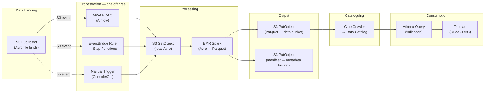
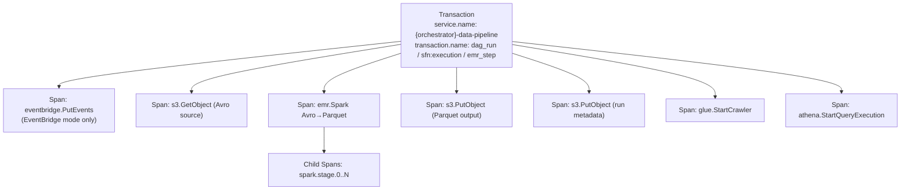
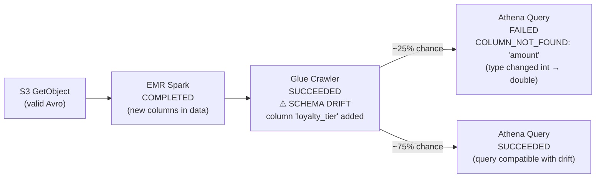

# Data & Analytics Pipeline

A chained event scenario modelling a realistic multi-service AWS data pipeline. Data lands in S3 in **Avro** format, is processed by **Spark on EMR** into **Parquet**, written to S3 with metadata going to a separate bucket, catalogued in **Glue Data Catalog**, and consumed via **Athena** and **Tableau**. The chain generates correlated **log documents, CloudTrail audit events, and APM traces** across all services.

> **Investigation guide for the alerts in this chain:** [../runbooks/data-pipeline-alerts.md](../runbooks/data-pipeline-alerts.md) — five-minute triage, ES|QL queries, containment, and escalation per rule. Each rule also links the chain overview dashboard plus the per-service dashboard for its primary dataset (MWAA / Athena / EMR / S3) — see [../SETUP-WIZARD-AND-UNINSTALL.md → Linked dashboards on alerts](../SETUP-WIZARD-AND-UNINSTALL.md#linked-dashboards-on-alerts).

## Services Involved

| Service                | Role                                                                    | AWS Dataset          |
| ---------------------- | ----------------------------------------------------------------------- | -------------------- |
| **Amazon S3**          | Source (Avro), output (Parquet), metadata (run manifests)               | `aws.s3access`       |
| **Amazon EMR**         | Spark-based Avro → Parquet conversion (EC2, Serverless, or EKS compute) | `aws.emr`            |
| **AWS Glue**           | Data cataloguing, schema discovery, partition management                | `aws.glue`           |
| **Amazon Athena**      | Interactive query + BI connector for Tableau                            | `aws.athena`         |
| **Amazon MWAA**        | Apache Airflow orchestration (one of three orchestration modes)         | `aws.mwaa`           |
| **Amazon EventBridge** | S3 event-driven trigger → Step Functions (alternative orchestration)    | `aws.eventbridge`    |
| **AWS Step Functions** | State machine orchestration (alternative to MWAA)                       | `aws.stepfunctions`  |
| **Tableau**            | BI tool querying processed data via Athena JDBC connector               | (Athena access logs) |

## Orchestration Modes

Each pipeline run randomly selects one of three orchestration modes, reflecting how real teams trigger data pipelines:

| Mode            | Trigger                                     | Flow                                                                                 |
| --------------- | ------------------------------------------- | ------------------------------------------------------------------------------------ |
| **MWAA**        | S3 event notification → Airflow S3KeySensor | MWAA DAG → S3 Get → EMR Spark → S3 Put (data + metadata) → Glue → Athena → Tableau   |
| **EventBridge** | S3 `ObjectCreated` → EventBridge rule → SFN | EventBridge → Step Functions → S3 Get → EMR Spark → S3 Put → Glue → Athena → Tableau |
| **Manual**      | User triggers EMR step via console/CLI      | CloudTrail `AddJobFlowSteps` → S3 Get → EMR Spark → S3 Put → Glue → Athena → Tableau |

## Architecture

### EMR Compute Variants

EMR jobs run on three different compute backends (randomly selected per run):

| Variant            | Description                            | Key Differences                                                                              |
| ------------------ | -------------------------------------- | -------------------------------------------------------------------------------------------- |
| **EMR on EC2**     | Traditional cluster with EC2 instances | Cluster bootstrap logs, YARN-style operational log lines, instance-level Spark executor logs |
| **EMR Serverless** | Fully managed serverless Spark runtime | Application-level logs only, no cluster bootstrap, auto-scaling events                       |
| **EMR on EKS**     | Spark running on Amazon EKS            | Kubernetes pod logs, EKS cluster events, container-level Spark log lines                     |

## Generated Documents

Each pipeline run produces 12–25 documents depending on orchestration mode and success/failure.

### Log Documents

Every document shares a `pipeline_run_id`, `dag_id`, and `orchestration_mode` label for correlation.

| Step | Document                    | `__dataset`                                          | Key Fields                                                                   |
| ---- | --------------------------- | ---------------------------------------------------- | ---------------------------------------------------------------------------- |
| 1    | S3 PutObject (Avro landing) | `aws.s3access`                                       | Trigger event (MWAA/EventBridge modes only)                                  |
| 1b   | Orchestrator start          | `aws.mwaa` / `aws.eventbridge` / `aws.stepfunctions` | Mode-specific trigger and routing                                            |
| 2    | S3 GetObject (source)       | `aws.s3access`                                       | `bucket`, `key` (Avro file), `bytes_sent`                                    |
| 3    | EMR Spark job               | `aws.emr`                                            | `cluster_id`, `spark_app_id`, `input_format: avro`, `output_format: parquet` |
| 4    | S3 PutObject (Parquet)      | `aws.s3access`                                       | `bucket` (data bucket), `key` (Parquet output)                               |
| 5    | S3 PutObject (metadata)     | `aws.s3access`                                       | `bucket` (metadata bucket), `key` (run manifest)                             |
| 6    | Glue Crawler                | `aws.glue`                                           | `crawler_name`, `tables_updated`, `partitions_added`, schema drift info      |
| 7    | Athena validation query     | `aws.athena`                                         | `query_execution_id`, `workgroup`, `data_scanned_bytes`, `rows_returned`     |
| 8    | Tableau BI query            | `aws.athena`                                         | `workgroup: tableau-connector`, `client_request_token`, BI aggregation query |
| 9    | Orchestrator completion     | `aws.mwaa` / `aws.stepfunctions`                     | Duration, quality check result                                               |

### CloudTrail Audit Events

Every API call produces a companion CloudTrail event with full `userIdentity`, `requestParameters`, and `responseElements` — matching what a real CloudTrail trail records.

### APM Trace (1 per run)

The root transaction uses the orchestrator as `service.name` with child spans for each stage:

## Failure Scenarios

The error rate slider controls how frequently failures are injected. Four failure modes are available:

### 1. Null / Empty Source Files

A source file contains zero bytes. The pipeline succeeds technically but produces empty downstream results — a **silent degradation**.

**Detection signals:**

- Spark: `records_read: 0` with `state: COMPLETED`
- Athena: `data_scanned_bytes: 0`
- MWAA: `quality_check: DEGRADED`

### 2. Incorrect File Format

A source file is not valid Avro. EMR Spark throws `AvroParseException` and the pipeline **halts at EMR** — no Glue, Athena, or Tableau stages are produced.

**Detection signals:**

- EMR: `error.type: org.apache.avro.AvroParseException`
- APM: EMR span `outcome: failure`, downstream spans absent

### 3. Special Characters in S3 Keys

S3 paths contain URL-unsafe characters. EMR fails to resolve the path, throwing `FileNotFoundException`.

**Detection signals:**

- EMR: `error.type: java.io.FileNotFoundException` with encoded path
- Pipeline halts at EMR (same as format error)

### 4. Schema Drift in Glue Catalog

The Glue Crawler detects that the Parquet schema has changed — columns added, removed, or type-changed compared to the existing Catalog table. The crawler **succeeds** (it updates the table), but downstream Athena queries may **fail** if they reference columns that were removed or changed type.

**Detection signals:**

- Glue: `schema_change_type: COLUMN_ADDED | COLUMN_REMOVED | TYPE_CHANGED`
- Glue: `log.level: warn` with schema drift details in message
- Glue: companion CloudTrail `UpdateTable` event
- Athena (sometimes): `error.type: COLUMN_NOT_FOUND` — query references a column that was removed or renamed
- Labels: `schema_drift_detected: true`

### Error Rate Behaviour

| Error Rate | Behaviour                                                        |
| ---------- | ---------------------------------------------------------------- |
| 0%         | All pipeline runs succeed end-to-end                             |
| 1-10%      | Occasional failures; primarily null-file and schema drift        |
| 11-30%     | Mix of all four failure modes; some pipeline halts               |
| 31%+       | All four failure modes appear frequently; many pipeline failures |

## User Identity & Audit Trail

Every pipeline run includes **ECS user identity fields** on all operational log documents:

| Field                 | Example                                      | Description                       |
| --------------------- | -------------------------------------------- | --------------------------------- |
| `user.name`           | `jordan.chen`                                | Pipeline operator                 |
| `user.email`          | `jordan.chen@globex.io`                      | Operator email                    |
| `source.ip`           | `10.0.12.34`                                 | Office/VPN source IP              |
| `user_agent.original` | `aws-cli/2.15.0 Python/3.11.6 Darwin/23.4.0` | Tool used to trigger the pipeline |

Companion **CloudTrail audit events** include the full `aws.cloudtrail.user_identity` block with `type`, `arn`, `access_key_id`, and `session_context`.

Users are drawn from a shared `DATA_ENGINEERING_USERS` pool (in `src/helpers/identity.ts`) also used by the **ServiceNow CMDB generator**, enabling cross-index alert enrichment.

## Document Correlation

All documents in a single pipeline run are linked by:

| Correlation Key        | Scope                                 |
| ---------------------- | ------------------------------------- |
| `pipeline_run_id`      | Primary key — all docs in a run       |
| `dag_id`               | Groups runs of the same pipeline      |
| `orchestration_mode`   | Distinguishes manual/mwaa/eventbridge |
| `trace.id`             | Links all APM spans                   |
| `s3_source_bucket/key` | Secondary join path via S3            |

## Supporting Elastic Assets

Installed as part of the setup wizard and tagged with `cloudloadgen`:

### Dashboard: Data Pipeline Health

| Panel                   | Visualisation       | Data Source                                              |
| ----------------------- | ------------------- | -------------------------------------------------------- |
| Pipeline Success Rate   | KPI / gauge         | MWAA logs — `state: success` vs `state: failed`          |
| Stage Latency           | Bar chart per stage | APM spans grouped by `span.destination.service.resource` |
| Error Breakdown         | Donut chart         | EMR + Spark logs grouped by `error.type`                 |
| Null Data Incidents     | Time series         | Athena logs where `data_scanned_bytes: 0`                |
| Schema Drift Events     | Time series         | Glue logs where `schema_drift_detected: true`            |
| Pipeline Duration Trend | Line chart          | APM transaction `duration` over time                     |
| Orchestration Mode Mix  | Donut chart         | All pipeline logs grouped by `orchestration_mode`        |

### ML Anomaly Detection Jobs

| Job ID                               | Detector                                                 | Description                             |
| ------------------------------------ | -------------------------------------------------------- | --------------------------------------- |
| `aws-data-pipeline-duration-anomaly` | `high_mean(transaction.duration.us)`                     | Detects unusually slow pipeline runs    |
| `aws-data-pipeline-error-spike`      | `high_count` on `event.outcome: failure`                 | Detects spikes in pipeline failures     |
| `aws-data-pipeline-null-data`        | `high_count` on `athena.data_scanned_bytes: 0`           | Detects increase in empty query results |
| `aws-data-pipeline-stage-latency`    | `high_mean(span.duration.us)` partitioned by `span.name` | Detects per-stage latency anomalies     |

### Alerting Rules

| Rule                  | Condition                                      | Action                                 |
| --------------------- | ---------------------------------------------- | -------------------------------------- |
| Pipeline Failure Rate | `> 10%` failure rate over 15 min window        | Alert: pipeline reliability degraded   |
| Stage Latency SLA     | Any stage `p95 > 2x` baseline                  | Alert: stage latency SLA breach        |
| Null Data Propagation | `> 3` consecutive Athena queries with `0` rows | Alert: potential null data in pipeline |
| Format Error Spike    | `> 5` AvroParseException errors in 30 min      | Alert: check S3 source file formats    |

## Configuration

### Selecting this Chain in the UI

1. Set event type to **Logs** in the wizard.
2. On the **Advanced Data Types** step, select **Data & Analytics Pipeline**.
3. Adjust the **Error rate** slider to control failure injection.

### ServiceNow CMDB Correlation

When the **ServiceNow CMDB** generator is enabled, CMDB records include CIs matching the cloud infrastructure in this chain. This enables enrichment workflows that look up affected CI owners, support groups, and open incidents from pipeline failure alerts.

A sample Elastic Workflow is provided in [`workflows/data-pipeline-alert-enrichment.yaml`](../../workflows/data-pipeline-alert-enrichment.yaml).

## ML Training Mode

To get ML anomaly detection working effectively:

1. **Reset ML jobs** — clears stale model state
2. **Build a baseline** — ship 5-10 batches at 0% error rate
3. **Wait for ML to learn** — allow 15-30 minutes
4. **Inject anomalies** — ship one batch with anomalies enabled
5. **Stabilise & freeze** — wait for ML to score, then stop datafeeds

The **Ship** page's **ML Training Mode** automates all five steps.
