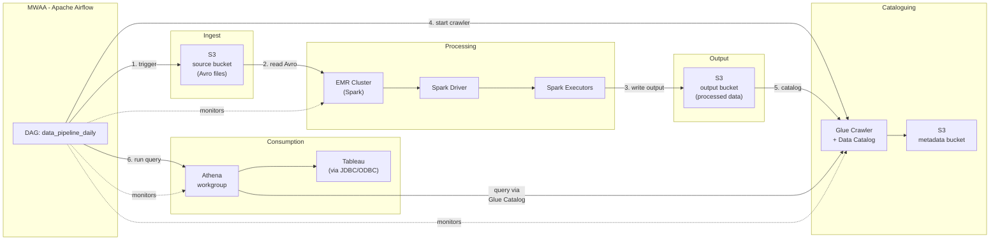
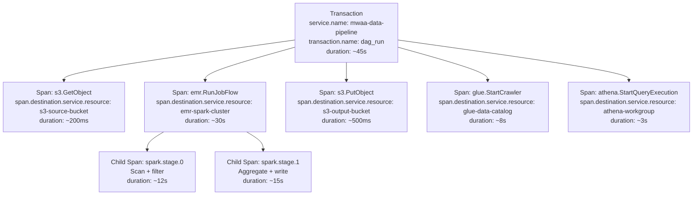
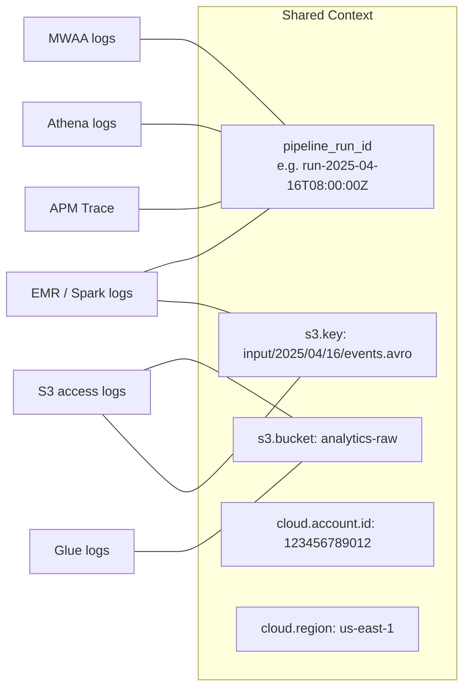
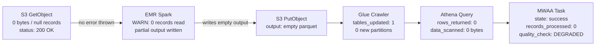
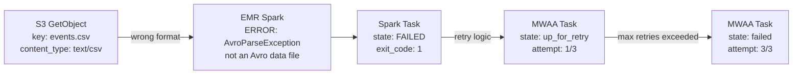
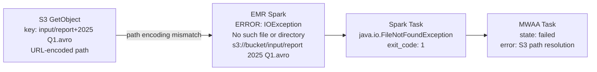
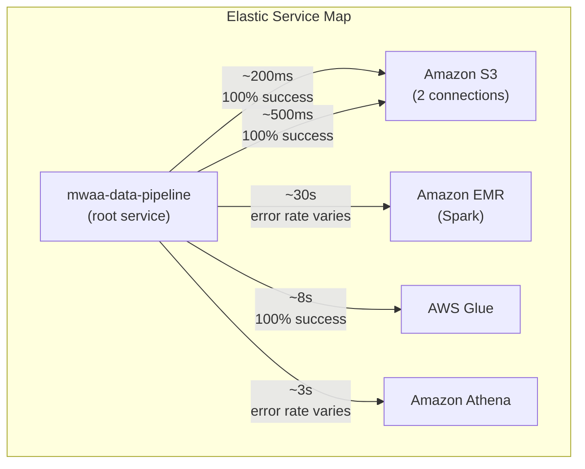

# Data & Analytics Pipeline

A chained event scenario modelling a realistic multi-service AWS data pipeline commonly used by Data & Analytics teams. The chain generates correlated log documents, metrics, and APM traces across S3, EMR (Spark), Glue, Athena, and MWAA (Apache Airflow), enabling end-to-end observability of a production data workflow inside Elastic.

## Services Involved

| Service           | Role                                                                       | AWS Dataset    |
| ----------------- | -------------------------------------------------------------------------- | -------------- |
| **Amazon S3**     | Source and output storage (Avro files, processed output, catalog metadata) | `aws.s3access` |
| **Amazon EMR**    | Spark-based data processing (serverless, EC2, or EKS compute)              | `aws.emr`      |
| **AWS Glue**      | Data cataloguing and metadata generation                                   | `aws.glue`     |
| **Amazon Athena** | Interactive query against the Glue Catalog                                 | `aws.athena`   |
| **Amazon MWAA**   | Apache Airflow orchestration of the full pipeline                          | `aws.mwaa`     |

## Architecture

### EMR Compute Variants

EMR jobs in this pipeline can run on three different compute backends. The generator randomly selects one per pipeline run to produce realistic variety:

| Variant            | Description                            | Key Differences                                                                           |
| ------------------ | -------------------------------------- | ----------------------------------------------------------------------------------------- |
| **EMR on EC2**     | Traditional cluster with EC2 instances | Cluster bootstrap logs, YARN resource manager metrics, instance-level Spark executor logs |
| **EMR Serverless** | Fully managed serverless Spark runtime | Application-level logs only, no cluster bootstrap, auto-scaling events                    |
| **EMR on EKS**     | Spark running on Amazon EKS            | Kubernetes pod logs, EKS cluster events, container-level Spark metrics                    |

## Generated Documents

Each pipeline run produces two categories of output:

### Log Documents (6-8 per run)

Every document shares a `pipeline_run_id` and correlated timestamps. The `__dataset` field routes each document to the correct Elasticsearch data stream.

| Step | Document               | `__dataset`    | Key Fields                                                              |
| ---- | ---------------------- | -------------- | ----------------------------------------------------------------------- |
| 1    | MWAA DAG triggered     | `aws.mwaa`     | `dag_id`, `run_id`, `task_id`, `state: running`                         |
| 2    | S3 GetObject (source)  | `aws.s3access` | `bucket`, `key` (Avro file), `operation: GetObject`, `bytes_sent`       |
| 3    | EMR Step submitted     | `aws.emr`      | `cluster_id`, `step_id`, `spark.app.id`, `state: RUNNING`               |
| 4    | Spark job log          | `aws.emr`      | `spark.stage.id`, `spark.task.count`, `records_read`, `records_written` |
| 5    | S3 PutObject (output)  | `aws.s3access` | `bucket`, `key` (output path), `operation: PutObject`, `bytes_sent`     |
| 6    | Glue Crawler run       | `aws.glue`     | `crawler_name`, `tables_created`, `tables_updated`, `state: SUCCEEDED`  |
| 7    | Athena query execution | `aws.athena`   | `query_execution_id`, `workgroup`, `data_scanned_bytes`, `state`        |
| 8    | MWAA DAG completed     | `aws.mwaa`     | `dag_id`, `run_id`, `state: success/failed`, `duration_ms`              |

### APM Trace (1 per run)

A single distributed trace with the MWAA orchestrator as the root transaction and child spans for each service call. This trace powers the Elastic Service Map.

### Document Correlation

All documents in a single pipeline run are linked by shared identifiers:

The `pipeline_run_id` is the primary correlation key. S3 bucket and key names provide a secondary join path. The APM trace ID (`trace.id`) links all spans within the trace, while `transaction.id` connects back to the MWAA DAG run.

## Failure Scenarios

The error rate slider in the UI controls how frequently failure scenarios are injected. When a failure is triggered, the generator randomly selects one of the following failure modes. Each produces a realistic cascade of correlated error documents across the pipeline.

### Null / Empty Source Files

A source S3 object contains zero bytes or Avro files with only null records. The error propagates silently through the pipeline, producing no hard failures but resulting in empty or null downstream query results.

**Detection signals:**

- Spark log: `records_read: 0` combined with `state: SUCCEEDED`
- Athena log: `data_scanned_bytes: 0` for a query that normally scans gigabytes
- MWAA log: `quality_check: DEGRADED` (custom application-level field)
- APM trace: all spans succeed but Athena span returns `rows: 0`

### Incorrect File Format

A source file in S3 is CSV or JSON instead of expected Avro. EMR Spark throws a deserialization exception and the pipeline fails at the processing stage.

**Detection signals:**

- Spark log: `error.message` contains `AvroParseException` or `not an Avro data file`
- EMR step: `state: FAILED`, `exit_code: 1`
- MWAA log: `state: failed` after `max_retries` attempts
- APM trace: EMR span has `outcome: failure` with error details; downstream spans (Glue, Athena) are absent
- No Glue or Athena documents are produced (pipeline halted)

### Special Characters in S3 Keys

Source file paths contain URL-unsafe characters (`%`, `+`, spaces, unicode). EMR Spark fails to resolve the S3 path, throwing an IOException.

**Detection signals:**

- Spark log: `error.type: java.io.FileNotFoundException` with S3 path containing encoded characters
- EMR step: `state: FAILED` with `IOException` in failure reason
- MWAA log: `state: failed`, `error.message` references S3 path
- APM trace: EMR span has `outcome: failure`; S3 GetObject span succeeds (S3 served the file, EMR couldn't parse the path)
- No Glue or Athena documents are produced (pipeline halted)

## Service Map Visualization

The APM trace structure maps directly to the Elastic Service Map. Each `service.name` becomes a node, and each `span.destination.service.resource` becomes an edge.

### Key APM fields

| Field                               | Value                                                                                                | Purpose                                   |
| ----------------------------------- | ---------------------------------------------------------------------------------------------------- | ----------------------------------------- |
| `service.name`                      | `mwaa-data-pipeline`                                                                                 | Root service node in Service Map          |
| `transaction.name`                  | `dag_run`                                                                                            | Groups all pipeline executions            |
| `span.destination.service.resource` | `s3-source-bucket`, `emr-spark-cluster`, `s3-output-bucket`, `glue-data-catalog`, `athena-workgroup` | Creates edges to downstream service nodes |
| `span.type`                         | `storage`, `compute`, `catalog`, `query`                                                             | Categorises span types                    |
| `span.outcome`                      | `success` / `failure`                                                                                | Drives error rate overlays on edges       |
| `trace.id`                          | UUID shared across all spans                                                                         | Links the entire distributed trace        |

### What you see in Kibana

- **Healthy pipeline**: all nodes green, latency within normal bounds on every edge.
- **Null file scenario**: all nodes green (no hard errors), but the Athena edge shows `0 rows returned` in metadata — requires ML or alerting to detect.
- **Format / path error**: the EMR node turns red with elevated error rate, downstream Glue and Athena nodes show no traffic (pipeline halted before reaching them).

## Supporting Elastic Assets

These assets are installed as part of the Cloud Loadgen Integration for this chained event and tagged with `cloudloadgen`.

### Dashboard: Data Pipeline Health

| Panel                      | Visualisation       | Data Source                                              |
| -------------------------- | ------------------- | -------------------------------------------------------- |
| Pipeline Success Rate      | KPI / gauge         | MWAA logs — `state: success` vs `state: failed`          |
| Stage Latency              | Bar chart per stage | APM spans grouped by `span.destination.service.resource` |
| Error Breakdown            | Donut chart         | EMR + Spark logs grouped by `error.type`                 |
| Null Data Incidents        | Time series         | Athena logs where `data_scanned_bytes: 0`                |
| Pipeline Duration Trend    | Line chart          | APM transaction `duration` over time                     |
| Active Pipelines by Region | Table               | MWAA logs grouped by `cloud.region`                      |

### ML Anomaly Detection Jobs

| Job ID                               | Detector                                                 | Description                             |
| ------------------------------------ | -------------------------------------------------------- | --------------------------------------- |
| `aws-data-pipeline-duration-anomaly` | `high_mean(transaction.duration.us)`                     | Detects unusually slow pipeline runs    |
| `aws-data-pipeline-error-spike`      | `high_count` on `event.outcome: failure`                 | Detects spikes in pipeline failures     |
| `aws-data-pipeline-null-data`        | `high_count` on `athena.data_scanned_bytes: 0`           | Detects increase in empty query results |
| `aws-data-pipeline-stage-latency`    | `high_mean(span.duration.us)` partitioned by `span.name` | Detects per-stage latency anomalies     |

### Alerting Rules

| Rule                  | Condition                                      | Action                                 |
| --------------------- | ---------------------------------------------- | -------------------------------------- |
| Pipeline Failure Rate | `> 10%` failure rate over 15 min window        | Alert: pipeline reliability degraded   |
| Stage Latency SLA     | Any stage `p95 > 2x` baseline                  | Alert: stage latency SLA breach        |
| Null Data Propagation | `> 3` consecutive Athena queries with `0` rows | Alert: potential null data in pipeline |
| Format Error Spike    | `> 5` AvroParseException errors in 30 min      | Alert: check S3 source file formats    |

## Configuration

### Selecting this Chain in the UI

1. Set event type to **Logs** in the wizard.
2. On the **Chained Events** step, select **Data & Analytics Pipeline**.
3. Adjust the **Error rate** slider to control how frequently failure scenarios are injected (0% = all successful runs, higher values = more failures mixed in).

### Error Rate Behaviour

| Error Rate | Behaviour                                                               |
| ---------- | ----------------------------------------------------------------------- |
| 0%         | All pipeline runs succeed end-to-end                                    |
| 1-10%      | Occasional failures; primarily null-file scenarios (silent degradation) |
| 11-30%     | Mix of null-file and format errors; some pipeline halts                 |
| 31%+       | All three failure modes appear; frequent pipeline failures and retries  |

### EMR Compute Variant

The generator randomly selects between EC2, Serverless, and EKS compute for each pipeline run. This produces realistic variety in log formats and metric sources without requiring manual configuration.
