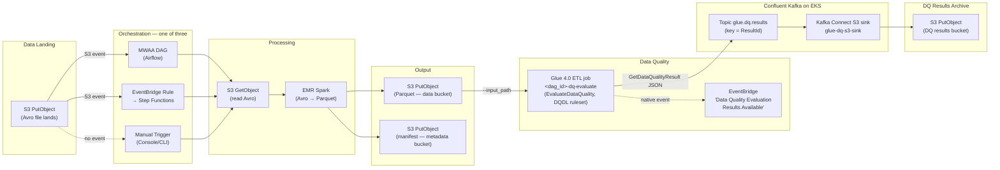
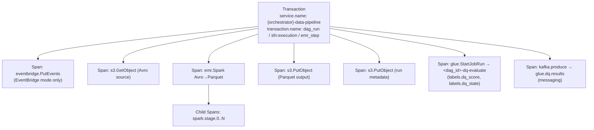
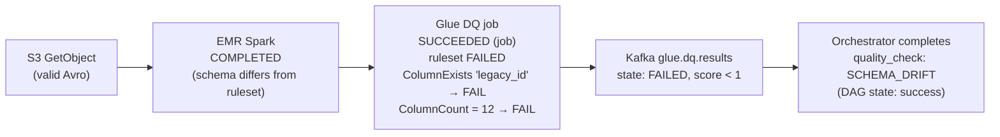

# Data & Analytics Pipeline

A chained event scenario modelling a realistic multi-service AWS data pipeline. Data lands in S3 in **Avro** format, is processed by **Spark on EMR** into **Parquet**, written to S3 with metadata going to a separate bucket, scored by a **Glue Data Quality** job, and the quality result is published to a **Confluent Kafka** topic (self-managed on EKS) from which a **Kafka Connect S3 sink** archives it to the DQ results bucket. The chain generates correlated **log documents, CloudTrail audit events, CloudWatch metrics, OpenLineage events, and APM traces** across all services.

> **Investigation guide for the alerts in this chain:** [../runbooks/data-pipeline-alerts.md](../runbooks/data-pipeline-alerts.md) — five-minute triage, ES|QL queries, containment, and escalation per rule. Each rule also links the chain overview dashboard plus the per-service dashboard for its primary dataset (MWAA / Glue Data Quality / EMR / S3) — see [../SETUP-WIZARD-AND-UNINSTALL.md → Linked dashboards on alerts](../SETUP-WIZARD-AND-UNINSTALL.md#linked-dashboards-on-alerts).
>
> **Run lineage:** [data-pipeline-lineage.md](./data-pipeline-lineage.md) — the OpenLineage events emitted by Airflow (MWAA) and Spark (EMR), how they reach Elastic over an Elastic Agent HTTP endpoint, how raw logs are correlated to a run through native ids, and the lineage dashboard, rules, ML jobs, and demo script built on them.
>
> **Generator source of truth:** `src/aws/generators/dataPipelineChain.ts` (stage order, failure semantics) and `src/aws/generators/glueDataQuality.ts` (the DQ result shape, DQDL ruleset, Kafka/EventBridge/S3-sink documents; the header comment is the `aws.glue_dataquality.*` field contract).

## Services Involved

| Service                    | Role                                                                                                        | AWS Dataset            |
| -------------------------- | ----------------------------------------------------------------------------------------------------------- | ---------------------- |
| **Amazon S3**              | Source (Avro), output (Parquet), metadata (run manifests), DQ results archive (Kafka Connect sink)          | `aws.s3access`         |
| **Amazon EMR**             | Spark-based Avro → Parquet conversion (EC2, Serverless, or EKS compute)                                     | `aws.emr`              |
| **AWS Glue**               | Glue 4.0 ETL job `<dag_id>-dq-evaluate` running the `EvaluateDataQuality` transform (continuous logging)    | `aws.glue`             |
| **AWS Glue Data Quality**  | The evaluation result (`GetDataQualityResult` JSON), consumed from Kafka via the Elastic Agent Kafka input  | `aws.glue_dataquality` |
| **Confluent Kafka on EKS** | Topic `glue.dq.results` (bootstrap `kafka.confluent.svc.cluster.local:9092`); Kafka Connect S3 sink         | `aws.eks`              |
| **Amazon MWAA**            | Apache Airflow orchestration (one of three orchestration modes)                                             | `aws.mwaa`             |
| **Amazon EventBridge**     | S3 event-driven trigger → Step Functions (alternative orchestration); native Glue DQ result event forwarded | `aws.eventbridge`      |
| **AWS Step Functions**     | State machine orchestration (alternative to MWAA)                                                           | `aws.stepfunctions`    |

Ingestion for every AWS service log and metric above is the customer's existing estate — **CloudWatch Logs** and **CloudWatch Metrics** into the AWS integration data streams. The DQ result is the one **Kafka-sourced** stream; the S3 sink bucket is the documented fallback tap (S3-SQS input). See [Glue Data Quality via Confluent Kafka](#glue-data-quality-via-confluent-kafka).

## Orchestration Modes

Each pipeline run randomly selects one of three orchestration modes, reflecting how real teams trigger data pipelines:

| Mode            | Trigger                                     | Flow                                                                                                                     |
| --------------- | ------------------------------------------- | ------------------------------------------------------------------------------------------------------------------------ |
| **MWAA**        | S3 event notification → Airflow S3KeySensor | MWAA DAG → S3 Get → EMR Spark → S3 Put (data + metadata) → Glue DQ job → Kafka `glue.dq.results` → Kafka Connect S3 sink |
| **EventBridge** | S3 `ObjectCreated` → EventBridge rule → SFN | EventBridge → Step Functions → S3 Get → EMR Spark → S3 Put → Glue DQ job → Kafka `glue.dq.results` → S3 sink             |
| **Manual**      | User triggers EMR step via console/CLI      | CloudTrail `AddJobFlowSteps` → S3 Get → EMR Spark → S3 Put → Glue DQ job → Kafka `glue.dq.results` → S3 sink             |

## Architecture


```mermaid
flowchart LR
    subgraph trigger [Data Landing]
        S3land["S3 PutObject\n(Avro file lands)"]
    end

    subgraph orchestration [Orchestration — one of three]
        MWAA["MWAA DAG\n(Airflow)"]
        EB["EventBridge Rule\n→ Step Functions"]
        Manual["Manual Trigger\n(Console/CLI)"]
    end

    subgraph process [Processing]
        S3src["S3 GetObject\n(read Avro)"]
        EMR["EMR Spark\n(Avro → Parquet)"]
    end

    subgraph output [Output]
        S3data["S3 PutObject\n(Parquet — data bucket)"]
        S3meta["S3 PutObject\n(manifest — metadata bucket)"]
    end

    subgraph quality [Data Quality]
        GlueDQ["Glue 4.0 ETL job\n&lt;dag_id&gt;-dq-evaluate\n(EvaluateDataQuality, DQDL ruleset)"]
        EBdq["EventBridge\n'Data Quality Evaluation\nResults Available'"]
    end

    subgraph kafka [Confluent Kafka on EKS]
        Topic["Topic glue.dq.results\n(key = ResultId)"]
        Sink["Kafka Connect S3 sink\nglue-dq-s3-sink"]
    end

    subgraph archive [DQ Results Archive]
        S3dq["S3 PutObject\n(DQ results bucket)"]
    end

    S3land -->|"S3 event"| MWAA
    S3land -->|"S3 event"| EB
    S3land -.->|"no event"| Manual

    MWAA --> S3src
    EB --> S3src
    Manual --> S3src

    S3src --> EMR
    EMR --> S3data
    EMR --> S3meta
    S3data -->|"--input_path"| GlueDQ
    GlueDQ -->|"GetDataQualityResult JSON"| Topic
    GlueDQ -.->|"native event"| EBdq
    Topic --> Sink
    Sink --> S3dq
```

The same picture, drawn against the Elastic ingestion paths: [../images/data-pipeline-lineage-architecture.png](../images/data-pipeline-lineage-architecture.png).

### EMR Compute Variants

EMR jobs run on three different compute backends (randomly selected per run):

| Variant            | Description                            | Key Differences                                                                              |
| ------------------ | -------------------------------------- | -------------------------------------------------------------------------------------------- |
| **EMR on EC2**     | Traditional cluster with EC2 instances | Cluster bootstrap logs, YARN-style operational log lines, instance-level Spark executor logs |
| **EMR Serverless** | Fully managed serverless Spark runtime | Application-level logs only, no cluster bootstrap, auto-scaling events                       |
| **EMR on EKS**     | Spark running on Amazon EKS            | Kubernetes pod logs, EKS cluster events, container-level Spark log lines                     |

## Generated Documents

Each pipeline run produces 15–30 documents depending on orchestration mode and success/failure, plus co-emitted CloudWatch metrics.

### Log Documents

Every document shares `labels.pipeline_run_id`, `labels.dag_id`, and `labels.orchestration_mode` for correlation. These are **enrichment labels**, not fields the AWS services emit — the generator writes them directly; on real data they are attached at ingest time from the OpenLineage events (see [Document Correlation](#document-correlation)).

| Step | Document                         | `__dataset`                                          | Key Fields                                                                                                                                                                                                                               |
| ---- | -------------------------------- | ---------------------------------------------------- | ---------------------------------------------------------------------------------------------------------------------------------------------------------------------------------------------------------------------------------------- |
| 1    | S3 PutObject (Avro landing)      | `aws.s3access`                                       | Trigger event (MWAA/EventBridge modes only)                                                                                                                                                                                              |
| 1b   | Orchestrator start               | `aws.mwaa` / `aws.eventbridge` / `aws.stepfunctions` | Mode-specific trigger and routing                                                                                                                                                                                                        |
| 2    | S3 GetObject (source)            | `aws.s3access`                                       | `bucket`, `key` (Avro file), `bytes_sent`                                                                                                                                                                                                |
| 3    | EMR Spark job                    | `aws.emr`                                            | `cluster_id`, `spark_app_id`, `input_format: avro`, `output_format: parquet`                                                                                                                                                             |
| 4    | S3 PutObject (Parquet)           | `aws.s3access`                                       | `bucket` (data bucket), `key` (Parquet output)                                                                                                                                                                                           |
| 4b   | S3 PutObject (metadata)          | `aws.s3access`                                       | `bucket` (metadata bucket), `key` (run manifest)                                                                                                                                                                                         |
| 5    | Glue Data Quality job run        | `aws.glue`                                           | `job.name: <dag_id>-dq-evaluate`, `job.run_id`, `job.type: glueetl`, `glue_version: 4.0`, `arguments` (`--input_path`, `--pipeline_run_id`, `--dq_topic`, `--bootstrap_servers`), log group `/aws-glue/jobs/output`                      |
| 6    | DQ result (Kafka message)        | `aws.glue_dataquality`                               | `result_id`, `ruleset_name`, `job.{name,run_id}`, `score`, `state`, `rules.{passed,failed,skipped,total}`, `rule_results[]`, `failed_rules[]`, `failed_rule_types[]`; `kafka.{topic,partition,offset,key,block_timestamp,headers}`       |
| 6b   | Native Glue DQ event             | `aws.eventbridge`                                    | `source: aws.glue-dataquality`, `detail_type: Data Quality Evaluation Results Available`, rule `glue-dq-results-to-logs`, `detail` (GLUE_JOB context, `resultID`, `state`, `score`)                                                      |
| 7    | Kafka Connect S3 sink commit     | `aws.eks`                                            | Container log from pod `glue-dq-s3-sink-connect-0` (namespace `confluent`): `Files committed to S3. Target commit offset for glue.dq.results-<p> is <offset>`; log group `/aws/containerinsights/confluent-platform/application`         |
| 7b   | S3 PutObject (DQ results bucket) | `aws.s3access`                                       | `key: topics/glue.dq.results/partition=<p>/glue.dq.results+<p>+<offset>.json`, `requester: …:role/confluent-s3-sink-connector`                                                                                                           |
| 8    | Orchestrator completion          | `aws.mwaa` / `aws.stepfunctions`                     | Duration, `quality_check` (`PASSED` / `DEGRADED` / `SCHEMA_DRIFT` / `DQ_RULES_FAILED` / `FAILED`), `dq_score`, `dq_state`. Only a halted Spark run fails the DAG / execution — DQ rule failures never do (ruleset-failure action `None`) |

### Step Functions execution history (EventBridge mode)

In EventBridge mode the state machine's execution history is delivered as one document per history event, the way CloudWatch Logs delivery at level `ALL` records it:

| `aws.stepfunctions.event_type`                      | `state_name`                                             | Key fields                                                                                                                           |
| --------------------------------------------------- | -------------------------------------------------------- | ------------------------------------------------------------------------------------------------------------------------------------ |
| `ExecutionStarted`                                  | —                                                        | `execution_arn`, `state_machine_arn`, `input` (bucket, key), `event_id: 1`                                                           |
| `TaskStateEntered` → `TaskSucceeded` / `TaskFailed` | `ReadSourceObject`, `RunSparkJob`, `EvaluateDataQuality` | `event_id`, `previous_event_id`, `details` (resource — `glue:startJobRun.sync` for the DQ state, `StepId` / `JobRunId`, error/cause) |
| `ExecutionSucceeded` / `ExecutionFailed`            | `PipelineComplete`                                       | `status`, `output` (`pipeline_run_id`, `records_processed`, `schema_drift`, `dq_state`, `dq_score`)                                  |

### OpenLineage events

Lineage is not stamped onto the raw documents above — it arrives as a separate stream of OpenLineage `RunEvent`s on `logs-aws.openlineage-default` (`event.dataset: aws.openlineage`), emitted by the components that know the graph. Coverage depends on the orchestration mode, exactly as it would in a real account:

| Mode            | Events                                                                                                                                                                                                                                                                                                                            |
| --------------- | --------------------------------------------------------------------------------------------------------------------------------------------------------------------------------------------------------------------------------------------------------------------------------------------------------------------------------- |
| MWAA            | Airflow provider: DAG run START + COMPLETE/FAIL (`job.name = <dag_id>`), 4 task runs (`wait_for_source_file`, `spark_avro_to_parquet`, `write_run_manifest`, `glue_dq_evaluate` — a `GlueJobOperator` with the Parquet prefix declared as an inlet), plus the Spark job with `parent` = the Airflow task and `root` = the DAG run |
| EventBridge     | Spark listener only — `parent` = `root` = the Step Functions execution (`spark.openlineage.parentRunId`); Step Functions has no OpenLineage integration                                                                                                                                                                           |
| Manual          | Spark listener only, no parent                                                                                                                                                                                                                                                                                                    |
| Kafka / S3 sink | None — the Confluent publisher and Kafka Connect are not lineage producers; they appear only in their own logs (`aws.glue_dataquality`, `aws.eks`, `aws.s3access`)                                                                                                                                                                |

The Spark events carry the real input/output datasets with `schema`, `columnLineage`, and `outputStatistics` (row count, size, file count). Full field contract, setup, and ES|QL in [data-pipeline-lineage.md](./data-pipeline-lineage.md).

### CloudTrail Audit Events

Every API call produces a companion CloudTrail event with full `userIdentity`, `requestParameters`, and `responseElements` — matching what a real CloudTrail trail records. For the DQ stages that is `glue:StartJobRun` (orchestrator role; `requestParameters.arguments` carries `--pipeline_run_id`), `glue:GetDataQualityResult` (the Glue job role `AWSGlueServiceRole-<dag_id>-dq`, reading the full result before publishing to Kafka), and `s3:PutObject` on the DQ results bucket (the IRSA role `confluent-s3-sink-connector`, `event_category: Data`).

### CloudWatch Metrics

Each run co-emits a capped set of metric documents to `metrics-aws.{s3,emr,glue,eks}` (plus `metrics-aws.mwaa` or `metrics-aws.{eventbridge,stepfunctions}` depending on mode), stamped with the run's region, account, and `labels.pipeline_run_id`, so the per-service metric dashboards and ML jobs light up in the same window as the logs. The Confluent cluster on EKS is covered by the EKS container-insights metrics.

### APM Trace (1 per run)

The root transaction uses the orchestrator as `service.name` with child spans for each stage:


```mermaid
flowchart TD
    TX["Transaction\nservice.name: {orchestrator}-data-pipeline\ntransaction.name: dag_run / sfn:execution / emr_step"]
    TX --> SpanEB["Span: eventbridge.PutEvents\n(EventBridge mode only)"]
    TX --> SpanS3Get["Span: s3.GetObject (Avro source)"]
    TX --> SpanEMR["Span: emr.Spark Avro→Parquet"]
    SpanEMR --> SparkStages["Child Spans: spark.stage.0..N"]
    TX --> SpanS3Put["Span: s3.PutObject (Parquet output)"]
    TX --> SpanS3Meta["Span: s3.PutObject (run metadata)"]
    TX --> SpanGlue["Span: glue.StartJobRun → &lt;dag_id&gt;-dq-evaluate\n(labels.dq_score, labels.dq_state)"]
    TX --> SpanKafka["Span: kafka.produce → glue.dq.results\n(messaging)"]
```

The Kafka Connect S3 sink is asynchronous and is deliberately **not** part of the orchestrator's trace — nothing the orchestrator runs is in that path.

## Failure Scenarios

The error rate slider controls how frequently failures are injected. Four failure modes are available:

### 1. Null / Empty Source Files

A source file contains zero bytes. The pipeline succeeds technically but produces empty downstream results — a **silent degradation**. The Glue DQ job still runs and catches it.

**Detection signals:**

- Spark: `records_read: 0` with `state: COMPLETED`
- Glue DQ: `RowCount > 0` → `FAIL` with `EvaluationMessage: "Value: 0 does not meet the constraint requirement!"`; `DataFreshness "event_ts" <= 24 hours` → `ERROR` (no rows to evaluate, counted in `rules.skipped`)
- `aws.glue_dataquality.state: FAILED`, `failed_rule_types: [RowCount]`, low `score`
- MWAA: `quality_check: DEGRADED`

### 2. Incorrect File Format

A source file is not valid Avro. EMR Spark throws `AvroParseException` and the pipeline **halts at EMR** — no Glue DQ, Kafka, or S3 sink stages are produced.

**Detection signals:**

- EMR: `error.type: org.apache.avro.AvroParseException`
- APM: EMR span `outcome: failure`, downstream spans absent

### 3. Special Characters in S3 Keys

S3 paths contain URL-unsafe characters. EMR fails to resolve the path, throwing `FileNotFoundException`.

**Detection signals:**

- EMR: `error.type: java.io.FileNotFoundException` with encoded path
- Pipeline halts at EMR (same as format error)

### 4. Schema Drift (caught by Glue Data Quality rules)

The Parquet output's schema differs from what the DQDL ruleset `<dag_id>-parquet-output-ruleset` expects — a column added, removed, or retyped. Spark **succeeds** (it wrote whatever the source contained); the Glue DQ job **succeeds too** (its ruleset-failure action is `None`, the Glue default), but the evaluation result carries `FAIL` rows with Glue's real wording:

| Drift          | Failing rule(s)                                | `EvaluationMessage`                                   |
| -------------- | ---------------------------------------------- | ----------------------------------------------------- |
| Column removed | `ColumnExists "legacy_id"`, `ColumnCount = 12` | `Input data does not include column legacy_id!`       |
| Column added   | `ColumnCount = 12`                             | `Value: 13 does not meet the constraint requirement!` |
| Type change    | `ColumnDataType "amount" = "Integer"`          | `Value: … does not meet the constraint requirement!`  |

**Detection signals:**

- `aws.glue_dataquality.state: FAILED`, `failed_rules[]` / `failed_rule_types[]` containing `ColumnExists`, `ColumnCount`, or `ColumnDataType`; `error.type: DataQualityRuleFailure`
- Glue job log: `log.level: warn`, `failed=<n>` in the `EvaluateDataQuality` summary line
- EventBridge: `Data Quality Evaluation Results Available` with `detail.state: FAILED`
- OpenLineage: the Spark job's `output_schema_fields` differ from the previous run
- Orchestrator: `quality_check: SCHEMA_DRIFT`, `dq_state: FAILED`, `dq_score < 1`; the DAG run / execution still ends `success`
- Labels: `schema_drift_detected: true` (generator convenience label, see [Document Correlation](#document-correlation))

Independently of drift, roughly **5 % of otherwise healthy runs** fail `Completeness "amount" > 0.95` marginally (e.g. `Value: 0.9412 does not meet the constraint requirement!`) — a genuine data-quality signal rather than a pipeline fault, which is why the DQ score-low rule and the DQ score-drift ML job exist alongside the schema-drift rule.


```mermaid
flowchart LR
    S3ok["S3 GetObject\n(valid Avro)"]
    EMRok["EMR Spark\nCOMPLETED\n(schema differs from ruleset)"]
    GlueDQ["Glue DQ job\nSUCCEEDED (job)\nruleset FAILED\nColumnExists 'legacy_id' → FAIL\nColumnCount = 12 → FAIL"]
    Kafka["Kafka glue.dq.results\nstate: FAILED, score < 1"]
    Orch["Orchestrator completes\nquality_check: SCHEMA_DRIFT\n(DAG state: success)"]

    S3ok --> EMRok --> GlueDQ --> Kafka --> Orch
```

### Error Rate Behaviour

| Error Rate | Behaviour                                                                              |
| ---------- | -------------------------------------------------------------------------------------- |
| 0%         | All pipeline runs succeed end-to-end (≈5 % carry a marginal Completeness rule failure) |
| 1-10%      | Occasional failures; primarily null-file and schema drift                              |
| 11-30%     | Mix of all four failure modes; some pipeline halts                                     |
| 31%+       | All four failure modes appear frequently; many pipeline failures                       |

## User Identity & Audit Trail

Every pipeline run includes **ECS user identity fields** on all operational log documents:

| Field                 | Example                                      | Description                       |
| --------------------- | -------------------------------------------- | --------------------------------- |
| `user.name`           | `jordan.chen`                                | Pipeline operator                 |
| `user.email`          | `jordan.chen@globex.io`                      | Operator email                    |
| `source.ip`           | `10.0.12.34`                                 | Office/VPN source IP              |
| `user_agent.original` | `aws-cli/2.15.0 Python/3.11.6 Darwin/23.4.0` | Tool used to trigger the pipeline |

Companion **CloudTrail audit events** include the full `aws.cloudtrail.user_identity` block with `type`, `arn`, `access_key_id`, and `session_context`.

Users are drawn from a shared `DATA_ENGINEERING_USERS` pool (in `src/helpers/identity.ts`) also used by the **ServiceNow CMDB generator**, enabling cross-index alert enrichment.

## Document Correlation

All documents in a single pipeline run are linked by:

| Correlation Key                                       | Scope                                                                                                                                                                                                                                                                                                                                                                                                                                             |
| ----------------------------------------------------- | ------------------------------------------------------------------------------------------------------------------------------------------------------------------------------------------------------------------------------------------------------------------------------------------------------------------------------------------------------------------------------------------------------------------------------------------------- |
| `labels.pipeline_run_id`                              | Primary key — all docs in a run, including CloudTrail companions and the APM transaction. Equals the OpenLineage root run id (DAG run / Step Functions execution). **Enrichment label**: written by the generator; in production attached at ingest by an `enrich` processor keyed on the native ids below, or joined at query time — see [data-pipeline-lineage.md](./data-pipeline-lineage.md#making-labelspipeline_run_id-real--enrich-policy) |
| `labels.dag_id`                                       | Groups runs of the same pipeline (same enrichment path)                                                                                                                                                                                                                                                                                                                                                                                           |
| `labels.orchestration_mode`                           | Distinguishes manual/mwaa/eventbridge (same enrichment path)                                                                                                                                                                                                                                                                                                                                                                                      |
| `aws.mwaa.run_id`                                     | Native — MWAA task/DAG logs ↔ `aws.openlineage.airflow.run_id`                                                                                                                                                                                                                                                                                                                                                                                    |
| `aws.emr.step_id`, `aws.emr.spark_app_id`             | Native — EMR step logs ↔ `aws.openlineage.spark.application_id`; `StepIds` in the CloudTrail `AddJobFlowSteps` response                                                                                                                                                                                                                                                                                                                           |
| `aws.glue.job.run_id`                                 | Native — Glue job log ↔ `jobRunId` in the CloudTrail `StartJobRun` response ↔ `JobRunId` in the DQ result ↔ the `glue_dq_evaluate` task's `GlueJobOperator` output                                                                                                                                                                                                                                                                                |
| `aws.glue_dataquality.result_id`, `.job.run_id`       | Native — DQ result (Kafka) ↔ CloudTrail `GetDataQualityResult` `requestParameters.resultId` ↔ EventBridge `detail.resultID`; `JobRunId` ↔ the `StartJobRun` whose `arguments.--pipeline_run_id` names the run                                                                                                                                                                                                                                     |
| `kafka.key`, `kafka.topic` / `.partition` / `.offset` | Native — the message key is `ResultId`; the partition/offset pair reappears in the Kafka Connect log line (`Target commit offset for glue.dq.results-<p> is <offset>`) and in the sink object key `glue.dq.results+<p>+<startOffset>.json`                                                                                                                                                                                                        |
| `aws.s3access.key`                                    | Native — S3 access logs ↔ the OpenLineage dataset name (`s3://bucket/key`); for the DQ archive, the Confluent DefaultPartitioner key above                                                                                                                                                                                                                                                                                                        |
| `aws.stepfunctions.execution_arn`                     | Native — execution history ↔ the Spark job's parent/root run; `executionArn` in CloudTrail `StartExecution`                                                                                                                                                                                                                                                                                                                                       |
| CloudTrail `requestParameters` / `responseElements`   | Native — `StepIds`, `jobRunId`, `resultId`, `arguments.--pipeline_run_id`, `executionArn`, `dag_run_id`                                                                                                                                                                                                                                                                                                                                           |
| `trace.id`                                            | Links all APM spans, and is carried by the **orchestrator** documents only (Airflow task logs, Step Functions history, EventBridge) — what an ADOT/OTel-instrumented worker emits. Raw S3 / EMR / Glue / Glue DQ result / EKS (Kafka Connect) logs do not carry it                                                                                                                                                                                |

## Glue Data Quality via Confluent Kafka

The DQ result is the only stream in this chain that does not arrive through CloudWatch. What is real, what is synthetic, and what to confirm with the customer:

**How it reaches Elastic.** The Glue job (or the publisher beside it) reads the evaluation through `GetDataQualityResult` and produces the response JSON unchanged to the Confluent topic `glue.dq.results`, key = `ResultId`, headers `content-type: application/json` and `glue-job-run-id: <JobRunId>`. Elastic Agent consumes the topic with the **Custom Kafka Logs** integration:

```yaml
inputs:
  - type: kafka
    streams:
      - data_stream:
          dataset: aws.glue_dataquality
          type: logs
        hosts: ["kafka.confluent.svc.cluster.local:9092"]
        topics: ["glue.dq.results"]
        group_id: elastic-agent-dq
        client_id: elastic-agent
        initial_offset: oldest
        # SASL/TLS to match the Confluent cluster's listener configuration
```

Documents land on `logs-aws.glue_dataquality-default`. The `kafka.*` block (`topic`, `partition`, `offset`, `key`, `block_timestamp`, `headers` as `"k: v"` strings) is exactly what the Elastic Agent kafka input sets; `input.type: kafka`; `message` holds the raw result. The shipped ingest pipeline (Setup → Analytics → **Glue Data Quality**; source `scripts/generate-aws-pipeline-registry.mjs`, key `aws.glue_dataquality`) parses `message` and derives:

| `aws.glue_dataquality.*`                                                                                         | From                                                                                                         |
| ---------------------------------------------------------------------------------------------------------------- | ------------------------------------------------------------------------------------------------------------ |
| `result_id`, `ruleset_name`, `evaluation_context`, `job.name`, `job.run_id`                                      | `ResultId`, `RulesetName`, `EvaluationContext`, `JobName`, `JobRunId`                                        |
| `score` (0–1), `started_on`, `completed_on`, `duration_ms`                                                       | `Score`, `StartedOn`, `CompletedOn` (also `@timestamp` and `event.duration`)                                 |
| `rule_results[]` `{name, description, evaluated_rule, rule_type, result, evaluation_message, evaluated_metrics}` | `RuleResults[]` flattened to snake_case; `rule_type` is the first DQDL token (`RowCount`, `Completeness`, …) |
| `rules.{passed,failed,skipped,total}`, `state` (`SUCCEEDED` \| `FAILED`)                                         | Counted from `Result` (`PASS` / `FAIL` / `ERROR` → skipped); `state` is `FAILED` when any rule failed        |
| `failed_rules[]`, `failed_rule_types[]`                                                                          | The DQDL strings / rule types with `Result: FAIL`                                                            |
| `event.outcome`, `error.type: DataQualityRuleFailure`, `error.message`                                           | Derived — `failure` + a one-line summary of the failed rules when `rules.failed > 0`                         |

**Fallback tap — the S3 sink bucket.** The Kafka Connect S3 sink connector `glue-dq-s3-sink` (IRSA role `confluent-s3-sink-connector`) commits the same records to the DQ results bucket under the Confluent `DefaultPartitioner` layout `topics/glue.dq.results/partition=<p>/glue.dq.results+<p>+<startOffset>.json`. If the customer would rather not open the Kafka listener to the agent, point the AWS integration's **S3 (SQS notification)** input at that bucket with the same `aws.glue_dataquality` dataset — the pipeline is identical, only `kafka.*` is absent and latency follows the connector's `flush.size` / `rotate.interval.ms` (seconds to a minute, which is why the sink documents in the generator land 5–60 s after the message).

**Making `labels.pipeline_run_id` real on the DQ result.** The result carries no run id, but the `StartJobRun` CloudTrail event does (`requestParameters.arguments.--pipeline_run_id`), and both carry `JobRunId`. The AWS CloudTrail integration keeps `request_parameters` / `response_elements` as JSON strings and also exposes them parsed under `aws.cloudtrail.flattened.*`; an enrich policy keyed on the job run id closes the gap:

```json
PUT _enrich/policy/pipeline-run-by-glue-job-run
{
  "match": {
    "indices": "logs-aws.cloudtrail*",
    "query": { "term": { "event.action": "StartJobRun" } },
    "match_field": "aws.cloudtrail.flattened.response_elements.jobRunId",
    "enrich_fields": ["aws.cloudtrail.flattened.request_parameters.arguments.--pipeline_run_id"]
  }
}

POST _enrich/policy/pipeline-run-by-glue-job-run/_execute

PUT _ingest/pipeline/logs-aws.glue_dataquality@custom
{
  "processors": [
    {
      "enrich": {
        "policy_name": "pipeline-run-by-glue-job-run",
        "field": "aws.glue_dataquality.job.run_id",
        "target_field": "_run",
        "ignore_missing": true
      }
    },
    {
      "set": {
        "field": "labels.pipeline_run_id",
        "copy_from": "_run.aws.cloudtrail.flattened.request_parameters.arguments.--pipeline_run_id",
        "if": "ctx._run != null"
      }
    },
    { "remove": { "field": "_run", "ignore_missing": true } }
  ]
}
```

The alternative key is the topic message key: `kafka.key` (= `ResultId`) ↔ `detail.resultID` in the EventBridge `Data Quality Evaluation Results Available` document, which in turn carries `detail.context.jobId` / `runId`. Re-execute the policy on a schedule, as with the Spark-app policy in [data-pipeline-lineage.md](./data-pipeline-lineage.md#making-labelspipeline_run_id-real--enrich-policy).

**Assumptions to confirm with the customer** (these decide which ids the message carries and are modelled, not observed):

1. **How the result is published to Kafka** — a step inside the Glue job (modelled here: the job's `GetDataQualityResult` call appears in CloudTrail under the job role), a Lambda triggered by the EventBridge `Data Quality Evaluation Results Available` event, or a connector. A Lambda publisher would surface as `aws.lambda` logs and a CloudTrail `Invoke`, and might forward the EventBridge `detail` instead of the API response.
2. **Message key and headers** — modelled as key = `ResultId`, headers `content-type` and `glue-job-run-id`. If the customer keys on `JobRunId` or the pipeline run id, the enrich policy above simplifies to a single field match.
3. **Topic name** — `glue.dq.results` is a placeholder; substitute the real topic in the Kafka input, the rules, and the dashboard filters.
4. **`DataSource` is absent** — `GetDataQualityResult` returns a `DataSource` block only for catalog-based evaluations (`StartDataQualityRulesetEvaluationRun`). For an `EvaluateDataQuality` transform inside an ETL job over an S3 path there is no catalog table, so the result has `EvaluationContext` and `JobName` / `JobRunId` instead. Confirm the customer's evaluation is the ETL-transform kind.
5. **Ruleset-failure action** — modelled as `None` (Glue default): DQ failures lower the score but never fail the job, so the DAG / execution ends `success` and `quality_check` on the orchestrator's completion document becomes `DQ_RULES_FAILED` / `SCHEMA_DRIFT`. If the customer uses `Fail job after loading target data` / `Fail job without loading`, the `glue_dq_evaluate` task fails the DAG and the Lineage rules fire too.

Fidelity rules that hold throughout (see [../development.md → Lineage](../development.md#lineage)): the Glue job log, the DQ result, the EventBridge event, the Kafka Connect container log, and the S3 access log carry **no** `trace.id` and no stage/lineage fields; `labels.pipeline_run_id` on them is ingest-time enrichment as above.

## Supporting Elastic Assets

Installed as part of the setup wizard and tagged with `cloudloadgen`:

### Dashboard: Data Pipeline Health

| Panel                   | Visualisation       | Data Source                                                                                  |
| ----------------------- | ------------------- | -------------------------------------------------------------------------------------------- |
| Pipeline Success Rate   | KPI / gauge         | MWAA logs — `state: success` vs `state: failed`                                              |
| Stage Latency           | Bar chart per stage | APM spans grouped by `span.destination.service.resource`                                     |
| Error Breakdown         | Donut chart         | EMR + Spark logs grouped by `error.type`                                                     |
| Null Data Incidents     | Time series         | Glue DQ results where `failed_rule_types: RowCount`                                          |
| Schema Drift Events     | Time series         | Glue DQ results where `failed_rule_types` in `ColumnExists`, `ColumnCount`, `ColumnDataType` |
| DQ Score                | Line / gauge        | `aws.glue_dataquality.score` per `job.name` over time                                        |
| Pipeline Duration Trend | Line chart          | APM transaction `duration` over time                                                         |
| Orchestration Mode Mix  | Donut chart         | All pipeline logs grouped by `orchestration_mode`                                            |

### Dashboard: Data & Analytics Pipeline — run lineage

`installer/aws-custom-dashboards/data-pipeline-lineage-dashboard.json`. ES|QL over `logs-aws.openlineage*`: run KPIs, a "Recent pipeline runs" table (click a run id to filter every panel on `labels.pipeline_run_id`), the run's jobs in execution order with inputs/outputs/rows/error, dataset lineage edges, output schema per job (drift), a duration waterfall, jobs slower than their own p50 baseline (`INLINE STATS`), coverage by orchestration mode, raw evidence with native ids, and the APM trace per run. Walkthrough in [data-pipeline-lineage.md → Dashboard walkthrough](./data-pipeline-lineage.md#dashboard-walkthrough).

### ML Anomaly Detection Jobs

| Job ID                                   | Detector                                                                                          | Description                                                                                                              |
| ---------------------------------------- | ------------------------------------------------------------------------------------------------- | ------------------------------------------------------------------------------------------------------------------------ |
| `aws-data-pipeline-duration-anomaly`     | `high_mean(aws.mwaa.duration_ms)` partitioned by `aws.mwaa.dag_id`                                | Detects unusually slow pipeline runs                                                                                     |
| `aws-data-pipeline-error-spike`          | `high_count` on `event.outcome: failure` across the chain's datasets                              | Detects spikes in pipeline failures                                                                                      |
| `aws-data-pipeline-null-data`            | `high_count` on `aws.glue_dataquality.failed_rule_types: RowCount` by `job.name`                  | Detects increase in empty-output runs (the `RowCount > 0` rule failing)                                                  |
| `aws-data-pipeline-dq-score-drift`       | `low_mean(aws.glue_dataquality.score)` partitioned by `aws.glue_dataquality.job.name`             | DQ score sliding below its own baseline — marginal Completeness failures and drift before the threshold rule fires       |
| `aws-data-pipeline-stage-latency`        | `high_mean(aws.openlineage.run.duration_ms)` partitioned by `aws.openlineage.job.name`            | Per-stage latency from OpenLineage run durations; `labels.pipeline_run_id` is an influencer so the anomaly names the run |
| `aws-data-pipeline-lineage-job-failures` | `high_count` on `aws.openlineage.event_type: FAIL` partitioned by `aws.openlineage.job.name`      | Failure spikes per job                                                                                                   |
| `aws-data-pipeline-lineage-output-rows`  | `low_mean(aws.openlineage.output_statistics.row_count)` partitioned by `aws.openlineage.job.name` | Silent null data — jobs completing with far fewer output rows than usual                                                 |

### Alerting Rules

`installer/aws-custom-rules/data-pipeline-rules.json` — nine rules, all tagged `cloudloadgen`, `data-pipeline`, disabled on install.

| Rule                                                                     | Condition                                                                                      | Notes                                                                                                       |
| ------------------------------------------------------------------------ | ---------------------------------------------------------------------------------------------- | ----------------------------------------------------------------------------------------------------------- |
| Data Pipeline — High Failure Rate                                        | > 3 failed DAG runs in 15 min                                                                  | Links the overview, MWAA, and lineage dashboards                                                            |
| Data Pipeline — Null/Empty Data Detected                                 | ≥ 1 DQ result with `failed_rule_types: RowCount` in 15 min                                     | DQ-based: the `RowCount > 0` rule failed on the Parquet output                                              |
| Data Pipeline — EMR/Spark Processing Error                               | ≥ 1 EMR document with `error.type` in 15 min                                                   |                                                                                                             |
| Data Pipeline — S3 Source File Format Error                              | ≥ 1 non-`.avro` or `%`-encoded key in 15 min                                                   |                                                                                                             |
| Data Pipeline — Slow Pipeline Run (>60s)                                 | ≥ 1 DAG completion with `aws.mwaa.duration_ms > 60000` in 30 min                               |                                                                                                             |
| Data Pipeline — Glue Schema Drift Detected                               | ≥ 1 DQ result with `failed_rule_types` in `ColumnExists`, `ColumnCount`, `ColumnDataType`      | DQ-based: replaces the former crawler schema-change rule                                                    |
| Data Pipeline — DQ Score Low (`cloudloadgen-data-pipeline-dq-score-low`) | ≥ 1 DQ result with `aws.glue_dataquality.score` below threshold (or `state: FAILED`) in 15 min | Catches marginal Completeness failures that are not drift; context: `job.name`, `score`, `failed_rules`     |
| Data Pipeline — Lineage: job failed (per run)                            | OpenLineage `FAIL` event; one alert per (run, job)                                             | Context: `run_id`, `dag`, `job`, `mode`, `integration`, `error`, `inputs`, `owner`                          |
| Data Pipeline — Lineage: job slower than baseline (>2× p50)              | Job duration > 2× its own p50 across the window (`INLINE STATS … BY job`, ≥ 3 runs)            | Context: `run_id`, `dag`, `job`, `duration_ms`, `baseline_p50_ms`, `baseline_p95_ms`, `ratio_pct`, `inputs` |

The seven non-Lineage rules link the lineage dashboard under "Related dashboards" and carry a **Lineage** triage section in their investigation guide. Runbook: [../runbooks/data-pipeline-alerts.md](../runbooks/data-pipeline-alerts.md).

## Configuration

### Selecting this Chain in the UI

1. Set event type to **Logs** in the wizard.
2. On the **Advanced Data Types** step, select **Data & Analytics Pipeline**.
3. Adjust the **Error rate** slider to control failure injection.

### ServiceNow CMDB Correlation

When the **ServiceNow CMDB** generator is enabled, CMDB records include CIs matching the cloud infrastructure in this chain. This enables enrichment workflows that look up affected CI owners, support groups, and open incidents from pipeline failure alerts.

A sample Elastic Workflow is provided in [`workflows/data-pipeline-alert-enrichment.yaml`](../../workflows/data-pipeline-alert-enrichment.yaml). It now prepends the run's OpenLineage lineage (jobs in execution order, jobs never completed, stage duration vs 7-day baseline, the Glue DQ result for the run, raw evidence native ids, APM trace link) to the CMDB context — see [data-pipeline-lineage.md → Alerts with lineage context](./data-pipeline-lineage.md#alerts-with-lineage-context).

## ML Training Mode

To get ML anomaly detection working effectively:

1. **Reset ML jobs** — clears stale model state
2. **Build a baseline** — ship 5-10 batches at 0% error rate
3. **Wait for ML to learn** — allow 15-30 minutes
4. **Inject anomalies** — ship one batch with anomalies enabled
5. **Stabilise & freeze** — wait for ML to score, then stop datafeeds

The **Ship** page's **ML Training Mode** automates all five steps.
