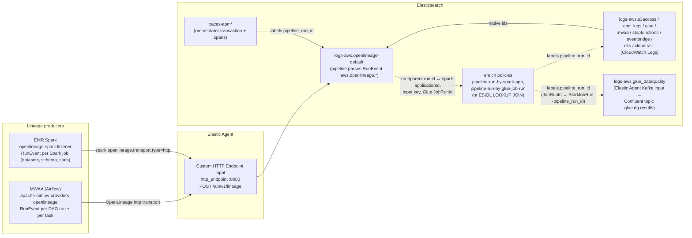
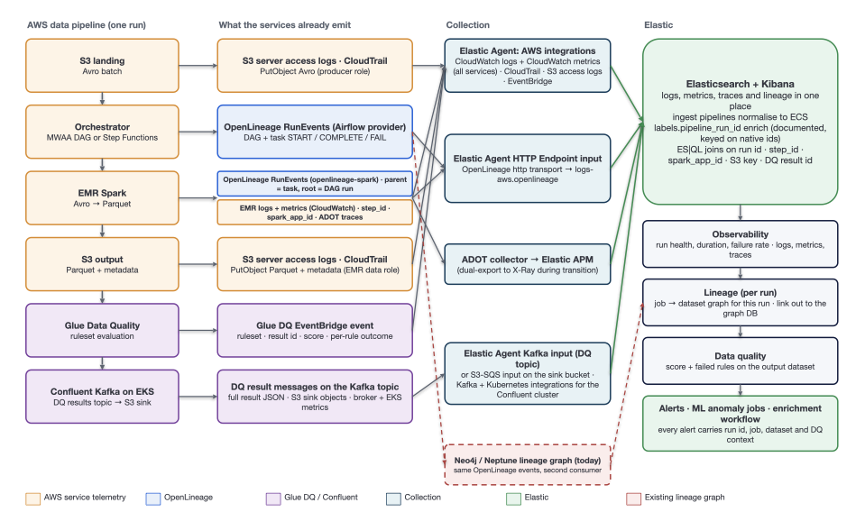

# Data & Analytics Pipeline — run lineage (OpenLineage)

Companion to [data-analytics-pipeline.md](./data-analytics-pipeline.md). That page describes the raw AWS telemetry a pipeline run produces (S3 access logs, EMR step logs, Glue Data Quality job logs and results, Kafka Connect container logs on EKS, MWAA / Step Functions / EventBridge orchestrator logs, CloudTrail, APM). This page describes the **lineage layer on top of it**: OpenLineage `RunEvent`s emitted by Airflow on MWAA and by Spark on EMR, shipped to Elastic through an Elastic Agent HTTP endpoint, and turned into a per-run "which job read what, wrote what, and failed where" view.

> **Investigation guide:** [../runbooks/data-pipeline-alerts.md → Lineage triage](../runbooks/data-pipeline-alerts.md#lineage-triage-all-rules). **Dashboard:** `Data & Analytics Pipeline — run lineage`. **Generator source of truth:** `src/aws/generators/openlineage.ts` (the header comment is the field contract) and `src/aws/generators/dataPipelineChain.ts`.

## Why lineage is emitted by the orchestrator

Real data platforms do **not** stamp lineage onto raw service logs. An S3 server access log records a `GET` on a key; an EMR step log records a Spark application; a Glue job log records a job run; a Glue Data Quality result records a ruleset score; a Kafka Connect log records a committed offset. None of them carry a notion of "stage 3 of pipeline X" — that knowledge lives in the components that hold the graph: the **orchestrator** (Airflow) and the **compute engine** (Spark), both of which have OpenLineage integrations that emit it as structured events.

The load generator follows that split exactly. Raw service documents look like what AWS ships. Lineage is a separate stream of OpenLineage events. The one piece of glue — `labels.pipeline_run_id` on every raw document — is an **enrichment label**, and in production it is produced the way enrichment labels are produced: at ingest time from the OpenLineage events, or at query time with a join. The generator writes it directly so the demo works before you have wired up an enrich policy; the [Real-world setup](#real-world-setup) section shows how to make it real.

| What you see in Elastic                                                                                                             | Native to AWS / OpenLineage                                                               | Synthetic convenience in the load generator                                                                                                          |
| ----------------------------------------------------------------------------------------------------------------------------------- | ----------------------------------------------------------------------------------------- | ---------------------------------------------------------------------------------------------------------------------------------------------------- |
| OpenLineage `RunEvent` JSON (`message`) — job, run, parent/root, facets, inputs, outputs                                            | Yes — Airflow provider / Spark listener wire format                                       | —                                                                                                                                                    |
| Curated `aws.openlineage.*` fields                                                                                                  | Produced by the shipped ingest pipeline `logs-aws.openlineage-default` from the raw event | The generator emits the post-pipeline shape directly (same fields, raw event kept in `message`)                                                      |
| S3 access, EMR, Glue, Glue DQ result (Kafka), EKS/Kafka Connect, MWAA, Step Functions, EventBridge, CloudTrail documents            | Yes — native log shapes                                                                   | —                                                                                                                                                    |
| Native correlation ids (`aws.emr.spark_app_id`, `aws.glue.job.run_id`, `aws.glue_dataquality.result_id`, `kafka.offset`, S3 key, …) | Yes                                                                                       | —                                                                                                                                                    |
| `trace.id` on Airflow task logs / Step Functions history / EventBridge                                                              | Yes, when the worker is ADOT/OTel-instrumented (that is what the generator models)        | —                                                                                                                                                    |
| `trace.id` on raw S3 / EMR / Glue / Glue DQ result / Kafka Connect logs                                                             | **Never** — those services do not emit it                                                 | Deliberately omitted                                                                                                                                 |
| `labels.pipeline_run_id` on raw documents (including CloudTrail companions)                                                         | Not emitted by AWS                                                                        | **Written by the generator.** In production this is an ingest-time `enrich` label keyed on the native ids, or a query-time `LOOKUP JOIN`. See below. |
| `labels.dag_id`, `labels.orchestration_mode` on raw documents                                                                       | Not emitted by AWS                                                                        | **Written by the generator.** Same enrichment path — both are derivable from the OpenLineage event (DAG `job.name`, parent job namespace/name).      |

## Architecture



Raw logs travel their normal paths (CloudWatch Logs / CloudWatch Metrics into the AWS integration data streams — the customer's existing estate) and are untouched by lineage. The Glue DQ result is the one Kafka-sourced stream (Elastic Agent Kafka input on the Confluent topic; the Kafka Connect S3 sink bucket is the fallback tap — see [data-analytics-pipeline.md → Glue Data Quality via Confluent Kafka](./data-analytics-pipeline.md#glue-data-quality-via-confluent-kafka)). The OpenLineage stream is the only new input. The full picture with ingestion paths: 

### Correlation keys

The OpenLineage events are the source of truth for "what belongs to this run". Every raw document carries a **native** identifier that appears verbatim in a lineage event, so the join needs no synthetic ids:

| Raw document            | Native id                                                                                                                                 | Matches on the OpenLineage side                                                                                                                                                                    |
| ----------------------- | ----------------------------------------------------------------------------------------------------------------------------------------- | -------------------------------------------------------------------------------------------------------------------------------------------------------------------------------------------------- |
| MWAA task / DAG log     | `aws.mwaa.run_id`                                                                                                                         | `aws.openlineage.airflow.run_id` (the `airflow` run facet's `dagRun.run_id`)                                                                                                                       |
| EMR step log            | `aws.emr.step_id`, `aws.emr.spark_app_id`                                                                                                 | `aws.openlineage.spark.application_id` (== `spark_applicationDetails.applicationId`)                                                                                                               |
| S3 access log           | `aws.s3access.key`                                                                                                                        | the dataset `name` in `aws.openlineage.inputs[]` / `outputs[]` (`s3://bucket/key`)                                                                                                                 |
| Glue DQ job log         | `aws.glue.job.run_id`                                                                                                                     | `jobRunId` in the CloudTrail `StartJobRun` response, whose `arguments.--pipeline_run_id` is the root run id; the `glue_dq_evaluate` task (GlueJobOperator) reports the Parquet prefix as its input |
| Glue DQ result (Kafka)  | `aws.glue_dataquality.result_id`, `aws.glue_dataquality.job.run_id`, `kafka.key` (= ResultId)                                             | `JobRunId` ↔ the same `StartJobRun`; `ResultId` ↔ CloudTrail `GetDataQualityResult` `resultId` and EventBridge `detail.resultID`. Not an OpenLineage match — the join goes through CloudTrail      |
| Kafka Connect / S3 sink | `kafka.partition` + `kafka.offset`, `aws.s3access.key` (`topics/glue.dq.results/partition=<p>/glue.dq.results+<p>+<offset>.json`)         | the DQ result's `kafka.partition` / `kafka.offset`; the EKS log line `Target commit offset for glue.dq.results-<p> is <offset>`                                                                    |
| Step Functions history  | `aws.stepfunctions.execution_arn`                                                                                                         | `aws.openlineage.run.parent.*` / `run.root.*` of the Spark job (parent = the state machine execution)                                                                                              |
| CloudTrail companion    | `requestParameters` / `responseElements` — `StepIds`, `jobRunId`, `resultId`, `arguments.--pipeline_run_id`, `executionArn`, `dag_run_id` | the same ids as above                                                                                                                                                                              |

**Root vs parent.** The ParentRunFacet (1-1-0) carries both `parent` (the immediate caller) and `root` (the top of the tree). A Spark job launched by an Airflow task has `parent` = the task run and `root` = the DAG run; a Spark job launched by Step Functions has `parent` = `root` = the state machine execution. The Airflow provider injects `spark.openlineage.rootParentRunId` / `rootParentJobName` / `rootParentJobNamespace` alongside the `parentRunId` properties for exactly this reason. The ingest pipeline resolves `labels.pipeline_run_id` as **`run.root.id` → `run.parent.id` → `run.id`**, so every event in a run — DAG, task, Spark — lands on the same value in one hop. Without `root` you would need a two-hop join (Spark → task → DAG) to group Spark events with their DAG.

## Real-world setup

### Airflow on MWAA

Add to the MWAA environment's Airflow configuration options (or `airflow.cfg` on self-managed Airflow) and install `apache-airflow-providers-openlineage` in `requirements.txt`:

```ini
[openlineage]
namespace = mwaa-prod
transport = {"type":"http","url":"https://<elastic-agent-host>:8080","endpoint":"api/v1/lineage"}
spark_inject_parent_job_info = True
```

Equivalent environment variables: `AIRFLOW__OPENLINEAGE__NAMESPACE`, `AIRFLOW__OPENLINEAGE__TRANSPORT`, `AIRFLOW__OPENLINEAGE__SPARK_INJECT_PARENT_JOB_INFO`.

What the provider emits (producer `https://github.com/apache/airflow/tree/providers-openlineage/<version>`):

- **One RunEvent per DAG run** — `job.name = <dag_id>`, `eventType` START then COMPLETE or FAIL; run facets `nominalTime`, `processing_engine`, and on completion `airflowState` (`dagRunState`, `tasksState` per task).
- **One RunEvent pair per task instance** — `job.name = "<dag_id>.<task_id>"`; run facets `airflow` (`dag`, `dagRun`, `task`, `taskInstance`, `taskUuid`), `parent` → the DAG run, `errorMessage` on FAIL; job facets `jobType` (`integration: AIRFLOW`, `jobType: TASK|DAG`, `processingType: BATCH`), `ownership`, `documentation`.
- **Task-level datasets** come from operator extractors (`S3KeySensor` reports the key as an input) or from explicit task `inlets` / `outlets` (the `PythonOperator` manifest write declares the Parquet prefix as an inlet and the manifest key as an outlet; `GlueJobOperator` for `glue_dq_evaluate` has no dataset extractor of its own, so the DAG declares the Parquet prefix `s3://<output bucket><output prefix>` as an **inlet** — the provider reports it as the task's INPUT, and the task has no lineage output because the DQ result goes to Kafka, not to a dataset Airflow knows about).
- `spark_inject_parent_job_info = True` makes Spark jobs submitted by Airflow operators carry `parent` (the task run) and `root` (the DAG run) facets automatically.

### Spark on EMR

Add the `openlineage-spark` listener to the step's `spark-submit`:

```bash
spark-submit \
  --packages io.openlineage:openlineage-spark_2.12:<version> \
  --conf spark.extraListeners=io.openlineage.spark.agent.OpenLineageSparkListener \
  --conf spark.openlineage.transport.type=http \
  --conf spark.openlineage.transport.url=https://<elastic-agent-host>:8080 \
  --conf spark.openlineage.transport.endpoint=api/v1/lineage \
  --conf spark.openlineage.namespace=mwaa-prod \
  # only when NOT launched by Airflow (e.g. from a Step Functions state):
  --conf spark.openlineage.parentRunId=<execution-uuid> \
  --conf spark.openlineage.parentJobName=<state-machine-name> \
  --conf spark.openlineage.parentJobNamespace=mwaa-prod \
  ...
```

What the listener emits (producer `https://github.com/OpenLineage/OpenLineage/tree/<version>/integration/spark`):

- START / COMPLETE / FAIL with the **real** input and output datasets — `dataSource`, `schema`, `columnLineage`, and `outputStatistics` (`rowCount`, `size`, `fileCount`).
- Run facets `spark_applicationDetails` (`applicationId`, `appName`, `master`, `deployMode`, `driverHost`), `spark_properties`, `processing_engine`, and `parent` when a parent is configured or injected.
- Job naming `<appName>.execute_insert_into_hadoop_fs_relation_command.<output_dataset>` (`spark.openlineage.jobName.appendDatasetName` defaults to true).

Manual `add-steps` submissions with no parent properties produce Spark lineage with no parent — that is genuinely what ad-hoc runs look like.

### Elastic Agent — Custom HTTP Endpoint input

Add a **Custom HTTP Endpoint Logs** integration to the agent policy on the host both MWAA and EMR can reach:

```yaml
inputs:
  - type: http_endpoint
    streams:
      - data_stream:
          dataset: aws.openlineage
          type: logs
        listen_address: 0.0.0.0
        listen_port: 8080
        url: /api/v1/lineage
        content_type: application/json
        ssl.certificate: /etc/elastic-agent/certs/agent.crt
        ssl.key: /etc/elastic-agent/certs/agent.key
        # optional: secret.header / secret.value, or basic_auth, to match the
        # OpenLineage transport's auth settings
```

Documents land on `logs-aws.openlineage-default`. The load generator installs the ingest pipeline of the same name (Setup → Analytics → **OpenLineage**), which extracts the curated fields in the [field reference](#field-reference) and leaves the raw event in `message`. In the load generator, select the **OpenLineage** service (Analytics group) for standalone events, or the **Data & Analytics Pipeline** chain for events correlated with raw logs; its ingestion-source default is `api` (HTTP endpoint).

### Making `labels.pipeline_run_id` real — enrich policy

The OpenLineage stream already knows the run id for every native id. An enrich policy turns that into a label on the raw logs at ingest time. Example for EMR step logs, keyed on the Spark application id:

```json
PUT _enrich/policy/pipeline-run-by-spark-app
{
  "match": {
    "indices": "logs-aws.openlineage*",
    "match_field": "aws.openlineage.spark.application_id",
    "enrich_fields": ["labels.pipeline_run_id", "labels.dag_id", "labels.orchestration_mode"]
  }
}

POST _enrich/policy/pipeline-run-by-spark-app/_execute
```

Then in the `logs-aws.emr_logs@custom` pipeline (the `@custom` hook keeps the change out of the managed integration pipeline):

```json
PUT _ingest/pipeline/logs-aws.emr_logs@custom
{
  "processors": [
    {
      "enrich": {
        "policy_name": "pipeline-run-by-spark-app",
        "field": "aws.emr.spark_app_id",
        "target_field": "_run",
        "ignore_missing": true
      }
    },
    {
      "set": {
        "field": "labels.pipeline_run_id",
        "copy_from": "_run.labels.pipeline_run_id",
        "if": "ctx._run != null && ctx._run.labels != null"
      }
    },
    { "remove": { "field": "_run", "ignore_missing": true } }
  ]
}
```

The match field on the OpenLineage side is `aws.openlineage.spark.application_id`; the enriched value is `labels.pipeline_run_id`, which the OpenLineage pipeline already resolved to the **root** run — so an EMR log picks up the DAG run id (or the Step Functions execution) in a single hop. Repeat the pattern for the other streams with the matching native id: S3 access logs on `aws.s3access.key` against an `MV_EXPAND`-ed copy of `inputs`/`outputs`, MWAA logs on `aws.mwaa.run_id` against `aws.openlineage.airflow.run_id`. The Glue DQ job log and the DQ result are the exception: neither appears in OpenLineage with a native id, so their policy is keyed on **`JobRunId`** against the CloudTrail `StartJobRun` event (whose `arguments.--pipeline_run_id` names the run) — recipe in [data-analytics-pipeline.md → Glue Data Quality via Confluent Kafka](./data-analytics-pipeline.md#glue-data-quality-via-confluent-kafka).

Two operational notes:

- Enrich indices are snapshots. `POST _enrich/policy/<name>/_execute` must be **re-run on a schedule** (a Kibana Workflow, a cron'd curl, or Watcher) so that runs started since the last execution are matched; documents arriving before the policy re-executes will miss the label. Set the OpenLineage event's arrival ahead of the EMR log (it usually is — the listener posts on job start) and keep the execute interval short.
- On Elasticsearch **9.1+** you can skip the enrich round-trip and join at query time: reindex (or `_reindex` on a schedule) the OpenLineage stream into an index created with `index.mode: lookup`, then `LOOKUP JOIN pipeline_runs ON spark_app_id` from ES|QL — see the [cookbook](#esql-cookbook).

## Field reference

Index `logs-aws.openlineage*`, `event.dataset: aws.openlineage`. Curated fields are produced by the `logs-aws.openlineage-default` pipeline from the RunEvent in `message`.

| Field                                                                                                       | Type         | Source in the RunEvent                                            | Notes                                                                                         |
| ----------------------------------------------------------------------------------------------------------- | ------------ | ----------------------------------------------------------------- | --------------------------------------------------------------------------------------------- |
| `aws.openlineage.event_type`                                                                                | keyword      | `eventType`                                                       | START, RUNNING, COMPLETE, FAIL, ABORT                                                         |
| `aws.openlineage.event_time`                                                                                | date         | `eventTime`                                                       | Also `@timestamp`                                                                             |
| `aws.openlineage.producer`, `.schema_url`                                                                   | keyword      | `producer`, `schemaURL`                                           | Airflow provider vs Spark integration URI                                                     |
| `aws.openlineage.run.id`                                                                                    | keyword      | `run.runId`                                                       | UUID                                                                                          |
| `aws.openlineage.run.parent.id`, `.job_name`, `.job_namespace`                                              | keyword      | `run.facets.parent.run.runId`, `.job.name`, `.job.namespace`      | Immediate parent: DAG run for tasks; Airflow task or Step Functions execution for Spark       |
| `aws.openlineage.run.root.id`, `.job_name`                                                                  | keyword      | `run.facets.parent.root.run.runId`, `.root.job.name`              | Top of the tree (DAG run or state machine execution). Equal to parent when there is one level |
| `aws.openlineage.run.duration_ms`                                                                           | long         | COMPLETE/FAIL `eventTime` − START `eventTime`                     | Terminal events only                                                                          |
| `aws.openlineage.run.nominal_start_time`                                                                    | date         | `run.facets.nominalTime.nominalStartTime`                         | Airflow schedule interval start                                                               |
| `aws.openlineage.job.namespace`, `.name`                                                                    | keyword      | `job.namespace`, `job.name`                                       | `mwaa-<env>`; `<dag_id>`, `<dag_id>.<task_id>`, or the Spark job name                         |
| `aws.openlineage.job.type`, `.integration`, `.processing_type`                                              | keyword      | `job.facets.jobType`                                              | DAG, TASK, JOB · AIRFLOW, SPARK · BATCH                                                       |
| `aws.openlineage.processing_engine.name`, `.version`                                                        | keyword      | `run.facets.processing_engine`                                    | Airflow 2.x / Spark 3.x                                                                       |
| `aws.openlineage.airflow.dag_id`, `.run_id`, `.task_id`, `.try_number`, `.operator_class`, `.dag_run_state` | keyword      | `run.facets.airflow.*`, `run.facets.airflowState.dagRunState`     | Airflow events only                                                                           |
| `aws.openlineage.spark.application_id`, `.app_name`, `.master`, `.deploy_mode`                              | keyword      | `run.facets.spark_applicationDetails.*`                           | Spark events only; `application_id` == `aws.emr.spark_app_id`                                 |
| `aws.openlineage.inputs[]`, `.outputs[]`                                                                    | keyword      | `inputs[].namespace + name`, `outputs[]…`                         | `s3://bucket/key` (Avro source, Parquet prefix, manifest key)                                 |
| `aws.openlineage.input_count`, `.output_count`                                                              | integer      | array lengths                                                     |                                                                                               |
| `aws.openlineage.output_statistics.row_count`, `.size`, `.file_count`                                       | long         | `outputs[].outputFacets.outputStatistics`                         | Spark COMPLETE only — where silent null data shows up                                         |
| `aws.openlineage.output_schema_fields[]`                                                                    | keyword      | `outputs[].facets.schema.fields` as `name:type`                   | Column drift is visible run-over-run                                                          |
| `aws.openlineage.sql.query`, `.dialect`                                                                     | text/keyword | `job.facets.sql`                                                  | Populated only by SQL operators; none in this DAG today                                       |
| `event.action`                                                                                              | keyword      | = `event_type`                                                    |                                                                                               |
| `event.outcome`                                                                                             | keyword      | COMPLETE → success, FAIL/ABORT → failure, START/RUNNING → unknown |                                                                                               |
| `event.type`, `event.duration`                                                                              |              | start/end; `duration_ms` × 1e6 (ns) on terminal events            | ECS                                                                                           |
| `error.message`, `.type`, `.stack_trace`                                                                    | text         | `run.facets.errorMessage`                                         | FAIL only                                                                                     |
| `user.name`                                                                                                 | keyword      | `job.facets.ownership.owners[0].name`                             | DAG owner                                                                                     |
| `labels.pipeline_run_id`                                                                                    | keyword      | `run.root.id` → `run.parent.id` → `run.id`                        | Same value on the DAG, its tasks, and the Spark job                                           |
| `labels.dag_id`, `labels.orchestration_mode`                                                                | keyword      | derived                                                           | `mwaa`, `eventbridge`, `manual`                                                               |
| `cloud.service.name`                                                                                        | keyword      | producer                                                          | `mwaa` or `emr`                                                                               |
| `message`                                                                                                   | text         | the raw RunEvent JSON                                             | Full facets preserved                                                                         |

## Coverage by orchestration mode

Lineage coverage is deliberately uneven, because that is what you get in a real account:

| Mode                             | Airflow lineage                                                                                                                                                | Spark lineage                                                          | Native orchestrator evidence                                                                                                                                                                                                                                                                                                                     |
| -------------------------------- | -------------------------------------------------------------------------------------------------------------------------------------------------------------- | ---------------------------------------------------------------------- | ------------------------------------------------------------------------------------------------------------------------------------------------------------------------------------------------------------------------------------------------------------------------------------------------------------------------------------------------ |
| **MWAA**                         | Full — DAG run + 4 tasks: `wait_for_source_file`, `spark_avro_to_parquet`, `write_run_manifest`, `glue_dq_evaluate` (GlueJobOperator, Parquet prefix as inlet) | Yes, `parent` = the `spark_avro_to_parquet` task, `root` = the DAG run | MWAA task logs (`trace.id`), `dag_complete` doc (`quality_check`, `dq_score`, `dq_state`)                                                                                                                                                                                                                                                        |
| **EventBridge → Step Functions** | None — Step Functions has no OpenLineage integration                                                                                                           | Yes, `parent` = `root` = the state machine execution                   | Step Functions execution history: `aws.stepfunctions.event_type` `ExecutionStarted` / `TaskStateEntered` / `TaskSucceeded` / `TaskFailed` / `ExecutionSucceeded` / `ExecutionFailed`, `state_name` `ReadSourceObject` / `RunSparkJob` / `EvaluateDataQuality` (`glue:startJobRun.sync`), `event_id`, `previous_event_id`, `details` (`trace.id`) |
| **Manual** (`add-steps`)         | None                                                                                                                                                           | Yes, **no parent**                                                     | CloudTrail `AddJobFlowSteps` only                                                                                                                                                                                                                                                                                                                |
| **Glue DQ → Kafka → S3 sink**    | None — the DQ publisher and Kafka Connect are not lineage producers                                                                                            | n/a                                                                    | `aws.glue_dataquality` result (Kafka input), EventBridge `Data Quality Evaluation Results Available`, EKS container log from `glue-dq-s3-sink-connect-0`, S3 access log on the DQ results bucket, CloudTrail `StartJobRun` / `GetDataQualityResult` / `PutObject`                                                                                |

The last row is a useful talking point: the DQ result crossing Kafka into the results bucket appears in Glue's, Confluent's, and S3's own logs but never in lineage, because nothing that knows the graph is in the loop. That is _why the orchestrator has to emit lineage_ — and why the "Lineage coverage by orchestration mode" panel exists.

The Glue DQ job is configured with ruleset-failure action `None` (the Glue default), so failed rules lower the score but never fail the `glue_dq_evaluate` task: the MWAA `dag_complete` document and the DAG-level OpenLineage event show `success` with `quality_check: DQ_RULES_FAILED` (or `SCHEMA_DRIFT`) and `dq_score` / `dq_state` recorded. Only a halted Spark run (`AvroParseException`, `FileNotFoundException`) fails the DAG run — the same semantics as a real `DagRun` under default trigger rules.

## ES|QL cookbook

All queries assume the curated fields; swap `<run_id>` for a `labels.pipeline_run_id` from the dashboard's "Recent pipeline runs" table.

**Per-run lineage — one row per job in execution order**

```esql
FROM logs-aws.openlineage*
| WHERE labels.pipeline_run_id == "<run_id>"
| STATS started = MIN(@timestamp),
        events = MV_CONCAT(MV_SORT(VALUES(aws.openlineage.event_type), "DESC"), " → "),
        duration_ms = MAX(aws.openlineage.run.duration_ms),
        inputs = MV_CONCAT(VALUES(aws.openlineage.inputs), " | "),
        outputs = MV_CONCAT(VALUES(aws.openlineage.outputs), " | "),
        rows_written = MAX(aws.openlineage.output_statistics.row_count),
        error = MV_CONCAT(VALUES(error.message), " | ")
  BY job = aws.openlineage.job.name, integration = aws.openlineage.job.integration, job_type = aws.openlineage.job.type
| SORT started ASC
```

**Dataset lineage edges (input → job → output)**

```esql
FROM logs-aws.openlineage*
| WHERE aws.openlineage.event_type == "COMPLETE" AND aws.openlineage.output_count > 0
| MV_EXPAND aws.openlineage.inputs
| MV_EXPAND aws.openlineage.outputs
| STATS edge_count = COUNT() BY input = aws.openlineage.inputs, job = aws.openlineage.job.name, output = aws.openlineage.outputs
| SORT edge_count DESC
```

**Jobs slower than their own baseline (INLINE STATS)**

```esql
FROM logs-aws.openlineage*
| WHERE aws.openlineage.run.duration_ms IS NOT NULL AND aws.openlineage.job.type != "DAG"
| STATS duration_ms = MAX(aws.openlineage.run.duration_ms), started = MIN(@timestamp)
  BY run_id = labels.pipeline_run_id, job = aws.openlineage.job.name
| INLINE STATS baseline_p50_ms = PERCENTILE(duration_ms, 50), baseline_p95_ms = PERCENTILE(duration_ms, 95) BY job
| EVAL ratio_pct = ROUND(100.0 * duration_ms / baseline_p50_ms, 0)
| WHERE ratio_pct >= 150
| SORT ratio_pct DESC
```

**Downstream impact — jobs that started but never completed (outputs never produced)**

```esql
FROM logs-aws.openlineage*
| WHERE labels.pipeline_run_id == "<run_id>" AND aws.openlineage.job.type != "DAG"
| STATS has_start = MAX(CASE(aws.openlineage.event_type == "START", 1, 0)),
        has_complete = MAX(CASE(aws.openlineage.event_type == "COMPLETE", 1, 0)),
        outputs = MV_CONCAT(VALUES(aws.openlineage.outputs), " | ")
  BY job = aws.openlineage.job.name
| WHERE has_start == 1 AND has_complete == 0
```

Alternatively, take the failed job's `outputs` and search `inputs` across later runs — any job whose `inputs` contains the URI is a downstream consumer.

**Raw evidence — native ids behind the lineage**

```esql
FROM logs-aws.s3access*, logs-aws.emr_logs*, logs-aws.glue*, logs-aws.glue_dataquality*, logs-aws.eks*, logs-aws.mwaa*, logs-aws.stepfunctions*, logs-aws.cloudtrail*
| WHERE labels.pipeline_run_id == "<run_id>"
| EVAL native_id = COALESCE(aws.emr.step_id, aws.glue_dataquality.result_id, aws.glue.job.run_id, aws.s3access.request_id,
                            aws.stepfunctions.execution_arn, aws.mwaa.run_id, aws.cloudtrail.request_id, kubernetes.pod.name),
       detail = COALESCE(aws.s3access.key, aws.emr.spark_app_id, aws.stepfunctions.state_name, aws.mwaa.task_id,
                         MV_CONCAT(aws.glue_dataquality.failed_rules, "; "), TO_STRING(kafka.offset), event.action)
| KEEP @timestamp, event.dataset, event.outcome, native_id, detail, error.type, error.message
| SORT @timestamp ASC
| LIMIT 200
```

**The DQ result for a run — score, state, failed rules**

```esql
FROM logs-aws.glue_dataquality*
| WHERE labels.pipeline_run_id == "<run_id>"
| KEEP @timestamp, aws.glue_dataquality.job.name, aws.glue_dataquality.job.run_id, aws.glue_dataquality.result_id,
       aws.glue_dataquality.score, aws.glue_dataquality.state, aws.glue_dataquality.rules.failed, aws.glue_dataquality.rules.total,
       aws.glue_dataquality.failed_rules, aws.glue_dataquality.failed_rule_types, kafka.topic, kafka.partition, kafka.offset
```

**Query-time join without the label (9.1+, `LOOKUP JOIN`)** — assumes `pipeline_runs` is a lookup-mode index holding `spark_app_id`, `pipeline_run_id` copied from the OpenLineage stream:

```esql
FROM logs-aws.emr_logs*
| WHERE aws.emr.spark_app_id IS NOT NULL
| EVAL spark_app_id = aws.emr.spark_app_id
| LOOKUP JOIN pipeline_runs ON spark_app_id
| STATS steps = COUNT(), failures = COUNT() WHERE event.outcome == "failure" BY pipeline_run_id
```

**Logs ↔ APM pivot** — the orchestrator's APM transaction carries the same label:

```esql
FROM traces-apm*
| WHERE labels.pipeline_run_id == "<run_id>" AND processor.event == "transaction"
| KEEP trace.id, service.name, transaction.name, transaction.duration.us
```

Open `/app/apm/link-to/trace/<trace.id>` for the waterfall. The orchestrator log documents (MWAA task logs, Step Functions history, EventBridge) share that `trace.id`; the raw S3 / EMR / Glue / Glue DQ result / Kafka Connect documents do not, so the pivot from those goes through `labels.pipeline_run_id`.

## Dashboard walkthrough

`Data & Analytics Pipeline — run lineage` (`installer/aws-custom-dashboards/data-pipeline-lineage-dashboard.json`). Every panel is ES|QL over `logs-aws.openlineage*` except the last two.

| Panel                                                                             | What it shows                                                                                                                                 |
| --------------------------------------------------------------------------------- | --------------------------------------------------------------------------------------------------------------------------------------------- |
| Pipeline runs · Runs with full lineage (Airflow) · Failed jobs · Datasets tracked | KPIs. "Runs with full lineage" counts runs that have a DAG-level event — the MWAA share.                                                      |
| Recent pipeline runs — click a run id to filter every panel                       | Started, run id, DAG, mode, outcome, jobs, failed job, total duration. **Click a run id** to apply a filter pill on `labels.pipeline_run_id`. |
| Run lineage — jobs in execution order                                             | Started, job, integration, job type, event sequence (`START → COMPLETE` / `START → FAIL`), duration, inputs, outputs, rows written, error     |
| Dataset lineage edges (input → job → output)                                      | The graph as edges, weighted by count                                                                                                         |
| Output schema by job (column drift shows here)                                    | `output_schema_fields` per job per run — compare the drifted run to the previous one                                                          |
| Job duration per run (waterfall)                                                  | Durations per job for the filtered run                                                                                                        |
| Jobs running slower than their own baseline                                       | `INLINE STATS` p50 / p95 per job over the dashboard time range; rows with ratio ≥ 150 %. **Clear the run filter** to see baselines.           |
| Job duration trend by job · Failures by job · Error types                         | Trend and breakdowns                                                                                                                          |
| Lineage coverage by orchestration mode                                            | Runs per `labels.orchestration_mode` — the MWAA / EventBridge / manual split                                                                  |
| Raw evidence for the selected run(s) — native identifiers                         | The raw-evidence query above across the eight raw streams (including the Kafka-sourced `glue_dataquality` result and the EKS Connect log)     |
| APM trace per run (pivot to APM)                                                  | `traces-apm*` transactions with `trace.id` per run                                                                                            |

**Interaction model.** There is no ES|QL control for run selection. The dashboard is driven by **click-to-filter**: click a `run_id` cell in "Recent pipeline runs" and Kibana adds a `labels.pipeline_run_id: <id>` filter pill that scopes every panel to that run. Remove the pill to return to fleet-wide baselines (the slower-than-baseline panel needs the wider population to compute p50).

## Alerts with lineage context

Two ES|QL rules in `installer/aws-custom-rules/data-pipeline-rules.json` fire **one alert per row**:

| Rule                                                                         | Fires when                                                                                                       | Alert context                                                                                              |
| ---------------------------------------------------------------------------- | ---------------------------------------------------------------------------------------------------------------- | ---------------------------------------------------------------------------------------------------------- |
| `[CloudLoadGen] Data Pipeline — Lineage: job failed (per run)`               | An OpenLineage `FAIL` event exists for a (run, job)                                                              | `run_id`, `dag`, `job`, `mode`, `integration`, `error`, `inputs`, `owner`, `failed_at`                     |
| `[CloudLoadGen] Data Pipeline — Lineage: job slower than baseline (>2× p50)` | A job's terminal duration is more than 2× its own p50 across the rule window (`INLINE STATS … BY job`, ≥ 3 runs) | `run_id`, `dag`, `job`, `mode`, `duration_ms`, `baseline_p50_ms`, `baseline_p95_ms`, `ratio_pct`, `inputs` |

The seven other rules (High Failure Rate, Null/Empty Data, EMR/Spark Processing Error, S3 Source File Format Error, Slow Pipeline Run, Glue Schema Drift, DQ Score Low — the null-data and schema-drift rules now read the Glue DQ result rather than a query log or crawler log) link the lineage dashboard under "Related dashboards" and carry a **Lineage** section in their investigation guide with the per-run query.

**How the workflow enriches the alert.** `workflows/data-pipeline-alert-enrichment.yaml` resolves the run id from the alert (falling back to the most recent `FAIL` in the last 6 hours), then runs ES|QL steps for: the lineage table (execution order, status, integration, duration, rows, inputs, outputs, error), jobs that never completed (downstream impact), each stage's duration vs its 7-day p50 (`INLINE STATS`), the run's Glue DQ result (`dq_result`: score, state, failed rules, Kafka topic/partition/offset), the raw evidence with native ids, and the APM `trace.id`. Those blocks go into the email / Slack / ServiceNow body ahead of the CMDB owner and open-incident context, and into the indexed enrichment record.

## ML jobs

`installer/aws-custom-ml-jobs/jobs/data-pipeline-jobs.json`:

| Job                                      | Detector                                                                                                    | Influencers                                                                            | Purpose                                                                    |
| ---------------------------------------- | ----------------------------------------------------------------------------------------------------------- | -------------------------------------------------------------------------------------- | -------------------------------------------------------------------------- |
| `aws-data-pipeline-stage-latency`        | `high_mean(aws.openlineage.run.duration_ms)` partitioned by `aws.openlineage.job.name` (DAG-level excluded) | `labels.pipeline_run_id`, `labels.dag_id`, `labels.orchestration_mode`, `cloud.region` | Per-stage latency anomalies; the anomaly names the run                     |
| `aws-data-pipeline-lineage-job-failures` | `high_count` on `event_type: FAIL` by `job.name`                                                            | `labels.pipeline_run_id`, `labels.dag_id`, `error.type`                                | Failure spikes per job                                                     |
| `aws-data-pipeline-lineage-output-rows`  | `low_mean(aws.openlineage.output_statistics.row_count)` by `job.name` on COMPLETE                           | `labels.pipeline_run_id`, `labels.dag_id`                                              | Silent null data — a job that "succeeds" writing far fewer rows than usual |
| `aws-data-pipeline-dq-score-drift`       | `low_mean(aws.glue_dataquality.score)` by `aws.glue_dataquality.job.name` (on `logs-aws.glue_dataquality*`) | `labels.pipeline_run_id`, `aws.glue_dataquality.failed_rule_types`                     | DQ score sliding below its own baseline before the threshold rule fires    |

Because `labels.pipeline_run_id` is an influencer, an anomaly record points at a run id you can paste straight into the dashboard filter or the per-run query.

## What to show the customer

1. **Baseline.** Ship 5–10 batches of the Data & Analytics Pipeline chain at **0 %** error rate (ML training mode does this for you). Open the lineage dashboard with no filter: the edges panel shows the graph `s3://…/*.avro → spark → s3://…/parquet → write_run_manifest → s3://…/manifest.json`, with `glue_dq_evaluate` reading the Parquet prefix, and "Jobs running slower than their own baseline" is empty.
2. **Coverage.** Point at "Lineage coverage by orchestration mode": MWAA runs have full DAG + task + Spark lineage; EventBridge runs have Spark lineage plus Step Functions history; manual runs have Spark only. Then show the DQ result in `logs-aws.glue_dataquality*` and the Kafka Connect commit in the EKS logs — neither appears anywhere in lineage; the orchestrator is the only thing that can emit it.
3. **Inject.** Ship one batch at 20–30 % error rate so `schema_drift`, `null_file`, and `wrong_format` runs appear.
4. **Alert.** Open `Lineage: job failed (per run)` for a halted run: the alert already says which run, which job (the Spark job with `AvroParseException`), which inputs, and who owns the DAG. For a schema-drift run the DAG did **not** fail — open `Glue Schema Drift Detected` instead: the DQ result names the failed rules (`ColumnExists "legacy_id"` — `Input data does not include column legacy_id!`). Click through to the lineage dashboard — the filter pill lands on that run.
5. **Lineage table.** Read the run top to bottom: `START → COMPLETE` for each job until the failed one shows `START → FAIL` with the error; everything after it has no row (never started) or `START` only. For schema drift every job is `COMPLETE` — open "Output schema by job" and compare `amount:int` → `amount:double` (or the missing `legacy_id`) between the previous run and this one, then show the same drift as a DQ rule failure in the run's `aws.glue_dataquality` document.
6. **Downstream impact.** The failed job's `outputs` (the Parquet prefix and manifest) are what the consumers — including the DQ job that reads the prefix — are now missing; the workflow email lists them under "Jobs never completed".
7. **Raw evidence.** Scroll to "Raw evidence — native identifiers": the same run resolved to `aws.emr.step_id`, `aws.glue.job.run_id`, `aws.glue_dataquality.result_id`, the Kafka partition/offset, the S3 keys (including the sink object `glue.dq.results+<p>+<offset>.json`), the Step Functions `execution_arn`, and the CloudTrail request ids — what you would paste into the AWS console or Confluent Control Center. Make the fidelity point here: these are the ids the enrich policies join on; nothing in the raw logs was invented.
8. **APM.** Click the trace id in "APM trace per run" for the orchestrator's waterfall (`glue.StartJobRun → <dag_id>-dq-evaluate` and `kafka.produce → glue.dq.results` are the last two spans); note that the Airflow task logs share the `trace.id` and the S3 / EMR / Glue / DQ result / Kafka Connect logs do not.

## Limitations and roadmap

- **AWS only today.** GCP (Cloud Composer → Dataproc via the same Airflow provider and the same `openlineage-spark` listener) and Azure (Data Factory `ActivityRun` records, which carry `pipelineRunId` natively but no OpenLineage facets; Databricks via the Spark listener) would follow the same pattern — one lineage stream plus native-id enrichment.
- **Run selection is click-to-filter**, not an ES|QL control; a dedicated run-picker control is a possible follow-up once ES|QL controls can feed a `labels.pipeline_run_id` variable into every panel.
- **`labels.pipeline_run_id` on raw logs is generator-written.** The enrich-policy and `LOOKUP JOIN` recipes above are how you get it on real data; the demo does not ship the policy itself.
- **Column-level lineage** is emitted (`columnLineage` facet in `message`) but not yet curated into fields or a panel.
