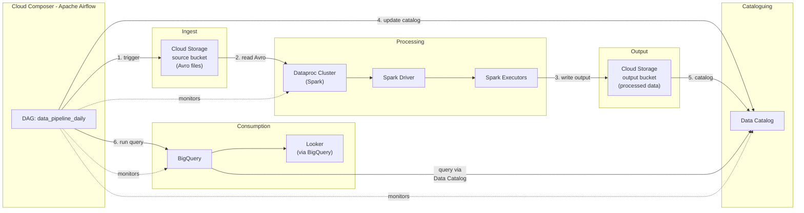

# GCP Data & Analytics Pipeline — Chained Event

## Overview

This chained event models a realistic multi-service data pipeline on Google Cloud Platform, mirroring the AWS data pipeline scenario with GCP-native services. It generates correlated log documents and APM traces across five services, enabling end-to-end observability including Elastic Service Map visualization.

> **Investigation guide for the alerts in this chain:** [../runbooks/data-pipeline-alerts.md](../runbooks/data-pipeline-alerts.md) — cloud-agnostic structure with GCP dataset names called out (`gcp.composer`, `gcp.dataproc`, `gcp.bigquery`, `gcp.gcs`). Each rule links the chain overview dashboard plus the per-service dashboard for its primary dataset (Composer / BigQuery / Dataproc / Cloud Storage) — see [../SETUP-WIZARD-AND-UNINSTALL.md → Linked dashboards on alerts](../SETUP-WIZARD-AND-UNINSTALL.md#linked-dashboards-on-alerts).

## Architecture



## Services Involved

| Service                 | Role                            | GCP Equivalent of AWS |
| ----------------------- | ------------------------------- | --------------------- |
| **Cloud Composer**      | Orchestration (managed Airflow) | MWAA                  |
| **Cloud Storage (GCS)** | Raw data storage & output       | S3                    |
| **Dataproc**            | Spark processing (batch ETL)    | EMR                   |
| **Data Catalog**        | Metadata cataloguing            | Glue Data Catalog     |
| **BigQuery**            | Analytics queries               | Athena                |

## Generated Documents

Each pipeline run produces **6-8 correlated log documents** plus **1 APM trace** (transaction + 5-7 spans):

1. **Composer DAG triggered** — `gcp.composer` dataset
2. **GCS GetObject** — `gcp.gcs` dataset (source Avro file)
3. **Dataproc Spark job** — `gcp.dataproc` dataset (processing)
4. **GCS PutObject** — `gcp.gcs` dataset (output Parquet)
5. **Data Catalog update** — `gcp.data_catalog` dataset
6. **BigQuery query** — `gcp.bigquery` dataset
7. **Composer DAG completed** — `gcp.composer` dataset (with quality check)

All documents share a `labels.pipeline_run_id` for cross-service correlation. Timing is **orchestrated batch analytics** (stages inside one DAG run), unlike the **Security Finding**, **IAM Privilege Escalation**, and **Data Exfiltration** chains, which use wider `@timestamp` spacing and `labels.finding_chain_id`, `labels.attack_session_id`, or `labels.exfil_chain_id`.

### User Identity & Audit Trail

Every pipeline run includes **ECS user identity fields** (`user.name`, `user.email`, `source.ip`, `user_agent.original`) on all operational log documents plus **companion GCP Cloud Audit Log events** for key API calls (e.g. `RunJob`, `CreateEntry`, `InsertJob`). Audit events include `gcp.audit.authentication_info` with the caller's principal email and service account delegation chain. Users are drawn from the shared `DATA_ENGINEERING_USERS` pool (same identities as ServiceNow CMDB records) for cross-index correlation.

## Failure Modes

### 1. Null / Empty Source Files (Silent Degradation)

- GCS returns 0 bytes for the source file
- Dataproc Spark processes 0 records, writes 0 output
- Data Catalog updates 0 entries
- BigQuery returns 0 rows
- Composer DAG completes with `quality_check: DEGRADED`
- No hard errors — the issue propagates silently through the chain

### 2. Incorrect File Format (Pipeline Halt)

- Dataproc Spark throws `AvroParseException`
- Pipeline halts — no GCS output, no Data Catalog update, no BigQuery query
- Composer DAG fails with `quality_check: FAILED`

### 3. Special Characters in GCS Keys (Pipeline Halt)

- Dataproc Spark throws `FileNotFoundException` due to URL-encoding issues
- Pipeline halts at the same point as incorrect format
- Composer DAG fails with `quality_check: FAILED`

## APM Traces & Service Map

The generator produces OpenTelemetry-compatible APM traces with GCP Cloud Trace metadata:

```
composer-data-pipeline (transaction: dag_run:data_pipeline_daily)
├── gcs.objects.get (span: storage/gcs → gcs-analytics-raw-ingest)
├── dataproc.SubmitJob (span: compute/dataproc → dataproc-etl)
│   ├── spark.stage.0 (child span)
│   ├── spark.stage.1 (child span)
│   └── spark.stage.N (child span)
├── gcs.objects.create (span: storage/gcs → gcs-analytics-processed)
├── datacatalog.UpdateEntry (span: catalog/data-catalog)
└── bigquery.jobs.query (span: query/bigquery → bigquery-analytics)
```

## Elastic Assets

- **Dashboard**: GCP Data & Analytics Pipeline — overview (12 Lens panels)
- **ML Jobs**: 4 anomaly detection jobs
  - `gcp-data-pipeline-duration-anomaly` — slow pipeline detection
  - `gcp-data-pipeline-error-spike` — failure rate spike
  - `gcp-data-pipeline-null-data` — zero-row BigQuery queries
  - `gcp-data-pipeline-stage-latency` — Dataproc Spark stage anomalies
- **Alerting Rules**: 5 Kibana ES-query rules (installed disabled by default)

| Rule                                                | Condition                                                   | Index Pattern             |
| --------------------------------------------------- | ----------------------------------------------------------- | ------------------------- |
| GCP Data Pipeline — High Failure Rate               | `> 3` Composer failures in 15 min                           | `logs-gcp.composer*`      |
| GCP Data Pipeline — Null/Empty Data Detected        | BigQuery query returns 0 rows                               | `logs-gcp.bigquery*`      |
| GCP Data Pipeline — Dataproc/Spark Processing Error | Dataproc log with `error.type` present                      | `logs-gcp.dataproc*`      |
| GCP Data Pipeline — GCS Source File Format Error    | GCS object name with URL-unsafe chars or non-Avro extension | `logs-gcp.cloud_storage*` |
| GCP Data Pipeline — Slow Pipeline Run (>60s)        | Composer DAG completion with `duration_ms > 60000`          | `logs-gcp.composer*`      |

## ServiceNow CMDB Correlation

CMDB records include GCP-specific CIs (`composer-globex-prod`, `dataproc-etl`, `bigquery-analytics`) that correlate with this chain's infrastructure. See the [AWS pipeline docs](./data-analytics-pipeline.md#servicenow-cmdb-correlation) for the full enrichment workflow pattern, which applies identically to GCP.

## ML Training Mode

See the [AWS pipeline docs](./data-analytics-pipeline.md#ml-training-mode) for ML training guidance — the same reset → baseline → wait → inject → stabilise workflow applies to GCP pipeline ML jobs.
