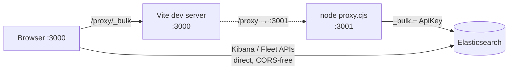

# Development

## Prerequisites

- **Node.js** 18+ (CI and Docker use 20)
- **npm** (lockfile: `package-lock.json`)

After `npm install`, **`postinstall`** runs **`copy-icons`** (copies AWS architecture icons used by the UI into `public/aws-icons/`).

## Run the app locally



Two terminals:

1. Bulk proxy (default **3001**):

   ```bash
   node proxy.cjs
   ```

2. Vite (default **3000**, forwards **`/proxy`** to the proxy):

   ```bash
   npm run dev
   ```

Open **http://localhost:3000**. Configure the Elasticsearch URL and API key in the UI; bulk requests are routed through **`/proxy`** in dev so the browser never holds the API key in a fetch URL.

### Proxy environment variables

The proxy (`proxy.cjs`) accepts the following environment variables:

| Variable                     | Default      | Description                                                                                      |
| ---------------------------- | ------------ | ------------------------------------------------------------------------------------------------ |
| `PROXY_PORT`                 | `3001`       | Port the proxy listens on                                                                        |
| `PROXY_HOST`                 | `127.0.0.1`  | Bind address; use `0.0.0.0` only when remote access is needed (e.g. published container)         |
| `PROXY_REQUEST_TIMEOUT_MS`   | `120000`     | Request timeout in milliseconds (covers large bulk requests)                                     |
| `PROXY_MAX_BODY_BYTES`       | `52428800`   | Max incoming body size in bytes (50 MiB) before rejecting with 413                               |
| `PROXY_QUIET`                | _(unset)_    | Set to `1` to disable stderr access logs (metadata only; never logs API keys or bodies)          |
| `ELASTIC_KIBANA_API_VERSION` | `2023-10-31` | Kibana `Elastic-Api-Version` header; override when your stack requires a different contract date |

The **Setup** wizard installs **Cloud Loadgen Integrations** per service — each integration bundles an ingest pipeline, Kibana dashboard, ML anomaly detection jobs, and alerting rules. All assets are tagged **`cloudloadgen`** so you can filter, view, or bulk-edit them easily in Kibana. Data streams use **TSDS** for metrics where appropriate. **Post-install options** let you enable alerting rules and start ML jobs immediately after installation (both off by default). **Scheduled shipping** is disabled by default — users must explicitly enable it. **Serverless** may limit uninstall/reinstall — [SETUP-WIZARD-AND-UNINSTALL.md](./SETUP-WIZARD-AND-UNINSTALL.md).

**Setup UI implementation (for contributors):** Service-category grouping is built in the `servicePackIndex` `useMemo` in `src/pages/SetupPage.tsx`. Title-fragment extraction uses `src/setup/setupAssetMatch.ts`. Service IDs are normalised via `SERVICE_ALIASES`, `GCP_OVERRIDES`, and `AZURE_OVERRIDES` maps (cloud-aware resolution). Category assignment uses the `SERVICE_CATEGORY` map (~200+ entries per cloud). Labels come from `src/setup/setupDisplayPolish.ts` (`polishSetupCategoryLabel`). Behavior is documented in [SETUP-WIZARD-AND-UNINSTALL.md](./SETUP-WIZARD-AND-UNINSTALL.md).

## Build and preview

```bash
npm run build
npm run preview
```

## Samples

Regenerate JSON for **all** clouds:

```bash
npm run samples
```

Verify that files on disk match every registered generator:

```bash
npm run samples:verify
```

Sample layout: **`samples/aws/{logs,metrics,traces}`**, **`samples/gcp/...`**, **`samples/azure/...`**.

## One-shot verification

```bash
npm run test
```

Runs Vitest, then **`samples`** and **`samples:verify`**.

## Docker

From the repo root (full clone so **`installer/`** is present):

```bash
./docker-up
```

Or: `npm run docker:up` (same script). This builds the image with a **tar stream** so Docker Desktop does not drop large **`installer/`** trees from the build context.

To build only: `npm run docker:build`. Plain `docker compose build` can work on some setups but may omit **`installer/`** on Docker Desktop; pre-flight: `npm run docker:check-installer`.

Service name: **`cloud-to-elastic-load-generator`**. App on **8765** → container **80**.

## Icons

- **AWS:** `postinstall` runs **`npm run copy-icons`** (`scripts/sync-aws-icons.mjs`): copies every SVG referenced in **`src/data/iconMap.ts`** from the **`aws-icons`** package into **`public/aws-icons/`** (using **`scripts/aws-icon-source-map.mjs`** when the default `architecture-service/${name}.svg` path is missing), then deletes files there that are no longer referenced. PNG category/findings artwork is committed as-is. **`npm run icons:audit`** compares on-disk files to `iconMap` + GCP/Azure vendor maps.
- **GCP / Azure:** Flat SVGs ship in **`public/gcp-icons/`** and **`public/azure-icons/`** with **`src/cloud/generated/vendorFileIcons.ts`**. Normal clones need nothing else.
- **Regenerating vendor maps (maintainers):** Put vendor source trees under **`local/cloud-icons/`** (same layout as before: `GCP icons/`, `Azure_Public_Service_Icons/`, etc.). That directory is gitignored. Run **`npm run icons:vendor`**. Optional: set **`CLOUD_ICONS_DIR`** to an absolute path if sources live outside the repo. If `local/cloud-icons/` is missing, the script does not overwrite committed maps.

**Optional local files:** Use **`local/`** for any large or private maintainer-only assets so the repo stays limited to committed **`public/`** / **`src/`** artifacts.

## Code quality

```bash
npm run format:check
npm run lint
npm run typecheck
```

## Key source directories

| Path                             | Description                                                                       |
| -------------------------------- | --------------------------------------------------------------------------------- |
| `src/aws/generators/`            | AWS log, metric, trace, and chained-event generators                              |
| `src/gcp/generators/`            | GCP generators                                                                    |
| `src/azure/generators/`          | Azure generators                                                                  |
| `src/servicenow/generators/`     | ServiceNow CMDB log generator (cross-cloud reference data)                        |
| `src/helpers/identity.ts`        | Shared user identity pool and audit trail event builders                          |
| `src/hooks/useMLTrainingLoop.ts` | React hook for automated ML reset → baseline → wait → inject → stabilise workflow |
| `src/pages/`                     | React page components (Landing, Connection, Services, Setup, Ship)                |
| `installer/`                     | CLI installers and asset JSON (dashboards, ML jobs, rules, pipelines)             |
| `workflows/`                     | Elastic Workflow YAML definitions (alert enrichment automation)                   |

## Documentation index

Guides (AWS CloudWatch routing, OTel, ingest reference, diagrams, advanced data types): [docs/README.md](./README.md).
