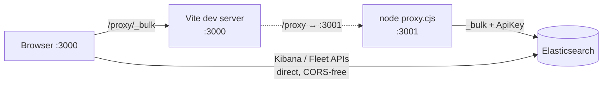

# Development

## Prerequisites

- **Node.js** 18+ (CI and Docker use 20)
- **npm** (lockfile: `package-lock.json`)

After `npm install`, **`postinstall`** runs **`copy-icons`** (copies AWS architecture icons used by the UI into `public/aws-icons/`).

## Run the app locally



Two terminals:

1. Bulk proxy (default **3001**):

   ```bash
   node proxy.cjs
   ```

2. Vite (default **3000**, forwards **`/proxy`** to the proxy):

   ```bash
   npm run dev
   ```

Open **http://localhost:3000**. Configure the Elasticsearch URL and API key in the UI; bulk requests are routed through **`/proxy`** in dev so the browser never holds the API key in a fetch URL.

### Proxy environment variables

The proxy (`proxy.cjs`) accepts the following environment variables:

| Variable                     | Default      | Description                                                                                      |
| ---------------------------- | ------------ | ------------------------------------------------------------------------------------------------ |
| `PROXY_PORT`                 | `3001`       | Port the proxy listens on                                                                        |
| `PROXY_HOST`                 | `127.0.0.1`  | Bind address; use `0.0.0.0` only when remote access is needed (e.g. published container)         |
| `PROXY_REQUEST_TIMEOUT_MS`   | `120000`     | Request timeout in milliseconds (covers large bulk requests)                                     |
| `PROXY_MAX_BODY_BYTES`       | `52428800`   | Max incoming body size in bytes (50 MiB) before rejecting with 413                               |
| `PROXY_QUIET`                | _(unset)_    | Set to `1` to disable stderr access logs (metadata only; never logs API keys or bodies)          |
| `ELASTIC_KIBANA_API_VERSION` | `2023-10-31` | Kibana `Elastic-Api-Version` header; override when your stack requires a different contract date |

The proxy uses **HTTP keep-alive** agents (up to 16 sockets) so TLS/TCP connections to Elasticsearch are reused across bulk requests. Bulk payloads larger than 1 KB are **gzip-compressed** before forwarding, reducing wire time.

The **Setup** wizard installs **Cloud Loadgen Integrations** per service — each integration bundles an ingest pipeline, Kibana dashboard, ML anomaly detection jobs, and alerting rules. All assets are tagged **`cloudloadgen`** so you can filter, view, or bulk-edit them easily in Kibana. Data streams use **TSDS** for metrics where appropriate. **Post-install options** let you enable alerting rules and start ML jobs immediately after installation (both off by default). **Scheduled shipping** is disabled by default — users must explicitly enable it. **Serverless** may limit uninstall/reinstall — [SETUP-WIZARD-AND-UNINSTALL.md](./SETUP-WIZARD-AND-UNINSTALL.md).

**Setup UI implementation (for contributors):** Service-category grouping is built in the `servicePackIndex` `useMemo` in `src/pages/SetupPage.tsx`. Title-fragment extraction uses `src/setup/setupAssetMatch.ts`. Service IDs are normalised via `SERVICE_ALIASES`, `GCP_OVERRIDES`, and `AZURE_OVERRIDES` maps (cloud-aware resolution) — the `normalize()` function strips `[-_\s/()+&]+` so fragments like "Pub/Sub" and "Security Operations (SecOps)" resolve cleanly. Category assignment uses the `SERVICE_CATEGORY` map (covers all clouds and Supporting Services). Labels come from `src/setup/setupDisplayPolish.ts` (`polishSetupCategoryLabel`). Behavior is documented in [SETUP-WIZARD-AND-UNINSTALL.md](./SETUP-WIZARD-AND-UNINSTALL.md).

## Build and preview

```bash
npm run build
npm run preview
```

Production builds have **source maps disabled** (`sourcemap: false`). TypeScript uses **incremental compilation** (`.tsbuildinfo`) and ESLint uses `--cache` (`.eslintcache`) to speed up repeat runs. Both cache files are gitignored.

## Samples

The `samples/` directory is **gitignored** — regenerate locally:

```bash
npm run samples
```

Verify that files on disk match every registered generator:

```bash
npm run samples:verify
```

Sample layout: **`samples/aws/{logs,metrics,traces}`**, **`samples/gcp/...`**, **`samples/azure/...`**, **`samples/supporting/...`**.

Similarly, `assets/` (standalone asset JSONs) and `installer/aws-custom-dashboards/ndjson/` are gitignored. Regenerate with `npm run assets:export` and `npm run generate:aws-dashboards:ndjson` respectively.

## One-shot verification

```bash
npm run test
```

Runs Vitest, then **`samples`** and **`samples:verify`**.

## Docker

From the repo root (full clone so **`installer/`** is present):

```bash
./docker-up
```

Or: `npm run docker:up` (same script). This builds the image with a **tar stream** so Docker Desktop does not drop large **`installer/`** trees from the build context.

To build only: `npm run docker:build`. Plain `docker compose build` can work on some setups but may omit **`installer/`** on Docker Desktop; pre-flight: `npm run docker:check-installer`.

Service name: **`cloud-to-elastic-load-generator`**. App on **8765** → container **80**.

## Icons

- **AWS:** `postinstall` runs **`npm run copy-icons`** (`scripts/sync-aws-icons.mjs`): copies every SVG referenced in **`src/data/iconMap.ts`** from the **`aws-icons`** package into **`public/aws-icons/`** (using **`scripts/aws-icon-source-map.mjs`** when the default `architecture-service/${name}.svg` path is missing), then deletes files there that are no longer referenced. PNG category/findings artwork is committed as-is. **`npm run icons:audit`** compares on-disk files to `iconMap` + GCP/Azure vendor maps.
- **GCP / Azure:** Flat SVGs ship in **`public/gcp-icons/`** and **`public/azure-icons/`** with **`src/cloud/generated/vendorFileIcons.ts`**. Normal clones need nothing else.
- **Regenerating vendor maps (maintainers):** Put vendor source trees under **`local/cloud-icons/`** (same layout as before: `GCP icons/`, `Azure_Public_Service_Icons/`, etc.). That directory is gitignored. Run **`npm run icons:vendor`**. Optional: set **`CLOUD_ICONS_DIR`** to an absolute path if sources live outside the repo. If `local/cloud-icons/` is missing, the script does not overwrite committed maps.

**Optional local files:** Use **`local/`** for any large or private maintainer-only assets so the repo stays limited to committed **`public/`** / **`src/`** artifacts.

## Code quality

```bash
npm run format:check
npm run lint
npm run typecheck
```

## Generator fidelity

Generators must produce documents that are indistinguishable from real cloud telemetry once ingested. The following constraints are enforced across all generators:

### ID formats

| Field                              | Correct format                 | Notes                                                             |
| ---------------------------------- | ------------------------------ | ----------------------------------------------------------------- |
| AWS X-Ray trace ID                 | `1-<8 hex>-<24 hex>`           | Epoch hex in second segment; use `randHexId(24)` for third        |
| Lambda log stream                  | `YYYY/MM/DD/[$LATEST]<32 hex>` | Suffix must be lowercase hex only                                 |
| OTel `trace.id` / `transaction.id` | 32 / 16 lowercase hex chars    | Use `randHexId(32)` / `randHexId(16)`                             |
| W3C `traceparent`                  | `00-<32 hex>-<16 hex>-01`      | All segments must be hex                                          |
| Git commit SHA                     | 40 lowercase hex chars         | Use `randHexId(40)` — `randId(40)` produces BASE36 (includes g–z) |
| Docker / OCI digest                | `sha256:<64 hex>`              | Use `randHexId(64)`                                               |
| Docker container ID                | `docker://<64 hex>`            | Same                                                              |
| AWS WAF WebACL ID                  | UUID (`randUUID()`)            | Was incorrectly using `randId(36)` BASE36                         |
| Elastic agent `ephemeral_id`       | UUID                           | Same                                                              |

`randId()` generates BASE36 (0–9, A–Z) and is **only** correct for opaque resource-name suffixes (function names, bucket suffixes, stack IDs, etc.). Use `randHexId()` or `randUUID()` wherever the real service enforces a specific encoding.

### VPC / network flow logs

- **No geo data on private IPs.** RFC1918 addresses (`10.x`, `172.16–31.x`, `192.168.x`) have no geolocation. The AWS VPC flow log generator only populates `destination.geo` when the destination is a public IP. GCP VPC flow logs skip `src_location` / `dest_location` for private IPs and omit `src_instance` / `dest_instance` for external endpoints.
- **VPC flow `host.name`** matches the ENI's instance and region — not a random unrelated host.
- **GCP VPC flow traffic distribution**: ~90% private source, ~70% private destination, reflecting realistic VPC-internal vs. internet-bound traffic ratios.

### TLS

- TLS 1.3 connections use TLS 1.3 cipher suite names (`TLS_AES_128_GCM_SHA256`, `TLS_AES_256_GCM_SHA384`). The ECDHE-RSA family belongs to TLS 1.2 and must not appear alongside `TLSv1.3`. CloudFront correctly uses `TLS_AES_128_GCM_SHA256`; ALB and NLB follow the same rule.

### Lambda billing

- AWS changed Lambda billed duration to **1 ms granularity** in December 2020. Billed duration is `Math.ceil(durationMs)`, not `Math.ceil(durationMs / 100) * 100`.

### GuardDuty

- `resource.resourceType` is correlated with the finding namespace: `EC2/` findings → `Instance`; `IAMUser/` findings → `AccessKey`; `S3/` findings → `S3Bucket`.
- `service.action.actionType` is derived from the finding type: DNS-named findings → `DNS_REQUEST`; brute-force / port-probe findings → `NETWORK_CONNECTION` / `PORT_PROBE`; IAMUser findings → `AWS_API_CALL`.

### CloudTrail

- `host` is absent — CloudTrail records API calls, which have no associated host.
- `userIdentity.sessionContext` is only present for `AssumedRole` and `WebIdentityUser` identity types.
- `userIdentity.arn` shape varies by identity type: IAM user gets `arn:aws:iam::<acct>:user/<name>`; AssumedRole gets `arn:aws:sts::<acct>:assumed-role/<role>/<session>`; Root gets `arn:aws:iam::<acct>:root`.
- `errorMessage` varies by `errorCode` — not a single hardcoded string.
- `source.geo` includes `location: { lat, lon }` for geospatial mapping.

### Account and identity pools

- AWS account pool: 12 accounts spanning production, staging, dev, security-tooling, shared-services, data-platform, networking, sandbox, log-archive, identity, payments, and ML — reflecting a realistic AWS Organization.
- `ATTACKER_HOSTS` and `TARGET_HOSTS` each have 20 entries spread across multiple regions to avoid obvious repetition.

### Adding a new generator

1. Return an `EcsDocument`-shaped object from the generator function.
2. Use `randHexId()` for all hex IDs; `randUUID()` for UUIDs; `randId()` only for opaque alphanumeric suffixes.
3. Never attach `source.geo` or `destination.geo` to private/RFC1918 IPs.
4. Match the real service's log format in the `message` field — check `samples/<cloud>/logs/<service>.json` for reference after running `npm run samples`.
5. Register the generator in the cloud's `generators/index.ts`.

## Key source directories

| Path                             | Description                                                                                                               |
| -------------------------------- | ------------------------------------------------------------------------------------------------------------------------- |
| `src/aws/generators/`            | AWS log, metric, trace, and chained-event generators (incl. EMR Spark)                                                    |
| `src/gcp/generators/`            | GCP generators                                                                                                            |
| `src/azure/generators/`          | Azure generators                                                                                                          |
| `src/supporting/`                | Supporting Services vendor config, service groups, generators (Entra ID, M365, Managed AD, O365 metrics, ServiceNow CMDB) |
| `src/servicenow/generators/`     | ServiceNow CMDB log generator (used by Supporting Services)                                                               |
| `src/helpers/identity.ts`        | Shared user identity pool and audit trail event builders                                                                  |
| `src/hooks/useMLTrainingLoop.ts` | React hook for automated ML reset → baseline → wait → inject → stabilise workflow                                         |
| `src/pages/`                     | React page components (Landing, Connection, Services, Setup, Ship)                                                        |
| `installer/`                     | CLI installers and asset JSON (496 dashboards, 778 ML jobs, 243 rules, pipelines)                                         |
| `workflows/`                     | Elastic Workflow YAML definitions (alert enrichment automation)                                                           |

## Documentation index

Guides (AWS CloudWatch routing, OTel, ingest reference, diagrams, advanced data types): [docs/README.md](./README.md).
