# Cloud Loadgen for Elastic — Architecture Diagrams

> **Catalog sizes (log · metric · trace services):** AWS **212 · 206 · 54**; GCP **129 · 123 · 48**; Azure **131 · 120 · 40**.

> **Installer assets (custom Kibana dashboards · ML anomaly jobs · Elasticsearch-query alert rules):** AWS **220 · 384 · 17**; GCP **127 · 152 · 17**; Azure **120 · 154 · 17**. Rules are defined in `installer/{aws,gcp,azure}-custom-rules/` (including Data & Analytics Pipeline rules plus Security Finding, IAM Privesc, and Data Exfil chains per cloud).

---

## 1 · System Architecture

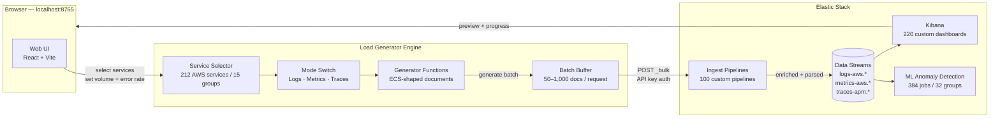

---

## 2 · Document Data Flow

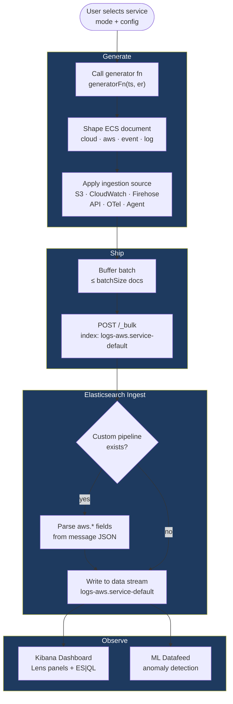

---

## 3 · Service Groups (212 services)

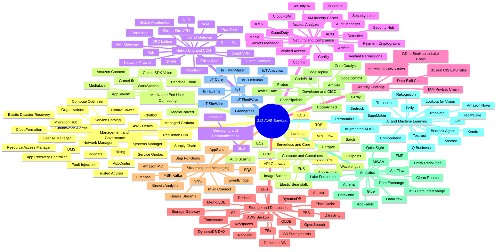

---

## 4 · Installer Flow

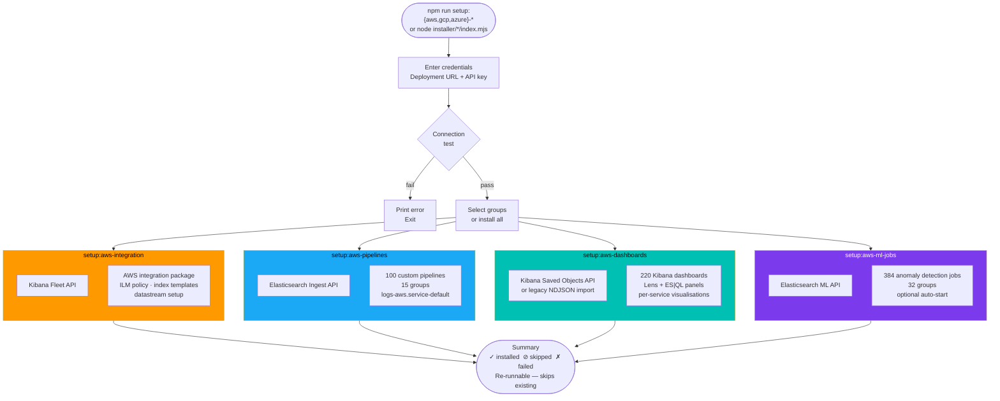

---

## 5 · Three-Mode Generation Pipeline

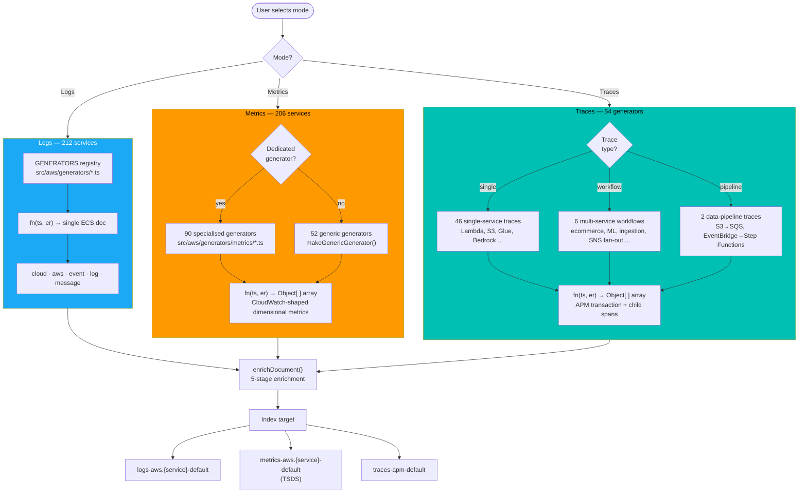

---

## 6 · Document Enrichment Pipeline

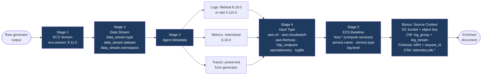

---

## 7 · Shipping Pipeline

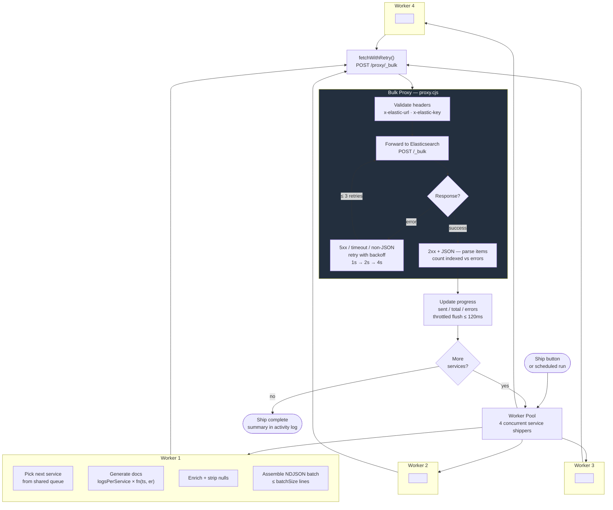

---

## 8 · Scheduled Mode and Anomaly Injection

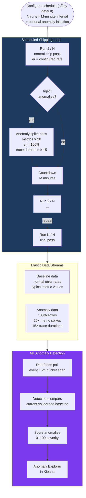

---

## 9 · Trace Architecture

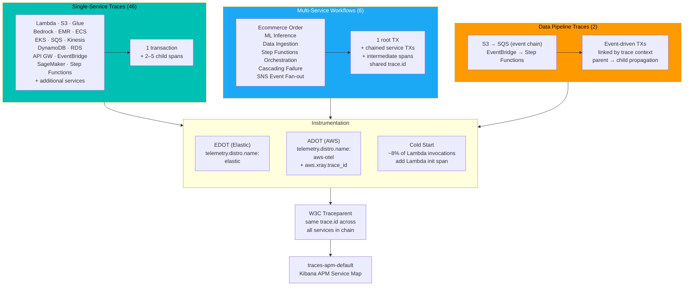

---

## 10 · Metrics Generator Architecture

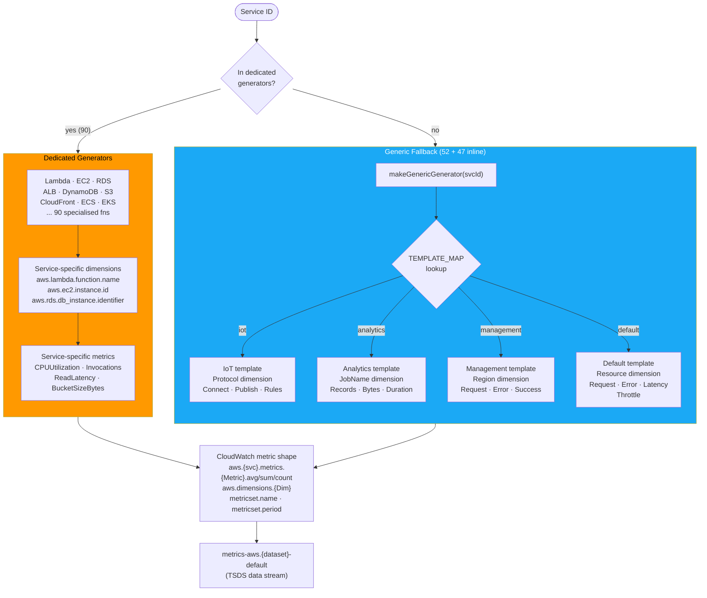

---

## 11 · Sub-Service Folding

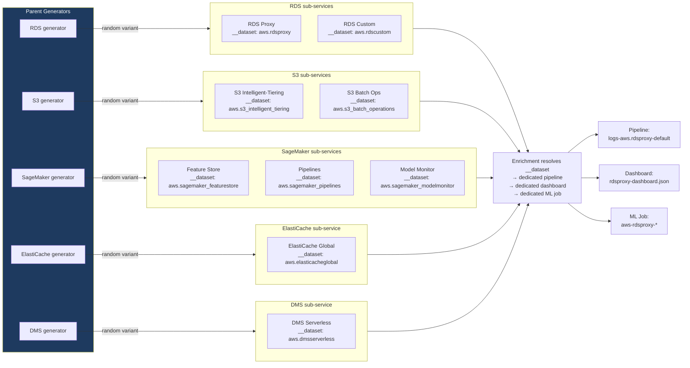

---

## 12 · ML Anomaly Detection Lifecycle

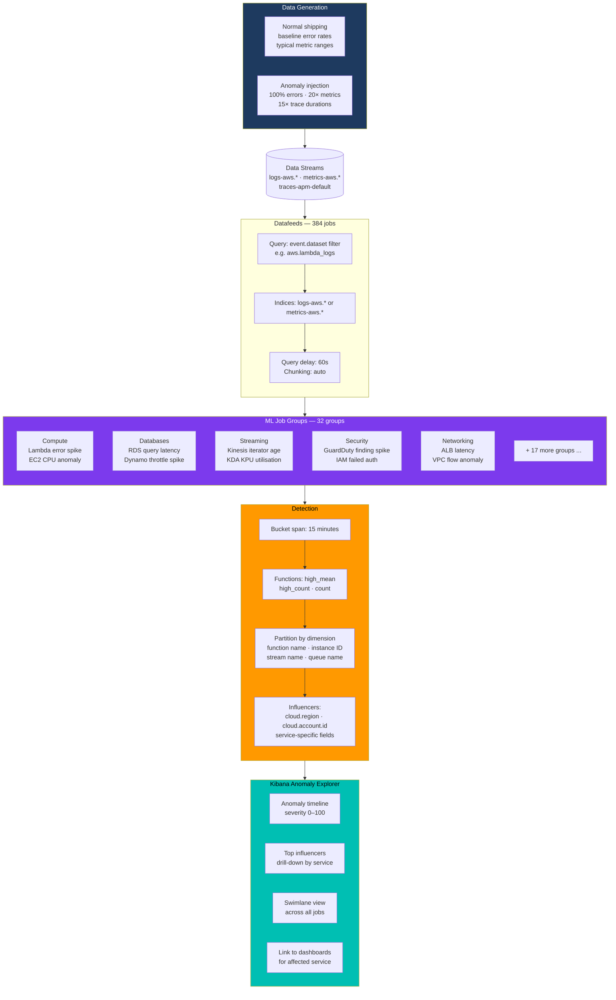

---

## 13 · Ingestion Source Routing

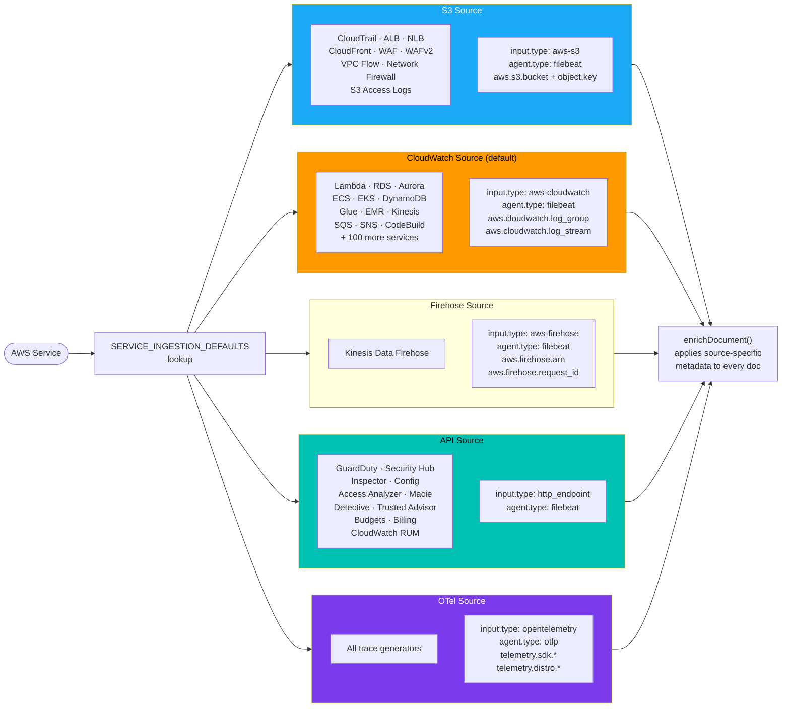

---

## 14 · End-to-End Workflow

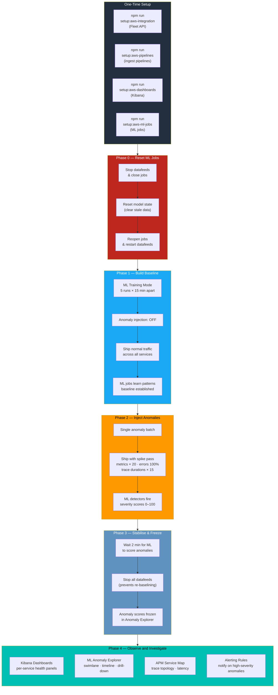
