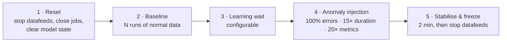

# ML training mode

The **Ship** page in **Cloud Loadgen for Elastic** can drive a full anomaly detection training cycle automatically — useful for demos where you need a clean, repeatable "baseline → anomaly → frozen score in the Anomaly Explorer" sequence.

## Flow

## Steps

| Step                      | What it does                                                                                                                                       | Why                                                                                                                   |
| ------------------------- | -------------------------------------------------------------------------------------------------------------------------------------------------- | --------------------------------------------------------------------------------------------------------------------- |
| **1. Reset**              | Stops every datafeed, closes every job, calls `_reset` to clear model state, then reopens jobs and restarts datafeeds.                             | Without this, ML jobs retain model state from previous runs and may renormalise anomaly scores back to zero.          |
| **2. Baseline**           | Ships normal data for a configurable number of ship runs (default 3) so the ML jobs see a stable pattern.                                          | Establishes "what normal looks like" for each detector.                                                               |
| **3. Learning wait**      | Pauses for a configurable duration (default 5 min) while ML scores the baseline.                                                                   | Gives the running datafeeds time to backfill and the model time to converge.                                          |
| **4. Anomaly injection**  | Ships **one** batch with anomalies forced on: 100% error rate, 15× duration scaling for logs and traces, 20× metric scaling, in a 5-minute window. | A single distinct deviation produces an unambiguous high-severity anomaly.                                            |
| **5. Stabilise & freeze** | Waits 2 minutes for ML to score the anomalies, then (optional, on by default) stops all datafeeds.                                                 | Stopping datafeeds prevents the model from re-baselining on the anomaly window and renormalising the score back down. |

## Toggles

| Toggle                            | Default | Effect                                                                                                                                  |
| --------------------------------- | ------- | --------------------------------------------------------------------------------------------------------------------------------------- |
| **Stop datafeeds after training** | On      | Runs step 5. Anomaly scores stay frozen and visible in the Anomaly Explorer. Turn off if you want the demo to keep producing live data. |
| **Baseline runs**                 | 3       | How many ship cycles produce normal data before the wait.                                                                               |
| **Learning wait minutes**         | 5       | How long step 3 pauses.                                                                                                                 |

## Behaviour caveats

- The reset step requires Elasticsearch ML privileges (the `full-access` API key in [`installer/api-keys/`](../installer/api-keys/) is sufficient; `ship-only` is not).
- If you only need to ship the anomaly batch without rebaselining, skip ML training mode and use the regular Ship flow with **Inject anomalies** toggled on.
- The training loop is implemented in `src/hooks/useMLTrainingLoop.ts` — refer to that hook for the exact API calls and ordering.

## Related

- [SETUP-WIZARD-AND-UNINSTALL.md](./SETUP-WIZARD-AND-UNINSTALL.md) — ML jobs are installed (closed) by Setup; the **Start ML jobs after install** post-install toggle is independent of training mode.
- [advanced-data-types.md](./advanced-data-types.md) — chained-event ML jobs that are good targets for training mode (`*-anomaly-score` jobs).
