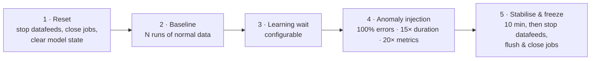

# ML training mode

The **Ship** page in **Cloud Loadgen for Elastic** can drive a full anomaly detection training cycle automatically — useful for demos where you need a clean, repeatable "baseline → anomaly → frozen score in the Anomaly Explorer" sequence.

## Flow

## Steps

| Step                      | What it does                                                                                                                                                                                                           | Why                                                                                                                                                             |
| ------------------------- | ---------------------------------------------------------------------------------------------------------------------------------------------------------------------------------------------------------------------- | --------------------------------------------------------------------------------------------------------------------------------------------------------------- |
| **1. Reset**              | For all loadgen ML jobs (aws-\*, gcp-\*, azure-\*): stops datafeeds, closes jobs, calls `_reset` to clear model state, reopens jobs, restarts datafeeds **from "now"** (ignoring old data).                            | Clears stale model state and prevents old injection spikes from corrupting the new baseline. Starting from "now" ensures the model only learns from fresh data. |
| **2. Baseline**           | Ships normal data for a configurable number of ship runs (default 5, spaced 15 min apart) so the ML jobs see a stable pattern.                                                                                         | Establishes "what normal looks like" for each detector.                                                                                                         |
| **3. Learning wait**      | Pauses for a configurable duration (default 30 min) while ML scores the baseline.                                                                                                                                      | Gives the running datafeeds time to backfill and the model time to converge.                                                                                    |
| **4. Anomaly injection**  | Ships **one** batch with anomalies forced on: 100% error rate, 15× duration scaling for logs and traces, 20× metric scaling, in a 5-minute window.                                                                     | A single distinct deviation produces an unambiguous high-severity anomaly.                                                                                      |
| **5. Stabilise & freeze** | Waits 10 min for datafeeds to forward anomaly data (frequency ~7.5 min for 15m buckets), then stops datafeeds, **flushes** each job with `advance_time` to force open buckets to produce results, and **closes** jobs. | The flush is critical — without it the 15m bucket containing the injection hasn't closed and no scores are written. Closing then freezes the model permanently. |

## Toggles

| Toggle                        | Default | Effect                                                                                                                                                                     |
| ----------------------------- | ------- | -------------------------------------------------------------------------------------------------------------------------------------------------------------------------- |
| **Close jobs after training** | On      | Runs step 5. Stops datafeeds and closes jobs so anomaly scores stay frozen and visible in the Anomaly Explorer. Turn off if you want the demo to keep producing live data. |
| **Baseline runs**             | 5       | How many ship cycles produce normal data before the wait.                                                                                                                  |
| **Baseline interval (min)**   | 15      | Minutes between each baseline run — spaces data out so ML sees a realistic time distribution.                                                                              |
| **Learning wait minutes**     | 30      | How long step 3 pauses — gives datafeeds time to backfill and the model time to converge.                                                                                  |

## Behaviour caveats

- The reset step requires Elasticsearch ML privileges (the `full-access` API key in [`installer/api-keys/`](../installer/api-keys/) is sufficient; `ship-only` is not).
- If you only need to ship the anomaly batch without rebaselining, skip ML training mode and use the regular Ship flow with **Inject anomalies** toggled on.
- The training loop is implemented in `src/hooks/useMLTrainingLoop.ts` — refer to that hook for the exact API calls and ordering.

## Related

- [SETUP-WIZARD-AND-UNINSTALL.md](./SETUP-WIZARD-AND-UNINSTALL.md) — ML jobs are installed (closed) by Setup; the **Start ML jobs after install** post-install toggle is independent of training mode.
- [advanced-data-types.md](./advanced-data-types.md) — chained-event ML jobs that are good targets for training mode (`*-anomaly-score` jobs).
