# Elastic onboarding installers

Standalone Node.js scripts to configure Elastic before (or instead of) shipping data with **Cloud Loadgen for Elastic**. All installers are idempotent — they skip what's already installed.

**Requirements:** Node.js 18+ (native `fetch`, ES modules). No `npm install` needed — the installers have zero external dependencies.

## Which command should I run?

```mermaid
flowchart TD
    Start{What do you want?} -->|Everything for one or<br/>more AWS services| Pack[npm run setup:aws-loadgen-packs<br/><i>pipeline + dashboard + ML + rules</i>]
    Start -->|Everything for GCP/Azure| UI[Use the Web UI Setup step<br/>or install assets individually below]
    Start -->|Just the official Fleet<br/>integration package| Fleet[setup:aws-integration<br/>setup:gcp-integration<br/>setup:azure-integration]
    Start -->|Custom pipelines| Pipes[setup:&#123;aws,gcp,azure&#125;-pipelines]
    Start -->|Custom dashboards| Dash[setup:&#123;aws,gcp,azure&#125;-dashboards]
    Start -->|ML anomaly jobs| ML[setup:&#123;aws,gcp,azure&#125;-ml-jobs]
    Start -->|Alerting rules| Rules[setup:alert-rules<br/><i>cross-cloud, walks all rule files</i>]
```



If you're not sure: run the web UI Setup step. It installs the same assets and adds uninstall support, post-install toggles, and Serverless-aware behaviour. CLI installers shine for repeatable scripted demos and air-gapped environments.

---

## Cloud Loadgen Integrations (recommended)

The **recommended** approach is to install assets **per service** as **Cloud Loadgen Integrations**. Each integration bundles:

- **Ingest pipeline** — parses and routes logs to the correct data stream (TSDS for metrics)
- **Data stream templates** — `logs-*` and `metrics-*` data views
- **Kibana dashboard** — ES|QL Lens panels tailored to the service
- **ML anomaly detection jobs** — detect error spikes, latency anomalies, rare activity
- **Alerting rules** — Elasticsearch query-based rules for critical patterns

All assets are tagged **`cloudloadgen`** — filter in Kibana **Saved Objects → Tags → cloudloadgen** to view, bulk-edit, or bulk-delete load-generator assets without affecting production objects. ML jobs and pipelines include `cloudloadgen` in their metadata for the same easy filtering.

### Web UI Setup step

The **Setup** wizard in the web UI installs/uninstalls the same Cloud Loadgen Integrations. Integrations are grouped by **service category** (Compute, Networking, Databases, Analytics, AI & ML, etc.) and each service shows what it includes (pipeline, dashboard, N ML jobs, alerting rules). You can filter, select individual services, or use **Align with Services** to match your generator selection. See **[docs/SETUP-WIZARD-AND-UNINSTALL.md](../docs/SETUP-WIZARD-AND-UNINSTALL.md)**.

### CLI per-service bundles

**AWS only** — the CLI exposes a single per-service bundle command:

```bash
# AWS — install pipeline + dashboard + ML jobs + rules per service
npm run setup:aws-loadgen-packs
```

There are **no** `setup:gcp-loadgen-packs` or `setup:azure-loadgen-packs` scripts. For **GCP** and **Azure**, use the **individual asset installers** below (integration, pipelines, dashboards, ML jobs, and alerting rules) or the web UI **Setup** step, which installs the same Cloud Loadgen Integrations for every cloud.

**What happens:**

1. Deployment type and optional TLS skip (self-managed)
2. Connection checks to Elasticsearch and Kibana; ML availability verified
3. A numbered list of **services** with a short summary (pipeline / dashboard / N ML jobs / rules)
4. For each selected service (or **all**): install pipeline → ensure data views → install dashboard → install ML jobs → install alerting rules. Job IDs are **deduplicated** if you select multiple services that share the same job
5. Optional prompt to **open** new jobs and **start** datafeeds

Idempotent: existing pipelines, dashboards (by title), jobs, and rules are skipped.

The web UI **Setup** page also provides **post-install options**: toggles to **enable alerting rules** and **start ML jobs** immediately after installation. Both are off by default — rules are created disabled and ML jobs are created closed. See [docs/SETUP-WIZARD-AND-UNINSTALL.md](../docs/SETUP-WIZARD-AND-UNINSTALL.md) for details.

---

## Deployment types

Each installer begins by asking which type of Elastic deployment you are connecting to:

```
Select your Elastic deployment type:

  1. Self-Managed  (on-premises, Docker, VM)
  2. Elastic Cloud Hosted  (cloud.elastic.co)
  3. Elastic Serverless  (cloud.elastic.co/serverless)
```

|                        | Self-Managed                                 | Cloud Hosted    | Serverless      |
| ---------------------- | -------------------------------------------- | --------------- | --------------- |
| **Kibana port**        | `:5601` (default)                            | `:9243`         | none            |
| **Elasticsearch port** | `:9200` (default)                            | `:9243`         | none            |
| **Protocol**           | `http://` or `https://`                      | `https://` only | `https://` only |
| **TLS skip option**    | yes (prompted)                               | no              | no              |
| **Package Registry**   | Kibana-proxied (air-gap safe) + EPR fallback | EPR via Kibana  | EPR via Kibana  |
| **Fleet required**     | yes — must be enabled                        | pre-configured  | pre-configured  |

### Self-Managed notes

**Self-signed / internal CA certificates**

If your Kibana or Elasticsearch endpoint uses a self-signed certificate or one issued by an internal CA, the installer will prompt:

```
Skip TLS certificate verification? Required for self-signed / internal CA certs. (y/N):
> y
  ⚠  TLS verification disabled — ensure you trust this endpoint.
```

Answering `y` sets `NODE_TLS_REJECT_UNAUTHORIZED=0` for the duration of the installer process only.

**Air-gapped / no internet access**

The integration installer resolves the latest package version by first querying Kibana's own Fleet API, which works without internet access. It only falls back to the public Elastic Package Registry if the Kibana Fleet API does not return a version. Pipeline and dashboard installers have no external network dependencies.

**Fleet setup**

On self-managed Kibana, Fleet must be enabled and initialised before running the official integration installer.

---

## Individual asset installers

If you prefer to install one asset type at a time (or need fine-grained control), the original individual installers are still available. These install the **same assets** as the per-service bundles above, just organised by asset type instead of by service.

### Installer 1 — Official Elastic Integration

| Cloud | Command                           | Package       |
| ----- | --------------------------------- | ------------- |
| AWS   | `npm run setup:aws-integration`   | Fleet `aws`   |
| GCP   | `npm run setup:gcp-integration`   | Fleet `gcp`   |
| Azure | `npm run setup:azure-integration` | Fleet `azure` |

Installs the official Elastic integration package via the Kibana Fleet API (pre-built index templates, ILM policies, pre-built dashboards).

### Installer 2 — Custom Ingest Pipelines

| Cloud | Command                         | Data streams                   |
| ----- | ------------------------------- | ------------------------------ |
| AWS   | `npm run setup:aws-pipelines`   | `logs-aws.{dataset}-default`   |
| GCP   | `npm run setup:gcp-pipelines`   | `logs-gcp.{dataset}-default`   |
| Azure | `npm run setup:azure-pipelines` | `logs-azure.{dataset}-default` |

Custom Elasticsearch ingest pipelines for services not covered by the official integration. Pipelines parse the structured JSON `message` field into named fields — making logs fully searchable and aggregatable. Data streams and TSDS are used where appropriate.

### Installer 3 — Custom Dashboards

| Cloud | Command                          | Query language           |
| ----- | -------------------------------- | ------------------------ |
| AWS   | `npm run setup:aws-dashboards`   | ES\|QL on `logs-aws.*`   |
| GCP   | `npm run setup:gcp-dashboards`   | ES\|QL on `logs-gcp.*`   |
| Azure | `npm run setup:azure-dashboards` | ES\|QL on `logs-azure.*` |

Pre-built Kibana dashboards using Lens panels. The `cloudloadgen` tag is applied to all dashboards.

**Removing dashboards:** CLI installers are **install-only**. Use the app's **Setup** step (Uninstall mode) or delete objects in Kibana (filter by the `cloudloadgen` tag). On **Serverless** deployments, removal may need to be done in the Kibana UI — see **[docs/SETUP-WIZARD-AND-UNINSTALL.md](../docs/SETUP-WIZARD-AND-UNINSTALL.md)**.

The dashboard installer uses a 3-tier fallback strategy:

1. **Dashboards API** (`POST /api/dashboards`) — preferred on Kibana 9.4+
2. **Saved Objects CRUD** (`POST/PUT /api/saved_objects/dashboard/:id`) — primary fallback for Cloud Hosted Kibana 9.x
3. **NDJSON import** (`POST /api/saved_objects/_import`) — last resort when both above are unavailable

All dashboards include `version: 1` in saved-object attributes for Kibana 9.x compatibility.

### Installer 4 — ML Anomaly Detection Jobs

| Cloud | Command                       | Target indices                    |
| ----- | ----------------------------- | --------------------------------- |
| AWS   | `npm run setup:aws-ml-jobs`   | `logs-aws.*`, `metrics-aws.*`     |
| GCP   | `npm run setup:gcp-ml-jobs`   | `logs-gcp.*`, `metrics-gcp.*`     |
| Azure | `npm run setup:azure-ml-jobs` | `logs-azure.*`, `metrics-azure.*` |

ML anomaly detection jobs that detect real operational and security anomalies. Jobs include `cloudloadgen` in their metadata.

### Chained scenario assets (dashboards, rules, ML jobs)

Beyond per-service bundles, the repo ships chained-scenario assets for **Data & Analytics Pipeline** (`data-pipeline-dashboard.json` / `gcp-data-pipeline-dashboard.json` / `azure-data-pipeline-dashboard.json`) and for **Security Finding**, **IAM Privilege Escalation**, and **Data Exfiltration** (`security-finding-chain`, `iam-privesc-chain`, and `data-exfil-chain` name prefixes; GCP and Azure use `gcp-` / `azure-` prefixes). There are **three security-chain dashboards per cloud** (**nine** such dashboards across AWS, GCP, and Azure), each with matching **Elasticsearch-query alert rule** and **ML job** JSON. Rule bundles live in `installer/{aws,gcp,azure}-custom-rules/` (`data-pipeline-rules.json` plus the three chain files); installing **all** rule files for a cloud installs **17** rules. ML definitions include `data-pipeline-jobs` plus the three chain job files per cloud under `installer/{aws,gcp,azure}-custom-ml-jobs/jobs/`. Install with the same `setup:*-dashboards`, `setup:*-ml-jobs`, and `npm run setup:alert-rules` commands as other custom assets.

---

## Why both approaches exist

|                        | Per-service bundles (`setup:aws-loadgen-packs`) | Individual installers (`setup:*-pipelines`, etc.) |
| ---------------------- | ----------------------------------------------- | ------------------------------------------------- |
| **Scope**              | Pipeline + dashboard + ML + rules per service   | One asset type across all services                |
| **Best for**           | Setting up specific services you plan to use    | Installing all dashboards or all ML jobs at once  |
| **Tagged**             | Everything tagged `cloudloadgen`                | Dashboards tagged; ML in metadata                 |
| **Re-runnable**        | Yes — skips existing                            | Yes — skips existing                              |
| **Credentials needed** | Elasticsearch + Kibana                          | Depends on asset type                             |

Running **Installer 1** (official Fleet package) plus **per-service bundles** gives you full coverage: official templates + custom load-generator assets.

### ServiceNow CMDB Integration auto-install

When the **ServiceNow CMDB Integration** toggle is enabled in the Setup wizard, the app installs the `servicenow` Fleet integration package. This enables Elastic's ServiceNow data views and allows cross-index enrichment between pipeline alerts and CMDB records (CI ownership, support groups, incidents, change requests). The ServiceNow CMDB generator produces realistic records across 9 CMDB/ITSM tables with CIs correlated to cloud infrastructure names. Data ships to `logs-servicenow.event-*`.

### Cloud Security Posture (CSPM/KSPM) auto-install

When **CSPM or KSPM services** are selected in the Setup wizard and the Fleet integration toggle is enabled, the app automatically installs the `cloud_security_posture` Fleet package alongside the cloud vendor integration. This enables Elastic's built-in **Posture Dashboard**, **Findings page**, and **Benchmark Rules** pages. The CSPM/KSPM generators produce findings documents using **321 real CIS benchmark rule UUIDs** from `elastic/cloudbeat`:

- **CIS AWS** (55 rules) — IAM, S3, EC2, RDS, Logging, Monitoring, Networking
- **CIS GCP** (71 rules) — IAM, Logging, Networking, VMs, Storage, SQL, BigQuery
- **CIS Azure** (72 rules) — IAM, Defender, Storage, SQL, Logging, Networking, VMs, Key Vault, App Service
- **CIS EKS** (31 rules) — Logging, Authentication, Networking, Pod Security
- **CIS Kubernetes** (92 rules) — Control Plane, etcd, RBAC, Worker Nodes, Pod Security Standards

---

## AWS custom pipelines — compatibility with official integration

Custom pipelines cover services **not** in the official Elastic AWS integration, so they are purely additive in most cases.

**Services excluded from custom pipelines** (already covered by the official integration): CloudTrail, VPC Flow, ALB/NLB, GuardDuty, S3 Access, API Gateway, CloudFront, Network Firewall, Security Hub, WAF, Route 53, EC2 (metrics), ECS, Config, Inspector, DynamoDB, Redshift, EBS, Kinesis, MSK/Kafka, SNS, SQS, Transit Gateway, VPN, AWS Health, Billing, NAT Gateway.

**Services with different dataset names** (both coexist safely):

| Service | Official dataset | Load generator dataset |
| ------- | ---------------- | ---------------------- |
| Lambda  | `aws.lambda`     | `aws.lambda_logs`      |
| EC2     | `aws.ec2`        | `aws.ec2_logs`         |
| EMR     | `aws.emr`        | `aws.emr_logs`         |

**Two pipelines that overwrite official integration pipelines:**

| Pipeline               | Group     | Notes                                                        |
| ---------------------- | --------- | ------------------------------------------------------------ |
| `logs-aws.rds-default` | databases | Skip if you want to preserve the official RDS field mappings |
| `logs-aws.eks-default` | compute   | Skip if you want to preserve the official EKS field mappings |

---

## Legacy dashboard import (Kibana 8.11 – 9.3)

```bash
npm run setup:aws-dashboards:legacy
```

Uses `POST /api/saved_objects/_import`. Pre-generated ndjson files live under `installer/aws-custom-dashboards/ndjson/`. Regenerate with:

```bash
npm run generate:aws-dashboards:ndjson
```

| Method               | Kibana version | Command                                   |
| -------------------- | -------------- | ----------------------------------------- |
| Dashboards API       | 9.4+           | `npm run setup:aws-dashboards`            |
| Saved Objects import | 8.11 – 9.3     | `npm run setup:aws-dashboards:legacy`     |
| Manual UI import     | 8.11+          | Stack Management → Saved Objects → Import |

---

## Adding new dashboards

Any `*-dashboard.json` file placed in the appropriate `installer/{cloud}-custom-dashboards/` directory is automatically discovered and presented in the selection menu. The JSON format is the Kibana Dashboards API format. Dashboard titles should follow the pattern `{Cloud} {ServiceName} — {subtitle}` for automatic grouping on the Setup page.

---

## All installer commands

| Command                             | Path                                   |
| ----------------------------------- | -------------------------------------- |
| `npm run setup:aws-loadgen-packs`   | `installer/aws-loadgen-packs/`         |
| `npm run setup:alert-rules`         | `installer/alert-rules-installer/`     |
| `npm run setup:aws-integration`     | `installer/aws-elastic-integration/`   |
| `npm run setup:aws-pipelines`       | `installer/aws-custom-pipelines/`      |
| `npm run setup:aws-dashboards`      | `installer/aws-custom-dashboards/`     |
| `npm run setup:aws-ml-jobs`         | `installer/aws-custom-ml-jobs/`        |
| `npm run setup:aws-apm-integration` | `installer/aws-apm-integration/`       |
| `npm run setup:gcp-integration`     | `installer/gcp-elastic-integration/`   |
| `npm run setup:gcp-pipelines`       | `installer/gcp-custom-pipelines/`      |
| `npm run setup:gcp-dashboards`      | `installer/gcp-custom-dashboards/`     |
| `npm run setup:gcp-ml-jobs`         | `installer/gcp-custom-ml-jobs/`        |
| `npm run setup:azure-integration`   | `installer/azure-elastic-integration/` |
| `npm run setup:azure-pipelines`     | `installer/azure-custom-pipelines/`    |
| `npm run setup:azure-dashboards`    | `installer/azure-custom-dashboards/`   |
| `npm run setup:azure-ml-jobs`       | `installer/azure-custom-ml-jobs/`      |
